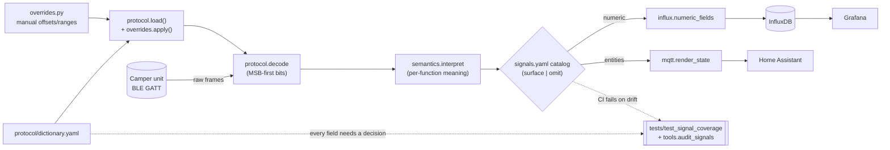
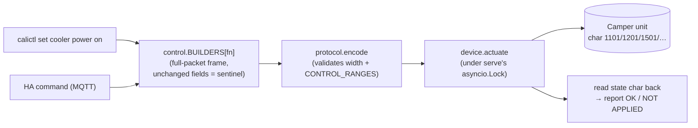
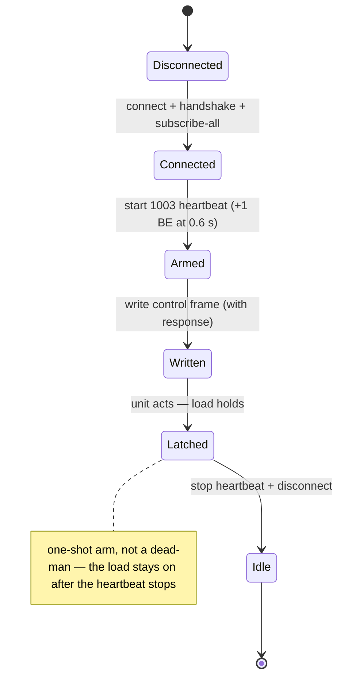

# Architecture — how the pieces fit

`open-california` turns the VW California camper's Bluetooth-LE control unit into clean signals and
real control, from a Raspberry Pi. This is the five-minute map: the pipeline, where each concern
lives, and how to extend it. For the deep provenance behind any claim, follow the links into
[`docs/business-logic/`](https://ckeller42.github.io/open-california/business-logic/index.html).

## The pipeline — how a byte becomes a signal

(How `dictionary.yaml` came to exist — extraction from the vendor app with `tools/extract_protocol` —
is a one-time reverse-engineering *process*, not part of this runtime picture; it is documented in
[`docs/business-logic/`](https://ckeller42.github.io/open-california/business-logic/index.html).)

One daemon (`serve.py`) owns the single BLE connection and drives that pipeline:

1. **`device.py` — the BLE owner.** Holds the one connection slot (an `asyncio.Lock`), reads each
   characteristic's raw frame, and ticks the `1003` liveness heartbeat so reads return fresh values
   instead of a stale latch. Nothing else opens a second BLE connection.
2. **`protocol.py` — the codec.** Decodes a raw frame into a field dict using the bit layout in
   `protocol/dictionary.yaml` (MSB-first), and encodes control frames the same way. `overrides.py`
   carries the few manual bit offsets the extractor cannot derive.
3. **`semantics.py` — interpretation.** Turns decoded fields into meaningful signals: names, scales,
   and derived signals (e.g. `usb_powered = master AND usb_charger`). This is where a raw bit becomes
   "camping USB is on."
4. **`serve.py` — the daemon.** Polls `device` then `protocol.decode` then `semantics`, caches the
   result with an "as of" timestamp, and fans out.
5. **Sinks.** `web.py` (the web UI + `/api/state`), `mqtt.py` (Home Assistant discovery), `influx.py`
   (InfluxDB, read by Grafana). Same process, one connection.

Supporting the daemon: `session.py` (a supervisor that holds the BLE slot while the UI is active and
releases it when idle), `observer.py` / `automation.py` (passive camping observer + auto-camper),
`firmware.py` / `anchors.py` (firmware-drift capture + plausibility checks), `history.py` +
`freshness.py` (energy history + stale-read handling).

## Control — the write path

`control.py` builds a **full-packet** frame — every field is resent, and unchanged fields carry their
*current* value or the leave-unchanged sentinel, never a default (writing defaults once sent a garbage
command). `protocol.encode` validates each value against its bit-width and a curated semantic range
before anything is written. `device.actuate` then writes the frame while the `1003` heartbeat ticks —
the firmware's arm gate (issue #2). Actuation is **one-shot arm**: the load latches, so the heartbeat
only needs to span the write window:

The state-char **readback is a write-through echo, never proof of actuation** — trust a human at the
device, or the unit's genuine `1502` notifications. Full per-step sequence diagrams (connect
handshake, heartbeat-armed write, lighting, roof, range rejection) are in the
[rendered protocol sequences](https://ckeller42.github.io/open-california/protocol-sequences.html);
recipes and per-feature history in
[`control-and-actuation.md`](https://ckeller42.github.io/open-california/business-logic/control-and-actuation.html).

## The signal catalog (why nothing silently drifts)

Every field in `dictionary.yaml` must have a decision in `protocol/signals.yaml`: `surface` (with a
name) or `omit` (with a reason). A field that is dropped or unaccounted **fails CI**
(`tests/test_signal_coverage.py`) — that is the `GUARD` box in the pipeline diagram. The auditor
(`tools/audit_signals`) also flags where an app setter/getter is inverted or combined — because
**semantics correctness is not auto-checked**. A naive `bool(field)` can mislabel a signal (that is
how the camping-lights inversion slipped through). Verify polarity against the app's own getter or
the unit's on-screen display, not a guess. See [`signals.md`](https://ckeller42.github.io/open-california/business-logic/signals.html).

## Add a signal (the loop)

1. **Catalog it** — `python3 -m tools.triage` (surface-or-omit, with provenance).
2. **Emit it** in `semantics.py`.
3. **Surface it** — update the Grafana dashboard (`calictl/deploy/camper-dashboard.json`, pushed with
   `push_dashboard.py`) and Home Assistant.
4. **Audit** — `python3 -m tools.audit_signals --report`.
5. **Keep the suite green** — `python3 -m pytest tests/ -q`.

## Invariants (do not break these)

- **Runtime `calictl/*` is stdlib-only at import.** `bleak` / `paho` / `influxdb_client` / `yaml`
  import lazily inside functions, so the whole test suite runs with no BLE or MQTT installed (CI
  asserts this).
- **`serve` is the single BLE owner.** `hci0` is shared with other readers on the Pi — never open a
  second connection from the daemon path; the loop-created `asyncio.Lock` serializes `poll` and
  `on_command`, so a control write never races a poll.
- **The BLE codec is MSB-first**, and control frames are full-packet (resend every field).
- **Evidence over assertion.** Tag every protocol claim by how it was verified — DEVICE (watched on
  hardware) / CAPTURE (on the wire) / DECOMPILE (from the app) / UNVERIFIED — and never put a unit on
  an unverified scale. The [`evidence-ledger.md`](https://ckeller42.github.io/open-california/business-logic/evidence-ledger.html) is the
  running record.

## Where to read next

| You want… | Read |
|---|---|
| Run it on a Pi | [`docs/raspberry-pi-setup.md`](docs/raspberry-pi-setup.md) |
| The wire protocol + frame format | [`docs/protocol.md`](docs/protocol.md) |
| Control recipes + the arm gate | [`docs/business-logic/control-and-actuation.md`](https://ckeller42.github.io/open-california/business-logic/control-and-actuation.html) |
| Sequence diagrams | the [rendered docs](https://ckeller42.github.io/open-california/protocol-sequences.html) |
| Per-signal provenance + scales | [`docs/business-logic/signals.md`](https://ckeller42.github.io/open-california/business-logic/signals.html) |
| The tested hardware + GATT map | the [hardware reference](https://ckeller42.github.io/open-california/hardware.html) |
| Contributor rules + hard invariants | [`CLAUDE.md`](CLAUDE.md) |
