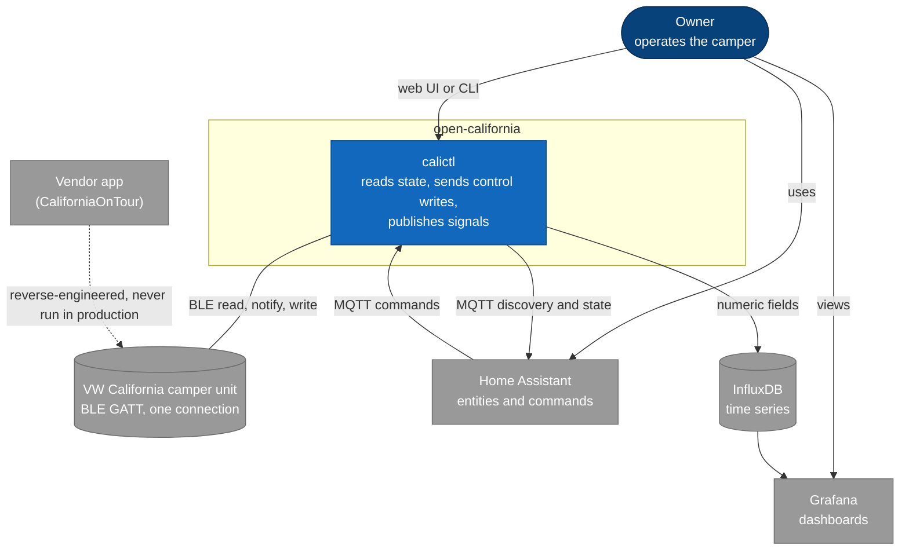
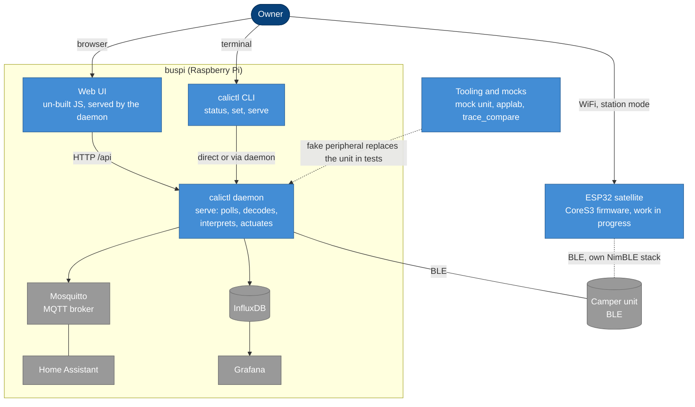
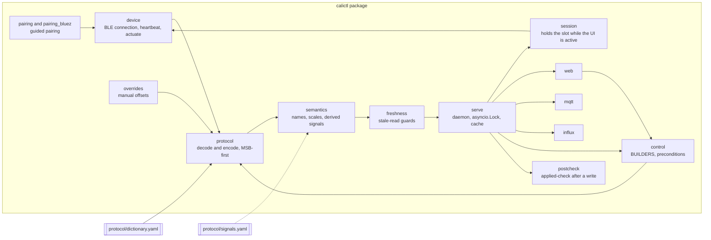
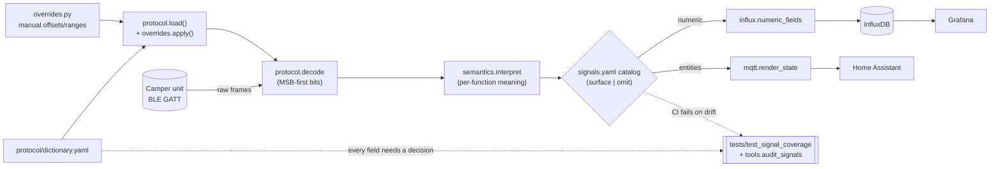
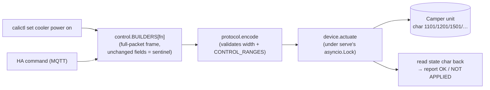
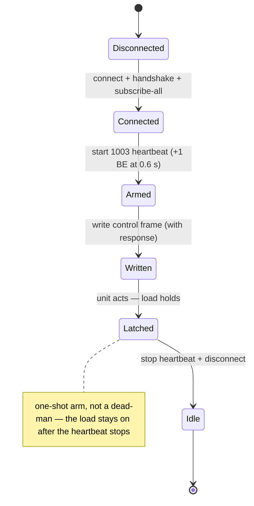
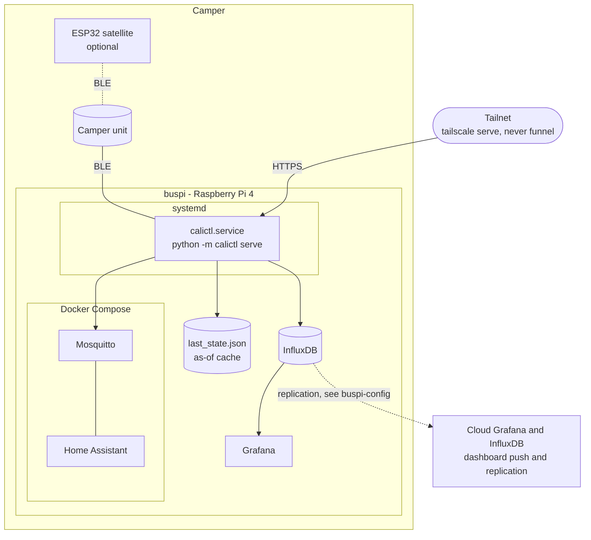

# Architecture

`open-california` turns the VW California camper's Bluetooth-LE control unit into clean signals and
real control, from a Raspberry Pi. This is the architecture documentation, structured after
[arc42](https://arc42.org) and drawn with the [C4 model](https://c4model.com) (context, container,
component, deployment). Diagrams are Mermaid flowcharts styled as C4, so the site builds without
Java. For the deep provenance behind any claim, follow the links into
[`docs/business-logic/`](https://ckeller42.github.io/open-california/business-logic/index.html).

## 1. Introduction and goals

`open-california` reads all telemetry of the VW California T7 camper unit over Bluetooth LE and
sends control writes to it, from a Raspberry Pi (`buspi`). It feeds Home Assistant (MQTT) and
Grafana (InfluxDB). It is an independent reverse-engineering project for the owner's own vehicle,
not affiliated with Volkswagen.

**Quality goals**, in priority order:

| # | Goal | What it means here |
|---|---|---|
| 1 | Safe actuation | A control write goes to a real vehicle (heaters, roof, loads). Frames are validated before they are written, and a readback is never taken as proof that something happened. |
| 2 | Truthful values | A signal is shown only with a unit and scale that were verified. Unverified values stay labelled as levels. |
| 3 | Tolerates an absent unit | The parked unit deep-sleeps and stops advertising. Access is intermittent by nature, so the last state is kept with an "as of" time. |
| 4 | One BLE owner | The unit allows one connection and the Pi's adapter is shared, so exactly one daemon talks to it. |
| 5 | Drift is caught | Every protocol field has a recorded decision, and CI fails when one is dropped. |

**Stakeholders:** the vehicle owner (operator and sole user), contributors who extend the protocol
map, and the downstream consumers Home Assistant and Grafana.

## 2. Constraints

| Constraint | Why |
|---|---|
| The unit accepts one BLE connection and `hci0` is shared with other readers | `serve` is the single BLE owner and an `asyncio.Lock` serialises all access |
| Runtime `calictl/*` imports only the standard library at import time | The suite runs with no BLE or MQTT installed. `bleak`, `paho`, `influxdb_client` and `yaml` import lazily |
| The BLE codec is MSB-first and control frames are full-packet | That is how the unit and the vendor app behave. Every field is resent, and unchanged fields carry the leave-unchanged sentinel |
| No vendor material in the repository | The APK, decompiled sources and manuals are never committed. VW material appears as citations only |
| The unit deep-sleeps when parked | Buspi cannot connect for days until physical use wakes it |
| The web UI is un-built JavaScript | `tsc --checkJs` is its hard gate, since no build step would catch an undeclared identifier |
| Runs on a Raspberry Pi with Python 3.11 to 3.13 | The deployment target is buspi |

## 3. Context and scope

The system boundary is the `calictl` daemon plus its optional ESP32 satellite. Everything else is
an external neighbour.

```mermaid
flowchart TB
  owner(["Owner<br/>operates the camper"])
  subgraph boundary["open-california"]
    sys["calictl<br/>reads state, sends control writes,<br/>publishes signals"]
  end
  unit[("VW California camper unit<br/>BLE GATT, one connection")]
  app["Vendor app<br/>(CaliforniaOnTour)"]
  ha["Home Assistant<br/>entities and commands"]
  graf["Grafana<br/>dashboards"]
  idb[("InfluxDB<br/>time series")]
  owner -->|web UI or CLI| sys
  owner -->|uses| ha
  owner -->|views| graf
  sys ---|BLE read, notify, write| unit
  sys -->|MQTT discovery and state| ha
  ha -->|MQTT commands| sys
  sys -->|numeric fields| idb
  idb --> graf
  app -.->|reverse-engineered, never run in production| unit
  classDef person fill:#08427b,color:#fff,stroke:#052e56
  classDef system fill:#1168bd,color:#fff,stroke:#0b4884
  classDef ext fill:#999,color:#fff,stroke:#6b6b6b
  class owner person
  class sys system
  class unit,app,ha,graf,idb ext
```

| Neighbour | Interface | Direction |
|---|---|---|
| Camper unit | BLE GATT characteristics, `1003` liveness heartbeat for writes | read and write |
| Home Assistant | MQTT discovery, state topics and command topics via Mosquitto | publish and subscribe |
| InfluxDB and Grafana | `influx.numeric_fields` written to a bucket, queried by dashboards | write only from here |
| Vendor app | none at runtime. It is the reference the protocol was reverse-engineered from, and the lab replays its frames against calictl | evidence only |
| Owner | web UI (`--web`, port 8088 on buspi), CLI, guided pairing wizard | both |

**Out of scope:** vehicle functions the unit does not expose, and any VW-owned code or assets.
Stairs, living-room heater, roof air conditioner, satellite dish and solar are decoded but not
installed on the reference van, so they are verified statically only.

## 4. Solution strategy

| Goal | Approach |
|---|---|
| Truthful values | A dictionary-driven codec: `protocol/dictionary.yaml` is the source of truth for bit layout, and manual offsets live only in `overrides.py`. A separate `semantics` layer gives fields meaning, so decode never guesses. |
| Drift is caught | A signal catalog (`protocol/signals.yaml`) records a `surface` or `omit` decision for every field, enforced by `tests/test_signal_coverage.py` and `tools.audit_signals`. |
| Safe actuation | Control frames are built by `control.BUILDERS`, validated by `protocol.encode` against bit widths and curated ranges, and written under the single BLE lock while the `1003` heartbeat ticks. Readback is a write-through echo, so it is never reported as proof. |
| One BLE owner | One daemon (`serve`) owns the connection. The web UI, MQTT and InfluxDB are sinks inside that process. |
| Absent unit | `serve` persists the last state with an "as of" timestamp, and the UI shows an offline banner. `freshness` holds the last plausible value for measurement-gated fields such as water. |
| Evidence over assertion | Every protocol claim carries a verification tier (DEVICE, CAPTURE, DECOMPILE, UNVERIFIED) in the evidence ledger. |

## 5. Building block view

### Containers (C4 level 2)

```mermaid
flowchart TB
  owner(["Owner"])
  unit[("Camper unit<br/>BLE")]
  subgraph pi["buspi (Raspberry Pi)"]
    daemon["calictl daemon<br/>serve: polls, decodes,<br/>interprets, actuates"]
    webui["Web UI<br/>un-built JS, served by the daemon"]
    cli["calictl CLI<br/>status, set, serve"]
    mqtt["Mosquitto<br/>MQTT broker"]
    ha["Home Assistant"]
    idb[("InfluxDB")]
    graf["Grafana"]
  end
  esp["ESP32 satellite<br/>CoreS3 firmware, work in progress"]
  tools["Tooling and mocks<br/>mock unit, applab, trace_compare"]
  owner -->|browser| webui
  owner -->|terminal| cli
  webui -->|HTTP /api| daemon
  cli -->|direct or via daemon| daemon
  daemon ---|BLE| unit
  daemon --> mqtt
  mqtt --- ha
  daemon --> idb
  idb --> graf
  esp -.-|BLE, own NimBLE stack| unit
  owner -->|WiFi, station mode| esp
  tools -.->|fake peripheral replaces the unit in tests| daemon
  classDef person fill:#08427b,color:#fff,stroke:#052e56
  classDef container fill:#438dd5,color:#fff,stroke:#2e6295
  classDef ext fill:#999,color:#fff,stroke:#6b6b6b
  class owner person
  class daemon,webui,cli,esp,tools container
  class unit,mqtt,ha,idb,graf ext
```

| Container | Technology | Responsibility |
|---|---|---|
| calictl daemon | Python 3.11+, `asyncio`, `bleak` | The single BLE owner. Polls, decodes, interprets, caches, actuates, fans out to the sinks. |
| Web UI | Vanilla JS, no build step, `tsc --checkJs` gate | Dashboard and controls in English and German, served by the daemon. Also served by the ESP satellite. |
| CLI | Python | One-shot reads and writes, `serve`, pairing helpers. Never opens a second connection when the daemon is up. |
| ESP32 satellite | C, NimBLE, ESP-IDF | Independent implementation of pairing, read and a restricted write path, tied to calictl by generated headers and golden vectors. It never talks to buspi. |
| Tooling and mocks | Python, Bumble | The mock unit (a BLE peripheral with real SMP pairing), the real app in an emulator, and a trace comparer. They make the unit reproducible. |

The sinks (Mosquitto, Home Assistant, InfluxDB, Grafana) are deployed next to the daemon but are
off-the-shelf components. They are drawn grey because this repository configures them and does not
implement them.

### Components of the daemon (C4 level 3)

```mermaid
flowchart LR
  subgraph calictl["calictl package"]
    device["device<br/>BLE connection, heartbeat, actuate"]
    session["session<br/>holds the slot while the UI is active"]
    protocol["protocol<br/>decode and encode, MSB-first"]
    overrides["overrides<br/>manual offsets"]
    semantics["semantics<br/>names, scales, derived signals"]
    control["control<br/>BUILDERS, preconditions"]
    freshness["freshness<br/>stale-read guards"]
    serve["serve<br/>daemon, asyncio.Lock, cache"]
    web["web"]
    mqttc["mqtt"]
    influx["influx"]
    pairing["pairing and pairing_bluez<br/>guided pairing"]
    postcheck["postcheck<br/>applied-check after a write"]
  end
  dict[["protocol/dictionary.yaml"]]
  cat[["protocol/signals.yaml"]]
  dict --> protocol
  overrides --> protocol
  device --> protocol
  protocol --> semantics
  semantics --> freshness
  freshness --> serve
  cat -.-> semantics
  session --> device
  serve --> session
  serve --> web
  serve --> mqttc
  serve --> influx
  web --> control
  control --> protocol
  serve --> control
  serve --> postcheck
  pairing --> device
```

Rules that shape these dependencies:

- `protocol` and `semantics` are pure. They import no I/O libraries, which is what lets the whole
  suite run without BLE or MQTT installed.
- Only `device` and `pairing_bluez` touch BLE, and only `serve` creates the `asyncio.Lock` (inside
  the running loop) that serialises every access.
- `semantics` is the one place that gives a field its name and scale. The sinks consume its output
  instead of re-deriving meaning.
- Control reaches the unit only through `control` then `protocol.encode` then `device.actuate`,
  entered via `serve.on_command`. The web layer checks `control.command_precondition` first.

### Data flow: how a byte becomes a signal

```mermaid
flowchart LR
  U[("Camper unit<br/>BLE GATT")] -->|raw frames| DECODE
  DICT[protocol/dictionary.yaml] --> LOAD["protocol.load()<br/>+ overrides.apply()"]
  OVR["overrides.py<br/>manual offsets/ranges"] --> LOAD
  LOAD --> DECODE["protocol.decode<br/>(MSB-first bits)"]
  DECODE --> SEM["semantics.interpret<br/>(per-function meaning)"]
  SEM --> CAT{"signals.yaml catalog<br/>(surface | omit)"}
  CAT -->|numeric| INFLUX[influx.numeric_fields] --> IDB[(InfluxDB)] --> GRAF[Grafana]
  CAT -->|entities| MQTT[mqtt.render_state] --> HA[Home Assistant]
  DICT -. every field needs a decision .-> GUARD[["tests/test_signal_coverage<br/>+ tools.audit_signals"]]
  CAT -. CI fails on drift .-> GUARD
```

(How `dictionary.yaml` came to exist — extraction from the vendor app with `tools/extract_protocol` —
is a one-time reverse-engineering *process*, not part of this runtime picture; it is documented in
[`docs/business-logic/`](https://ckeller42.github.io/open-california/business-logic/index.html).)

One daemon (`serve.py`) owns the single BLE connection and drives that pipeline:

1. **`device.py` — the BLE owner.** Holds the one connection slot (an `asyncio.Lock`), reads each
   characteristic's raw frame, and ticks the `1003` liveness heartbeat so the link stays up and the
   re-read chars refresh (water is measurement-gated, not heartbeat-driven — `freshness.py` guards
   its stale latch). Nothing else opens a second BLE connection.
2. **`protocol.py` — the codec.** Decodes a raw frame into a field dict using the bit layout in
   `protocol/dictionary.yaml` (MSB-first), and encodes control frames the same way. `overrides.py`
   carries the few manual bit offsets the extractor cannot derive.
3. **`semantics.py` — interpretation.** Turns decoded fields into meaningful signals: names, scales,
   and derived signals (e.g. `usb_powered = master AND usb_charger`). This is where a raw bit becomes
   "camping USB is on."
4. **`serve.py` — the daemon.** Polls `device` then `protocol.decode` then `semantics`, caches the
   result with an "as of" timestamp, and fans out.
5. **Sinks.** `web.py` (the web UI + `/api/state`), `mqtt.py` (Home Assistant discovery), `influx.py`
   (InfluxDB, read by Grafana). Same process, one connection.

Supporting the daemon: `session.py` (a supervisor that holds the BLE slot while the UI is active and
releases it when idle; a roof move or STOP runs inside a live session with its `1003` heartbeat
ticking, as the app's does, and never warms the session first — with none up it opens its own
connection; not yet device-verified), `observer.py` / `automation.py` (passive camping observer + auto-camper),
`firmware.py` / `anchors.py` (firmware-drift capture + plausibility checks), `history.py` +
`freshness.py` (energy history + stale-read handling).

### The ESP32 satellite (work in progress)

`firmware/` is a second, independent implementation of the pairing half of this picture: an
ESP32-S3 (M5Stack CoreS3) satellite that pairs with the camper unit over its own NimBLE stack and
reads its state without going through buspi at all. It reuses the *design*, not the Python code —
`calictl/pairing.py`'s state machine is ported to platform-free C (`firmware/components/cali_core`)
against the same golden vectors, and the frame codec is the same generated C already used for
codec parity (`csrc/`, issue #156) — so the dictionary stays the single source of truth for both
consumers. It writes the same control frames as calictl for five functions — cooler, camping mode,
lighting, air heater, energy — generated from `calictl/control.py` (`csrc/control_consts.h`) and
held byte-identical by golden vectors (`tests/vectors/control.json`, a C twin in
`cali_core/control.c`), through one write allow-list that never admits the roof's `1401`; its only
other write is the `1003` heartbeat. The roof and the wake-up light are refused ("Only via buspi or
the app"). As of this writing the read side is proven on a Linux host build against a fake unit, in
QEMU, and on a real CoreS3 against the Bumble mock unit over real BLE; the control path on the host
build against the fake unit and on the CoreS3 against the mock unit (2026-10-07) — nothing yet against the real camper unit. It
also joins WiFi on its own: a setup hotspot + captive portal takes the home network's credentials,
then it serves a status page (`/device`) and `/api/state` (the decoded `SNAP` plus pairing/link/WiFi)
from `http://calictl-esp.local` — the same platform-free C (`wifi_sm`/`wifi_run`/`http_core`/`web`)
on the host tier, where a scripted fake WiFi stands in for the radio, and on the chip. In station mode
the satellite serves the same calictl web UI at `/` with its controls live (`POST /api/command` in
calictl's shape, station mode only — never over the setup hotspot; roof and wake-up greyed);
`calictl/webui/semantics.js` twins `semantics.py` in the browser, and golden vectors
(`tools/gen_semantics_vectors.py`) keep the two equal. Nothing talks to buspi; see the
[WiFi how-to](https://ckeller42.github.io/open-california/howto-esp-wifi-setup.html). See
[the firmware docs](https://ckeller42.github.io/open-california/firmware.html) for the test tiers
and what each does and doesn't prove.

## 6. Runtime view

The wire-level flows are maintained as sequence diagrams that link to the requirement each one
depicts, so they are not repeated here. Read them in [Protocol sequences](https://ckeller42.github.io/open-california/protocol-sequences.html):

| Scenario | What it shows |
|---|---|
| Connect handshake | connect, subscribe to all characteristics, first read |
| Heartbeat-armed write | the `1003` heartbeat spanning one control write |
| Lighting | the bare brightness write and its commit frame on an awake unit |
| Roof | press-and-hold streaming and the release stop |
| Range rejection | a value refused by `protocol.encode` before anything is written |

Two runtime behaviours matter for every scenario:

- **Poll cycle.** `serve` takes the lock, reads every function, decodes, interprets, caches the
  result with its "as of" time, and fans out to the sinks. A control write takes the same lock, so
  a write never races a poll.
- **Session.** While the web UI is active a persistent session holds the BLE slot and releases it
  after about 25 seconds idle. A roof move runs inside a live session so there is never a second
  connection.

### The control write path

```mermaid
flowchart LR
  CLI["calictl set cooler power on"] --> BUILD["control.BUILDERS[fn]<br/>(full-packet frame,<br/>unchanged fields = sentinel)"]
  HA["HA command (MQTT)"] --> BUILD
  BUILD --> ENC["protocol.encode<br/>(validates width + CONTROL_RANGES)"]
  ENC --> ACT["device.actuate<br/>(under serve's asyncio.Lock)"]
  ACT --> UNIT[("Camper unit<br/>char 1101/1201/1501/…")]
  ACT --> RB["read state char back<br/>→ report OK / NOT APPLIED"]
```

`control.py` builds a **full-packet** frame — every field is resent, and unchanged fields carry their
*current* value or the leave-unchanged sentinel, never a default (writing defaults once sent a garbage
command). `protocol.encode` validates each value against its bit-width and a curated semantic range
before anything is written. `device.actuate` then writes the frame while the `1003` heartbeat ticks —
the firmware's arm gate (issue #2). Actuation is **one-shot arm**: the load latches, so the heartbeat
only needs to span the write window:

```mermaid
stateDiagram-v2
  [*] --> Disconnected
  Disconnected --> Connected: connect + handshake + subscribe-all
  Connected --> Armed: start 1003 heartbeat (+1 BE at 0.6 s)
  Armed --> Written: write control frame (with response)
  Written --> Latched: unit acts — load holds
  Latched --> Idle: stop heartbeat + disconnect
  Idle --> [*]
  note right of Latched: one-shot arm, not a dead-man — the load stays on after the heartbeat stops
```

The state-char **readback is a write-through echo, never proof of actuation** — trust a human at the
device, or the unit's genuine `1502` notifications. Full per-step sequence diagrams (connect
handshake, heartbeat-armed write, lighting, roof, range rejection) are in the
[rendered protocol sequences](https://ckeller42.github.io/open-california/protocol-sequences.html);
recipes and per-feature history in
[`control-and-actuation.md`](https://ckeller42.github.io/open-california/business-logic/control-and-actuation.html).

## 7. Deployment view

```mermaid
flowchart TB
  subgraph van["Camper"]
    unit[("Camper unit")]
    esp["ESP32 satellite<br/>optional"]
    subgraph buspi["buspi - Raspberry Pi 4"]
      subgraph systemd["systemd"]
        unitsvc["calictl.service<br/>python -m calictl serve"]
      end
      subgraph compose["Docker Compose"]
        mosq["Mosquitto"]
        hac["Home Assistant"]
      end
      idb[("InfluxDB")]
      graf["Grafana"]
      cache[("last_state.json<br/>as-of cache")]
    end
  end
  tail(["Tailnet<br/>tailscale serve, never funnel"])
  cloud["Cloud Grafana and InfluxDB<br/>dashboard push and replication"]
  unit ---|BLE| unitsvc
  unitsvc --> cache
  unitsvc --> mosq
  mosq --- hac
  unitsvc --> idb
  idb --> graf
  idb -.->|replication, see buspi-config| cloud
  tail -->|HTTPS| unitsvc
  esp -.-|BLE| unit
```

| Node | What runs there | Notes |
|---|---|---|
| buspi | the `calictl serve` unit, Mosquitto and Home Assistant containers, InfluxDB, Grafana | `serve` runs under a virtualenv, and the installed unit adds `--web 8088` through a `systemctl edit` drop-in rather than the committed template. Secrets live in root-only files under `/etc/buspi/`. |
| Camper unit | the vehicle's own firmware | Deep-sleeps when parked, so buspi cannot connect for days until physical use wakes it. |
| ESP32 satellite | independent firmware on a CoreS3 | Joins WiFi through a setup hotspot and serves the same web UI. It writes only in station mode, through a single allow-list, and never the roof. |
| Tailnet | `tailscale serve` in front of the web UI | Tailnet only. `funnel` (public) is never used. |
| Cloud | Grafana Cloud and InfluxDB Cloud | The dashboard JSON is pushed to both the Pi and the cloud with `push_dashboard.py`. Dashboards do not update on their own. |

The shared Pi's own deployment (readers, replication, watchdogs, logging) is documented in the
sibling [buspi-config](https://github.com/ckeller42/buspi-config) repository. This repository owns
only the camper-unit part.

## 8. Crosscutting concepts

| Concept | How it works | Where |
|---|---|---|
| Single source of protocol truth | `protocol/dictionary.yaml` feeds the Python codec, the generated C codec header and the golden vectors. Both consumers (calictl and the ESP satellite) decode the same bits. | `protocol/`, `csrc/`, `tests/vectors/` |
| Signal catalog | Every dictionary field has a `surface` (with a name) or `omit` (with a reason) decision. A dropped field fails CI. | `protocol/signals.yaml`, `tests/test_signal_coverage.py` |
| Semantic polarity | Interpretation is not auto-checked. A field whose app getter is inverted or combined is verified against the app's getter and the unit's own screen, never a naive `bool(field)`. | [signals notes](https://ckeller42.github.io/open-california/business-logic/signals.html) |
| Evidence tiers | Each claim is tagged DEVICE, CAPTURE, DECOMPILE or UNVERIFIED. A buildable command without a tier row fails CI, and so does an uncited app recording. | [evidence ledger](https://ckeller42.github.io/open-california/business-logic/evidence-ledger.html) |
| Control safety | Full-packet frames, width and range validation in `protocol.encode`, preconditions per command, a single lock, and an applied-check that treats readback as an echo. | `control`, `protocol`, `postcheck` |
| Freshness | Reads go stale and the unit deep-sleeps. The last state is persisted with an "as of" time, and implausible drops (water) are held and flagged stale. | `freshness`, [value freshness](https://ckeller42.github.io/open-california/business-logic/value-freshness.html) |
| Honest units | A value gets a unit only when it is verified. SoC is a coarse level, temperatures are raw levels, and currents are amps since they were checked against the app. | [signals notes](https://ckeller42.github.io/open-california/business-logic/signals.html) |
| Internationalisation | The UI uses the unit's own vocabulary in English and German. A test guards literal translation keys. | `calictl/webui/strings.de.js`, `tests/test_i18n_de.py` |
| Logging and tracing | Standard `logging` with an env-controlled level, and a JSONL recorder of every notify, read and write for replay against the mock. | `log`, `trace`, `tools.trace_compare` |
| Requirements traceability | `req` objects in code docstrings link to `test` objects in test docstrings through sphinx-needs. A dangling link fails the docs build. | [requirement traceability](https://ckeller42.github.io/open-california/#requirement-traceability) |
| Test layers | Unit tests, a mock unit, GUI end-to-end over the mock, real-unit trace replay, a BlueZ pairing rig and C codec parity. | [simulation and testing](https://ckeller42.github.io/open-california/simulation-and-testing.html) |

### The signal catalog: why nothing silently drifts

Every field in `dictionary.yaml` must have a decision in `protocol/signals.yaml`: `surface` (with a
name) or `omit` (with a reason). A field that is dropped or unaccounted **fails CI**
(`tests/test_signal_coverage.py`) — that is the `GUARD` box in the pipeline diagram. The auditor
(`tools/audit_signals`) also flags where an app setter/getter is inverted or combined — because
**semantics correctness is not auto-checked**. A naive `bool(field)` can mislabel a signal (that is
how the camping-lights inversion slipped through). Verify polarity against the app's own getter or
the unit's on-screen display, not a guess. See [`signals.md`](https://ckeller42.github.io/open-california/business-logic/signals.html).

### Add a signal (the loop)

1. **Catalog it** — `python3 -m tools.triage` (surface-or-omit, with provenance).
2. **Emit it** in `semantics.py`.
3. **Surface it** — update the Grafana dashboard (`calictl/deploy/camper-dashboard.json`, pushed with
   `push_dashboard.py`) and Home Assistant.
4. **Audit** — `python3 -m tools.audit_signals --report`.
5. **Keep the suite green** — `python3 -m pytest tests/ -q`. What each test layer (mock unit, GUI
   e2e, real-unit trace replay, the pairing harnesses, the app lab, C parity) proves and which CI job
   runs it: [simulation and testing](https://ckeller42.github.io/open-california/simulation-and-testing.html).

### Invariants (do not break these)

- **Runtime `calictl/*` is stdlib-only at import.** `bleak` / `paho` / `influxdb_client` / `yaml`
  import lazily inside functions, so the whole test suite runs with no BLE or MQTT installed (CI
  asserts this).
- **`serve` is the single BLE owner.** `hci0` is shared with other readers on the Pi — never open a
  second connection from the daemon path; the loop-created `asyncio.Lock` serializes `poll` and
  `on_command`, so a control write never races a poll.
- **The BLE codec is MSB-first**, and control frames are full-packet (resend every field).
- **Evidence over assertion.** Tag every protocol claim by how it was verified — DEVICE (watched on
  hardware) / CAPTURE (on the wire) / DECOMPILE (from the app) / UNVERIFIED — and never put a unit on
  an unverified scale. The [`evidence-ledger.md`](https://ckeller42.github.io/open-california/business-logic/evidence-ledger.html) is the
  running record.

## 9. Architecture decisions

The dated record of resolved questions and ruled-out dead ends is the
[decision log](https://ckeller42.github.io/open-california/business-logic/DECISIONS.html). The decisions that shape the architecture most are
summarised below in ADR form, newest context first. Each links to its provenance.

| Decision | Context | Consequence |
|---|---|---|
| **One daemon owns the BLE slot** | The unit takes one connection and the Pi's adapter is shared with other readers. | A lock created inside the running loop serialises poll and command, and no other code path may open a connection. |
| **Control writes are armed by a one-shot `1003` heartbeat** (issue 2, 2026-07-07) | Writes were ignored until a liveness counter was ticking. The load latches once armed. | The heartbeat only spans the write window. A roof move ticks it through the whole move. See [control and actuation](https://ckeller42.github.io/open-california/business-logic/control-and-actuation.html). |
| **Control frames follow the vendor app byte for byte** (ruling R1, 2026-10-06) | calictl once re-asserted current values in untargeted cooler fields, which differs from the app. | Untargeted fields carry the leave-unchanged value, and the recording replay compares whole frames. |
| **The ESP satellite is a second implementation, not a port of the runtime** (2026-10-06) | A satellite should work without buspi but must not drift from calictl. | It shares the dictionary, generated constants and golden vectors, writes through one allow-list, never drives the roof, and writes only in station mode. See [firmware](https://ckeller42.github.io/open-california/firmware.html). |
| **Runtime modules import only the standard library** | Tests must run on a machine with no BLE or MQTT stack. | Heavy dependencies import lazily inside functions, and a guard checks it. |
| **Diagrams are text-based Mermaid** | The docs site is built without Java and diagrams live next to the prose. | A lint guards the characters that break Mermaid in the browser, because the Sphinx build cannot catch them. |

New decisions go into the decision log first. Add a row here when a decision changes a building
block or a quality goal.

## 10. Quality requirements

### Quality scenarios

| Goal | Scenario | How it is checked |
|---|---|---|
| Safe actuation | A client sends a value outside a control's range. The frame is refused before any byte is written. | `protocol.encode` range tests, the range-rejection sequence |
| Safe actuation | A write is sent while the readback echoes the new value. The UI must not claim the unit acted. | `postcheck` and the "applied" semantics, [control and actuation](https://ckeller42.github.io/open-california/business-logic/control-and-actuation.html) |
| Truthful values | A new dictionary field appears with no catalog decision. CI fails. | `tests/test_signal_coverage.py`, `tools.audit_signals` |
| Truthful values | A new buildable command has no evidence tier. CI fails. | `tests/test_command_coverage.py` |
| One BLE owner | A poll and a command arrive together. They run one after the other. | the lock in `serve`, the e2e tests over the mock |
| Absent unit | The unit is asleep for days. The UI shows the last state and an offline banner, not an error. | persisted last state, web e2e tests |
| Drift is caught | The C codec and the Python codec disagree. CI fails. | `codec-parity`, `gen_codec_vectors --check` |
| Maintainability | An undeclared identifier reaches a rarely used screen. The type check rejects it. | `tsc --checkJs` baseline of zero errors |

### Quality gates in CI

The required checks are `test` on Python 3.11, 3.12 and 3.13, `pre-commit`, `no-vendor-material`,
`install-script`, `docs`, `codec-parity`, `gui-e2e`, `firmware-host-e2e`, `firmware-build` and
`firmware-qemu`. Coverage on `calictl/` is a ratchet that is only ever raised. The full list and
what each job proves is in [simulation and testing](https://ckeller42.github.io/open-california/simulation-and-testing.html).

## 11. Risks and technical debt

| Risk or debt | Impact | Status |
|---|---|---|
| The roof motor has never been driven by calictl | A protocol-correct path that has not moved real hardware. The unit withholds the motor for about 3 seconds until its safety counter validates. | Open. First owner-watched drive is tracked as issues 157 and 230. |
| Several app-faithful frames are not verified on the real unit | The cooler level and the guided pairing wizard are CI-verified but not yet confirmed at the van. | Open, issues 157 and 230. |
| The satellite has not touched the real unit | The read side and the control path ran against a fake unit and a mock unit on a bench only. | Open, work in progress. |
| Some scales are unverified | Temperatures and the state-of-charge level carry no unit. | Tracked in the signal notes. |
| The unit deep-sleeps and the vendor firmware can change | Access is intermittent, and a firmware update could move a field. | Mitigated by firmware-drift capture and plausibility anchors, but not removable. |
| Semantic correctness is not auto-checked | A getter that is inverted or combined can be shipped as a wrong label. | Mitigated by the polarity procedure and the on-screen ground truth. |
| Water readings can be a stale latch | A parked read may return an old value. | A guard holds the last plausible reading. Whether it is still needed is open until a van trace. |
| Grafana dashboards do not update on their own | A new signal can be missing from the dashboards. | A reminder hook and the push script. Still a manual step. |

## 12. Glossary

| Term | Meaning |
|---|---|
| Unit | The VW California T7 camper control unit that speaks BLE. |
| buspi | The Raspberry Pi that runs calictl and the other readers in the van. |
| Dictionary | `protocol/dictionary.yaml`, the extracted map of frame fields. |
| Catalog | `protocol/signals.yaml`, the surface or omit decision per field. |
| Function | One of the unit's 14 feature areas such as cooler, camping mode, lighting, air heater, water, energy or roof. Each has a state and a control characteristic. |
| `1003` heartbeat | The liveness counter incremented about every 0.6 seconds that arms control writes. |
| Full-packet | A control frame that resends every field, with unchanged fields set to the leave-unchanged sentinel. |
| Armed, latched | A write is accepted only while the heartbeat ticks, and the load then holds after it stops. |
| Readback echo | The state characteristic returning the value just written. It is not evidence that the load acted. |
| Mode-4 notification | The `1502` frame that carries the real ramping lighting brightness, the truthful feedback channel. |
| SafetyCounter | The roof's app-generated monotonic counter that the unit must validate before moving the motor. |
| Evidence tier | DEVICE (watched on hardware), CAPTURE (seen on the wire), DECOMPILE (read from the app), UNVERIFIED. |
| Satellite | The optional ESP32 firmware that talks to the unit without buspi. |
| Mock unit | The Bumble-based fake BLE peripheral used by tests and the app lab. |
| Sofortheizen, Dauerbetrieb, Flüstermodus | The unit's own German labels (immediate heating, continuous operation, whisper mode). The UI uses them as shown. |

## Where to read next

| You want… | Read |
|---|---|
| Run it on a Pi | [`docs/raspberry-pi-setup.md`](docs/raspberry-pi-setup.md) |
| The wire protocol + frame format | [`docs/protocol.md`](docs/protocol.md) |
| Control recipes + the arm gate | [`docs/business-logic/control-and-actuation.md`](https://ckeller42.github.io/open-california/business-logic/control-and-actuation.html) |
| Sequence diagrams | the [rendered docs](https://ckeller42.github.io/open-california/protocol-sequences.html) |
| Per-signal provenance + scales | [`docs/business-logic/signals.md`](https://ckeller42.github.io/open-california/business-logic/signals.html) |
| The tested hardware + GATT map | the [hardware reference](https://ckeller42.github.io/open-california/hardware.html) |
| Test layers, the mock unit + its fidelity gaps, CI jobs | [simulation and testing](https://ckeller42.github.io/open-california/simulation-and-testing.html) |
| Contributor rules + hard invariants | [`AGENTS.md`](AGENTS.md) |
