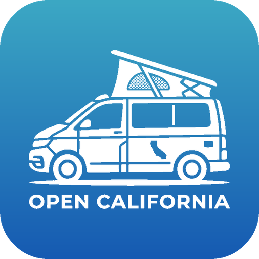
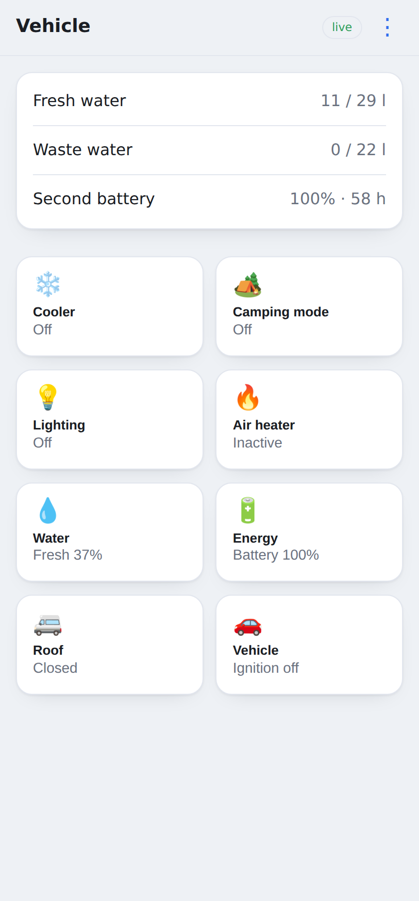
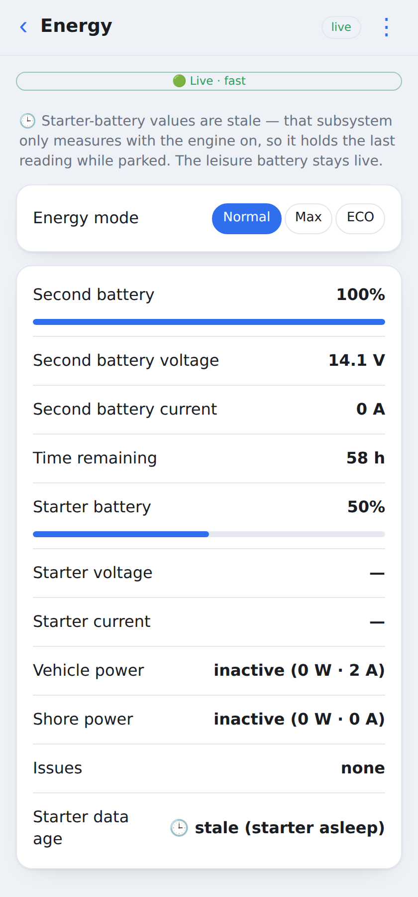
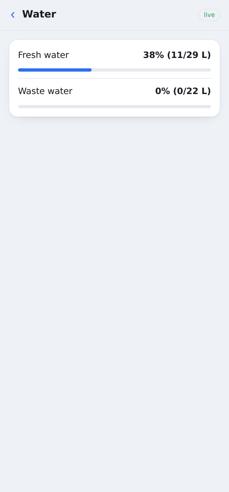

<p align="center">
  
</p>
<h1 align="center">Open California</h1>

<p align="center">
  <b>Run your VW California T7 camper from Linux — every sensor read, every load actuated, over Bluetooth LE.</b>
</p>

<p align="center">
  <a href="https://github.com/ckeller42/open-california/actions/workflows/ci.yml"></a>
  <a href="https://github.com/ckeller42/open-california/actions/workflows/ci.yml"></a>
  <a href="https://ckeller42.github.io/open-california/"></a>
  <a href="https://github.com/ckeller42/open-california/blob/main/pyproject.toml"></a>
  <a href="https://ckeller42.github.io/open-california/architecture.html"></a>
  <a href="https://github.com/ckeller42/open-california/blob/main/LICENSE"></a>
  <br>
  <a href="docs/raspberry-pi-setup.md"></a>
  <a href="docs/firmware.md"></a>
  <a href="calictl/deploy/homeassistant/HOMEASSISTANT.md"></a>
  <a href="calictl/deploy/GRAFANA.md"></a>
</p>

<p align="center">
  📖 <b><a href="https://ckeller42.github.io/open-california/">Detailed documentation</a></b> —
  API reference, requirement traceability, and the <a href="https://ckeller42.github.io/open-california/protocol-sequences.html">protocol sequence diagrams</a>.
</p>

The camper control unit only talks to the vendor's iOS/Android app — so from Linux, Home
Assistant, or a script there's simply no way to see the water level or turn on the fridge.
**Open California** reverse-engineers its Bluetooth-LE protocol into a clean, **stdlib-only**
toolkit: full telemetry, *real* control writes, and a built-in **web UI** — plus first-class
integration with **[Home Assistant](calictl/deploy/homeassistant/HOMEASSISTANT.md)** (MQTT
discovery) and **[Grafana](calictl/deploy/GRAFANA.md)** (via InfluxDB), all self-hosted on a
Raspberry Pi.

<p align="center">
  
  
  
</p>

> 🛑 **Use at your own risk.** It sends control writes to a real vehicle (heaters, roof,
> electrical loads) and can damage it or void your warranty — provided **AS IS, no warranty, no
> liability**. Independent project, **not affiliated with Volkswagen**; no VW binaries, sources,
> manuals, or artwork are distributed. See **[DISCLAIMER.md](DISCLAIMER.md)**.

## What it does

- **Reads everything** — decodes 14 BLE functions (cooler, air-heater, camping mode, lighting,
  energy, water, roof, vehicle state, …) into meaningful signals, cross-validated by a signal
  catalog + coverage guardrail so nothing is silently dropped or mislabeled. Values stay **fresh**
  by holding the unit's `1003` liveness heartbeat during reads ([why, and why water can read a stale
  1 L](https://ckeller42.github.io/open-california/protocol-sequences.html#fresh-state-read-under-heartbeat)):
  the unit reports 1 L whenever it is not measuring, so calictl holds the last good water reading.
- **Actually controls** — `calictl set cooler power on` (camping mode, lighting, roof, …) actuate
  for real, armed by the same `1003` heartbeat that unlocks the firmware's [write gate](https://ckeller42.github.io/open-california/protocol-sequences.html#heartbeat-armed-control-write)
  (lighting, roof, and range-rejection have their own [sequence diagrams](https://ckeller42.github.io/open-california/protocol-sequences.html)).
- **Fits your stack** — one BLE-owning daemon fans out to **InfluxDB/Grafana** and **Home
  Assistant** (MQTT), and serves the web UI above — same process, one link from the Pi. The unit
  serves several Bluetooth clients at once, so the phone app and the ESP32 satellite can stay
  connected alongside it.
- **Guides you through pairing** — a web wizard walks through first-run pairing and re-pair
  (type the passkey shown on the camper's own screen), built on a platform-free pairing state
  machine that the ESP32 satellite runs too (its own page has the same wizard).
- **English or German** — switch the web UI language from the ⋮ menu; it follows the browser
  language on first load and remembers your choice per browser.

## Quickstart

```sh
python3 -m pytest tests/ -q            # test suite — stdlib-only, no BLE/MQTT needed
python3 -m calictl status              # live read of every function (needs BLE; with the daemon up use its /api/state)
python3 -m calictl set cooler power on # actuate (heartbeat-armed); reads back + reports
python3 -m calictl serve --web 8080    # the daemon → InfluxDB + MQTT + web UI at :8080 (read-only)
python3 -m calictl serve --web 8080 --enable-writes   # ...allow control writes to the vehicle
```

No van needed for development: the whole stack runs against a model of the unit (the mock, a Bumble
BLE fake with real passkey pairing, the vendor app in an emulator) — see
**[Simulation and testing](https://ckeller42.github.io/open-california/simulation-and-testing.html)**.

The **daemon is read-only by default** — it will not write to the vehicle until you pass
`--enable-writes` (or set `CALICTL_ENABLE_WRITES=1`), so a stray deploy never actuates anything by
accident. The web UI disables its controls and shows a banner when read-only, and greys out any
control the unit refuses in the current state (with the reason as a tooltip).

Only the standard library is imported at load; `bleak` / `paho-mqtt` / `influxdb_client` load
lazily, only when actually talking to BLE / MQTT / InfluxDB.

## Raspberry Pi

Fresh Pi to a running monitor in one guided step — deps, virtualenv, **BLE pairing**, config, and
the systemd service:

```sh
curl -fsSL https://raw.githubusercontent.com/ckeller42/open-california/main/install.sh | sh
```

Pairing is interactive (type the passkey the camper shows). `sh install.sh --dry-run` previews
every step without changing anything. Full guide: **[Raspberry Pi setup](https://ckeller42.github.io/open-california/raspberry-pi-setup.html)**.
Need to (re-)pair later from the web UI, or after a "Bluetooth zurücksetzen" on the unit? See
**[How to pair your camper](https://ckeller42.github.io/open-california/howto-pair-your-camper.html)**.

> ⚠️ **Known-broken kernel: Raspberry Pi OS 6.18.50.** On the Pi 4's CYW43455 (no controller-side
> LL privacy), kernel 6.18.50 never issues the `LE Create Connection` for a bonded peer that
> rotates its address (RPA): pairing succeeds, but every reconnect fails (`Connect Failed`, and the
> daemon logs `no BLE session … after retries (TimeoutError)` forever). The camper unit rotates its
> address, so calictl is dead on that kernel. Kernel **6.18.34 works** — pin it until a fixed
> kernel is verified. Diagnosis + pin recipe:
> **[Raspberry Pi setup → Known issue](https://ckeller42.github.io/open-california/raspberry-pi-setup.html#known-issue-kernel-6-18-50-breaks-ble-reconnects)**.

## Tested on

- **Vehicle:** VW California **T7** camper control unit, over its vendor BLE GATT service.
- **Equipment installed** on the reference van (varies by van; not-installed functions are
  gated off automatically): cooler, camping mode, water, energy, lighting, air heater, and the
  pop-top roof (live `roof.Installed=1`; its motor has never been driven by this project).
  **Not installed** here — stairs, living-room heater, roof-A/C, satellite, solar; those
  functions are decompile/static-verified only, not live-tested.
- **Control writes live-actuation-verified** on that van: cooler, camping mode, lighting. Air
  heater is installed but not yet verified end-to-end (setters are decompile-verified). The pop-top
  roof is installed but its motor has **never been driven** by this project (its actuation frame is
  decompile-documented). Full per-function verification tiers are in the [hardware reference](https://ckeller42.github.io/open-california/hardware.html).
- **Host:** a Raspberry Pi ("buspi", Debian 13, aarch64), Python 3.13, BlueZ via `bleak`.

Full GATT service/characteristic map, software-version fields, the equipment/verification
tables: **[Hardware reference](https://ckeller42.github.io/open-california/hardware.html)**.

## How it works

- **Stdlib-only at import** — the runtime pulls no third-party packages until it actually needs a
  BLE/MQTT/InfluxDB connection, so tests run anywhere.
- **One BLE owner on the Pi** — a single daemon owns the Pi's shared `hci0` and holds one link to
  the unit, serialized by an `asyncio.Lock`; control writes never race a poll. (The unit itself
  serves several centrals at once — the phone app, the Pi and the ESP32 satellite were connected
  together.)
- **Dictionary-driven** — every field is extracted into [`protocol/dictionary.yaml`](protocol/dictionary.yaml)
  and has a catalog decision in [`protocol/signals.yaml`](protocol/signals.yaml); a dropped or
  unaccounted field **fails CI**. Manual bit offsets live only in [`overrides.py`](calictl/overrides.py).
- **One dictionary, two languages** — the same dictionary also generates the C codec tables in
  [`csrc/`](csrc/) for the ESP32 satellite (`python3 -m tools.gen_c_dict`; **never hand-edit
  `csrc/codec_dict.h`**). Golden vectors + a seeded differential fuzz harness keep the Python and C
  codecs byte-identical in CI (`codec-parity` job) — see [`csrc/README.md`](csrc/README.md).
- **ESP32 satellite** — a NimBLE firmware on an M5Stack CoreS3 that pairs with the camper unit
  independently of the Pi (bonded to the real unit since 2026-10-08, while the Pi stayed connected)
  and controls the fridge, camping mode, lights, air heater and energy mode (the wake-up light too,
  with the web page's clock; not the roof — "only via buspi or the app") with calictl's own frames,
  held byte-identical by golden vectors. It runs the same water guard, serves the same web UI
  (`calictl/webui` is bundled into the firmware), and answers *unconfirmed* when the link drops
  after a frame went out. Tested on a Linux host build + a Bumble fake unit, in Espressif's QEMU, on
  a CoreS3 against the mock unit, and live on the real unit. See **[ESP32 firmware](https://ckeller42.github.io/open-california/firmware.html)**.
  It joins your WiFi through its own setup hotspot and serves a status page and the calictl UI with
  live controls on your home network (never over the setup hotspot) — **[How to put the ESP32 satellite on your WiFi](https://ckeller42.github.io/open-california/howto-esp-wifi-setup.html)**.

- **Evidence from the real app** — the vendor app (CaliforniaOnTour 5.4.0) is a live concurrent
  central too: its HCI snoop log, pulled over wireless adb from the Pi (skill `phone-app-lab`,
  decoders in [`tools/applab/phone/`](tools/applab/phone/)), shows its frames on the real unit. Every
  non-motor control it sent (cooler, lighting, camping mode) is byte-identical to calictl's. Its
  screenshots and the decompile mapping live in a private analysis repository.

New here? Start with **[the architecture map](https://ckeller42.github.io/open-california/architecture.html)** — the five-minute map of the data flow and
where each concern lives. Contributor rules and hard invariants: **[AGENTS.md](AGENTS.md)**.
Reverse-engineering notes (control recipes, the write gate, value-freshness, signal scales):
**[docs/business-logic/](docs/business-logic/)**.

## License

**[MIT](LICENSE)** — covers the original work here ([`calictl`](calictl/) code, tooling, docs); no
VW material is included. No warranty, no liability — see **[DISCLAIMER.md](DISCLAIMER.md)**.
