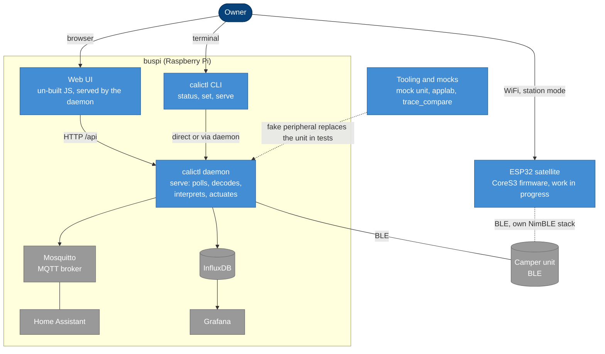
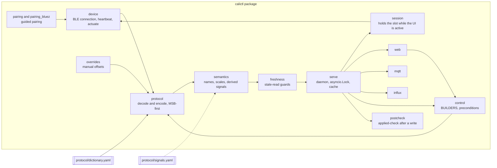

# Strategy and building blocks

## 4 Solution strategy

| Goal | Approach |
|---|---|
| Truthful values | A dictionary-driven codec: `protocol/dictionary.yaml` is the source of truth for bit layout, and manual offsets live only in `overrides.py`. A separate `semantics` layer gives fields meaning, so decode never guesses. |
| Drift is caught | A signal catalog (`protocol/signals.yaml`) records a `surface` or `omit` decision for every field, enforced by `tests/test_signal_coverage.py` and `tools.audit_signals`. |
| Safe actuation | Control frames are built by `control.BUILDERS`, validated by `protocol.encode` against bit widths and curated ranges, and written under the single BLE lock while the `1003` heartbeat ticks. Readback is a write-through echo, so it is never reported as proof. |
| One BLE owner | One daemon (`serve`) owns the connection. The web UI, MQTT and InfluxDB are sinks inside that process. |
| Absent unit | `serve` persists the last state with an "as of" timestamp, and the UI shows an offline banner. `freshness` holds the last plausible value for measurement-gated fields such as water. |
| Evidence over assertion | Every protocol claim carries a verification tier (DEVICE, CAPTURE, DECOMPILE, UNVERIFIED) in the evidence ledger. |

## 5 Building block view

### Level 1: containers

| Container | Technology | Responsibility |
|---|---|---|
| calictl daemon | Python 3.11+, `asyncio`, `bleak` | The single BLE owner. Polls, decodes, interprets, caches, actuates, fans out to the sinks. |
| Web UI | Vanilla JS, no build step, `tsc --checkJs` gate | Dashboard and controls in English and German, served by the daemon. Also served by the ESP satellite. |
| CLI | Python | One-shot reads and writes, `serve`, pairing helpers. Never opens a second connection when the daemon is up. |
| ESP32 satellite | C, NimBLE, ESP-IDF | Independent implementation of pairing, read and a restricted write path, tied to calictl by generated headers and golden vectors. It never talks to buspi. |
| Tooling and mocks | Python, Bumble | The mock unit (a BLE peripheral with real SMP pairing), the real app in an emulator, and a trace comparer. They make the unit reproducible. |

The sinks (Mosquitto, Home Assistant, InfluxDB, Grafana) are deployed next to the daemon but are
off-the-shelf components. They are drawn grey because this repository configures them and does not
implement them.

### Level 2: components of the calictl daemon

Rules that shape these dependencies:

- `protocol` and `semantics` are pure. They import no I/O libraries, which is what lets the whole
  suite run without BLE or MQTT installed.
- Only `device` and `pairing_bluez` touch BLE, and only `serve` creates the `asyncio.Lock` (inside
  the running loop) that serialises every access.
- `semantics` is the one place that gives a field its name and scale. The sinks consume its output
  instead of re-deriving meaning.
- Control reaches the unit only through `control` then `protocol.encode` then `device.actuate`,
  entered via `serve.on_command`. The web layer checks `control.command_precondition` first.

The dictionary-to-sink pipeline, with the guard that fails CI on a dropped field, is drawn in the
[architecture overview](../architecture.md).
