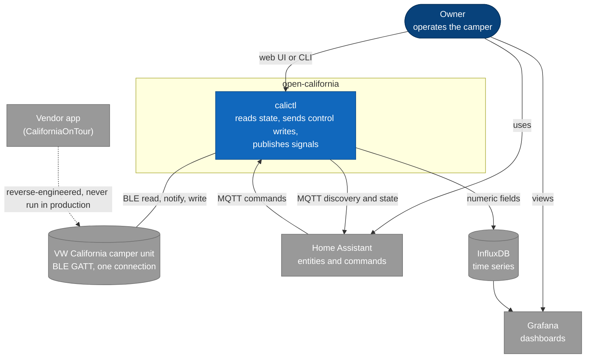

# Goals, constraints and context

## 1 Introduction and goals

`open-california` reads all telemetry of the VW California T7 camper unit over Bluetooth LE and
sends control writes to it, from a Raspberry Pi (`buspi`). It feeds Home Assistant (MQTT) and
Grafana (InfluxDB). It is an independent reverse-engineering project for the owner's own vehicle,
not affiliated with Volkswagen.

**Quality goals**, in priority order:

| # | Goal | What it means here |
|---|---|---|
| 1 | Safe actuation | A control write goes to a real vehicle (heaters, roof, loads). Frames are validated before they are written, and a readback is never taken as proof that something happened. |
| 2 | Truthful values | A signal is shown only with a unit and scale that were verified. Unverified values stay labelled as levels. |
| 3 | Tolerates an absent unit | The parked unit deep-sleeps and stops advertising. Access is intermittent by nature, so the last state is kept with an "as of" time. |
| 4 | One BLE owner | The unit allows one connection and the Pi's adapter is shared, so exactly one daemon talks to it. |
| 5 | Drift is caught | Every protocol field has a recorded decision, and CI fails when one is dropped. |

**Stakeholders:** the vehicle owner (operator and sole user), contributors who extend the protocol
map, and the downstream consumers Home Assistant and Grafana.

## 2 Constraints

| Constraint | Why |
|---|---|
| The unit accepts one BLE connection and `hci0` is shared with other readers | `serve` is the single BLE owner and an `asyncio.Lock` serialises all access |
| Runtime `calictl/*` imports only the standard library at import time | The suite runs with no BLE or MQTT installed. `bleak`, `paho`, `influxdb_client` and `yaml` import lazily |
| The BLE codec is MSB-first and control frames are full-packet | That is how the unit and the vendor app behave. Every field is resent, and unchanged fields carry the leave-unchanged sentinel |
| No vendor material in the repository | The APK, decompiled sources and manuals are never committed. VW material appears as citations only |
| The unit deep-sleeps when parked | Buspi cannot connect for days until physical use wakes it |
| The web UI is un-built JavaScript | `tsc --checkJs` is its hard gate, since no build step would catch an undeclared identifier |
| Runs on a Raspberry Pi with Python 3.11 to 3.13 | The deployment target is buspi |

## 3 Context and scope

The system boundary is the `calictl` daemon plus its optional ESP32 satellite. Everything else is
an external neighbour.

| Neighbour | Interface | Direction |
|---|---|---|
| Camper unit | BLE GATT characteristics, `1003` liveness heartbeat for writes | read and write |
| Home Assistant | MQTT discovery, state topics and command topics via Mosquitto | publish and subscribe |
| InfluxDB and Grafana | `influx.numeric_fields` written to a bucket, queried by dashboards | write only from here |
| Vendor app | none at runtime. It is the reference the protocol was reverse-engineered from, and the lab replays its frames against calictl | evidence only |
| Owner | web UI (`--web`, port 8088 on buspi), CLI, guided pairing wizard | both |

**Out of scope:** vehicle functions the unit does not expose, and any VW-owned code or assets.
Stairs, living-room heater, roof air conditioner, satellite dish and solar are decoded but not
installed on the reference van, so they are verified statically only.
