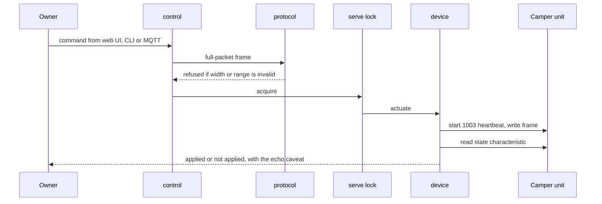
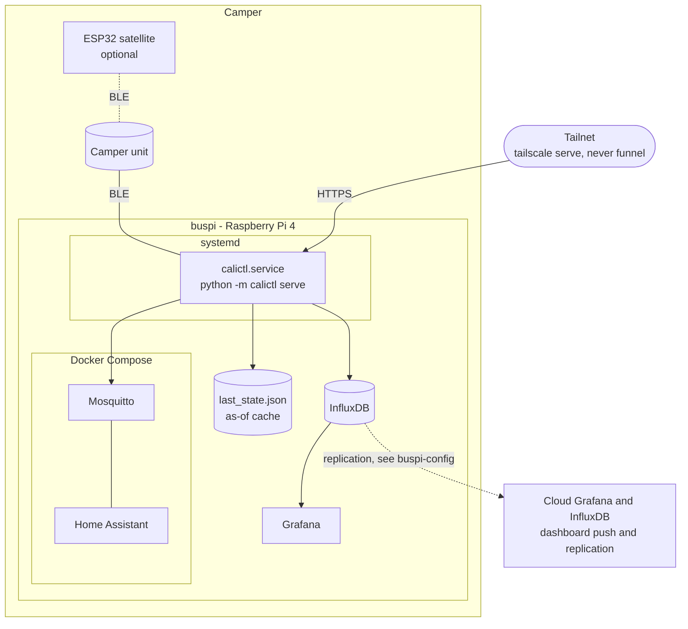

# Runtime and deployment

## 6 Runtime view

The wire-level flows are maintained as sequence diagrams that link to the requirement each one
depicts, so they are not repeated here. Read them in [Protocol sequences](../protocol-sequences.rst):

| Scenario | What it shows |
|---|---|
| Connect handshake | connect, subscribe to all characteristics, first read |
| Heartbeat-armed write | the `1003` heartbeat spanning one control write |
| Lighting | the bare brightness write and its commit frame on an awake unit |
| Roof | press-and-hold streaming and the release stop |
| Range rejection | a value refused by `protocol.encode` before anything is written |

Two runtime behaviours matter for every scenario:

- **Poll cycle.** `serve` takes the lock, reads every function, decodes, interprets, caches the
  result with its "as of" time, and fans out to the sinks. A control write takes the same lock, so
  a write never races a poll.
- **Session.** While the web UI is active a persistent session holds the BLE slot and releases it
  after about 25 seconds idle. A roof move runs inside a live session so there is never a second
  connection.

The control write path:

## 7 Deployment view

| Node | What runs there | Notes |
|---|---|---|
| buspi | the `calictl serve` unit, Mosquitto and Home Assistant containers, InfluxDB, Grafana | `serve` runs under a virtualenv, and the installed unit adds `--web 8088` through a `systemctl edit` drop-in rather than the committed template. Secrets live in root-only files under `/etc/buspi/`. |
| Camper unit | the vehicle's own firmware | Deep-sleeps when parked, so buspi cannot connect for days until physical use wakes it. |
| ESP32 satellite | independent firmware on a CoreS3 | Joins WiFi through a setup hotspot and serves the same web UI. It writes only in station mode, through a single allow-list, and never the roof. |
| Tailnet | `tailscale serve` in front of the web UI | Tailnet only. `funnel` (public) is never used. |
| Cloud | Grafana Cloud and InfluxDB Cloud | The dashboard JSON is pushed to both the Pi and the cloud with `push_dashboard.py`. Dashboards do not update on their own. |

The shared Pi's own deployment (readers, replication, watchdogs, logging) is documented in the
sibling [buspi-config](https://github.com/ckeller42/buspi-config) repository. This repository owns
only the camper-unit part.
