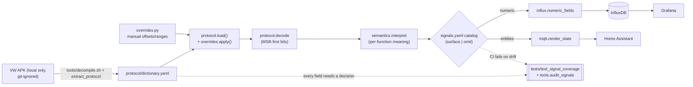
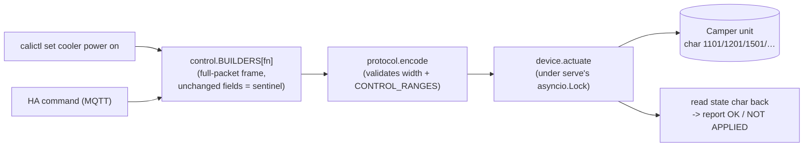
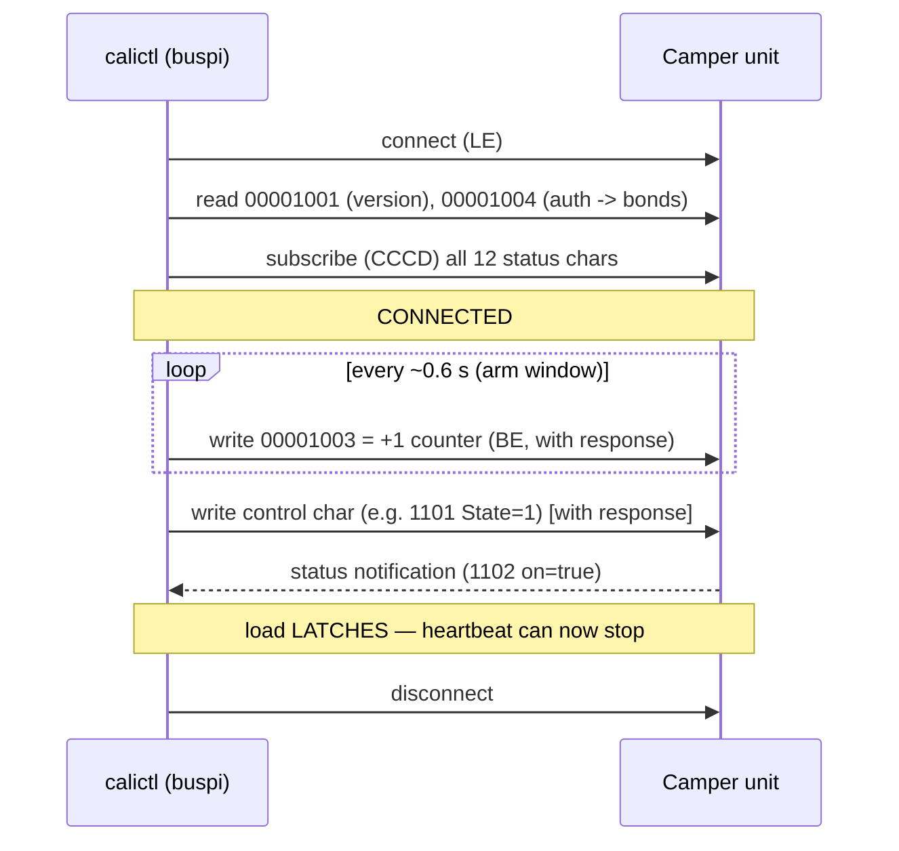

# Architecture

How a byte on the wire becomes a Grafana point / Home-Assistant entity, and how a
`set` becomes an actuation. Source of truth for bit layout is `protocol/dictionary.yaml`;
surface/omit decisions live in `protocol/signals.yaml`.

## Data pipeline

The **coverage guardrail** (`test_signal_coverage.py`) enforces three invariants in CI:
every dictionary field has a catalog decision; every *surfaced* state field is emitted by
semantics; every *surfaced* control field is placed. A dropped or mislabeled signal fails CI.

## Control path (`calictl set` / HA command)

## BLE connect + actuate (the arm sequence)

The firmware ignores control writes unless a **liveness heartbeat** is ticking on char
`00001003` (issue #2). Actuation is **one-shot arm**: the load latches, so the heartbeat only
spans the write window — `serve` did not need a persistent-connection redesign.

```mermaid
stateDiagram-v2
  [*] --> Disconnected
  Disconnected --> Connected: connect + handshake + subscribe-all
  Connected --> Armed: start 1003 heartbeat (+1 BE @0.6s)
  Armed --> Written: write control frame (with response)
  Written --> Latched: unit acts; load holds
  Latched --> Idle: stop heartbeat + disconnect
  Idle --> [*]
  note right of Latched: one-shot arm, NOT a deadman —\nload stays on after heartbeat stops
```

## Runtime invariants (see CLAUDE.md)

- **stdlib-only at import** — `bleak`/`paho`/`influxdb_client`/`yaml` are imported lazily
  inside functions; `import calictl.*` stays cheap and offline-safe (CI asserts this).
- **single BLE owner** — one daemon holds the vehicle's single connection slot; an
  `asyncio.Lock` created inside `serve.run()`'s loop serializes `poll` and `on_command`, so a
  control write never races a poll.
- **full-packet control frames** — resend every field; unchanged fields carry the
  leave-unchanged sentinel. `protocol.encode` validates each value against its bit-width and a
  curated semantic range before the frame is sent.
