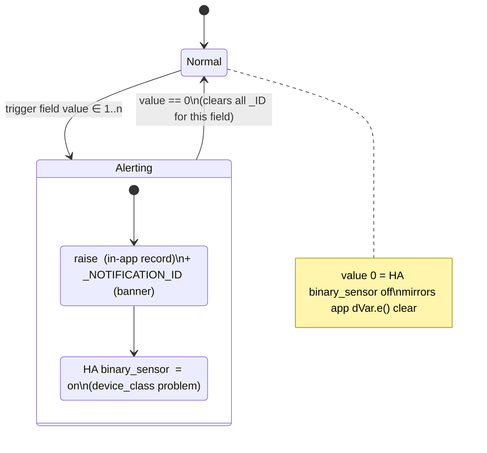

# CaliforniaOnTour Alert / Notification States

Reverse-engineered from the decompiled VW CaliforniaOnTour app (JADX output). This catalogs the
**discrete alert/warning/error events** the camper-unit BLE functions raise — distinct from the
continuous state fields documented in the sibling `business-logic/*.md` files (which cover the
*controllable* fields: Level, Mode, timers, etc.). Every alert here is a **derived, edge-triggered
event**: it fires when a decoded state field crosses into an "abnormal" value, and is explicitly
cleared when the field returns to normal — it is not itself part of the BLE control frame.

Source root for all `file:line` citations:
`.../scratchpad/decompile/src/sources`

Cross-ref: `protocol/dictionary.yaml` (this repo) for the raw bit offsets of the trigger fields.

## 1. Delivery architecture (applies to every alert below)

Each alert is raised through a common pipeline, visible identically in every feature class:

- **`new ym.e("<ID>", severity, ...)`** — registers/updates an **in-app alert record**
  (deep-links to `californiaontour://app/...`), passed to a `bn.d` sink (`dVar.a(...)`). Calling
  `dVar.e("<ID>")` **clears** the same record when the underlying condition goes away.
- **`new ue.b("<ID>_NOTIFICATION_ID", ...)`** — registers/clears a **push/banner notification**,
  passed to a `se.a` sink (`aVar.a(...)` / `aVar.b("<ID>_NOTIFICATION_ID")` to clear). This fires
  in parallel with the in-app alert, on every poll, regardless of whether the in-app alert has
  already been shown (used for the OS notification banner / lock screen).
- A **dedup guard** (`((g) eVar).c().<flag>` reading a `wp.b` bag of sticky booleans local to the
  app, e.g. `rf/b.java:469` `c().f28362v`) suppresses re-raising the in-app dialog if it's already
  been shown once for the current fault occurrence — the push notification is not deduped this
  way, so it can repeat.
- **Severity** — `ym.g` enum (`ym/g.java`): `CRITICAL(0)`, `URGENT(1)`, `HIGH(2)`, `MEDIUM(3)`,
  `LOW(4)` (field names `f31206x/f31207y/X/Y/Z` respectively — the constant names are
  counter-intuitive, verified from the enum's own string literals). This is the severity of the
  **in-app** alert record.
- **Push-channel severity** — separately, `ue.a` enum (`ue/a.java`): `ERROR(0)`, `WARNING(1)`,
  `INFO(2)` — used only for the notification-banner call, and does not always match the in-app
  `ym.g` severity for the same event (e.g. Cooler `ERROR` is in-app `HIGH` but the two surfaces
  it comes from disagree on push severity — see Cooler section).
- **Delivery mode** — `ym.c` enum (`ym/c.java`): `NONE(0)`, `ONLY_APP_IN_BACKGROUND(1)`,
  `ALWAYS(2)` — chosen per-alert via a user-notification-preference lookup
  (`kVar.h(l.f24997x)` / `kVar.h(l.f24998y)`, two different preference keys seen across features;
  exact end-user label UNVERIFIED).
- **`_CONFIRMED` / `_INTERACTED` constants** (`BLUETOOTH_<ALERT>_CONFIRMED`,
  `BLUETOOTH_<ALERT>_INTERACTED`, plus one `EXLAP_COOLER_ERROR_INTERACTED`) are a **separate,
  local-BLE-only ack channel** (matches the "VW EXLAP light-profile" local-connection mode noted
  in `lighting-energy-water-sat-roof.md`) — analytics-style events fired when the user
  acknowledges an alert while connected directly over Bluetooth (as opposed to the
  backend/MQTT-style channel the `_ID`/`_NOTIFICATION_ID` pair above uses). Full trigger-site trace
  UNVERIFIED — not exercised in this pass; listed for completeness in §7.

Some alert families have **two independent trigger sites** producing the same `_ID` — one in the
feature's primary widget class (route `californiaontour://app/<feature>`), and one in a secondary
"vehicle dashboard" summary class (route `californiaontour://app/vehicle`, package prefixes
`fh.`/`hh.`/`mh.`). Both read the same underlying decoded state field; they exist because the
dashboard aggregates multiple features into one summary card. Documented as "primary" / "secondary
(dashboard)" below.

Every alert is **edge-triggered off one decoded trigger field**: value 0 clears every `_ID` for
that field; value ∈ 1..n raises the mapped `<ID>` (in-app record) **and** `<ID>_NOTIFICATION_ID`
(banner) in parallel. A Home Assistant `binary_sensor` mirrors it directly — `on` at the alert
value, `off` at 0 — no extra debounce (see §13).

---

## 2. Cooler (fridge)

Trigger field: **`Error`**, dictionary `cooler.state_fields[Error]` — `offset: 0, width: 2` (raw
range 0-3). Decoded in `vf/c.java:420-424` (`aVar19` = `f27285n0`), dispatch at
`vf/c.java:423-567`.

| Value | Alert ID | Meaning | Severity (in-app / push) | Confirmable |
|---|---|---|---|---|
| 0 | *(clears all three)* | No error | — | — |
| 1 | `COOLER_ERROR_ID` | Generic cooler error | HIGH / ERROR (`vf/c.java:451`) | `COOLER_ERROR_NOTIFICATION_ID` |
| 2 | `COOLER_EMERGENCY_OPERATION_ID` | Fridge running in emergency/degraded operation mode | MEDIUM / WARNING (`vf/c.java:493`) | `COOLER_EMERGENCY_OPERATION_NOTIFICATION_ID` |
| 3 | `COOLER_DOOR_OPEN_ID` | Fridge door open (unclosed) | MEDIUM / WARNING (`vf/c.java:537`) | `COOLER_DOOR_OPEN_NOTIFICATION_ID` |

**Secondary (dashboard) surface**, `fh/a.java:345-374` — same physical device, a different local
enum (`iOrdinal` of a `c` enum compared against `cVar2`/`cVar3` sentinels) drives:

| Ordinal | Alert ID | Severity | Cite |
|---|---|---|---|
| 1 | `COOLER_ERROR_ID` | **MEDIUM** (differs from primary's HIGH) | `fh/a.java:353` |
| 2 | `COOLER_ERROR_SENSOR_ID` | MEDIUM | `fh/a.java:363` |

`COOLER_ERROR_SENSOR_ID` has no primary-surface counterpart — UNVERIFIED whether it's a second
physical cooler zone or a sensor-fault sub-case of the same `Error` field folded in only on the
dashboard. Flagged UNVERIFIED.

---

## 3. AirHeater (parking heater)

Trigger field: **`ErrorCode`**, dictionary `airheater.state_fields[ErrorCode]` — `offset: 12,
width: 4` (raw range 0-15, only 0-5 used). Decoded at `rf/b.java:441` (`aVar19` =
`f23031i0`), dispatch at `rf/b.java:446-711`.

| Value | Alert ID | Meaning | Severity | Confirmable |
|---|---|---|---|---|
| 0 | *(clears all five + sets sticky "deactivated" flag)* | No error | — | — |
| 1 | `AIR_HEATER_LOW_BATTERY_ID` | Vehicle/heater battery too low to operate | HIGH / ERROR (`rf/b.java:473`) | `AIR_HEATER_LOW_BATTERY_NOTIFICATION_ID` |
| 2 | `AIR_HEATER_FUEL_LOW_ID` | Fuel level too low to run heater | HIGH / ERROR (`rf/b.java:522`) | `AIR_HEATER_FUEL_LOW_NOTIFICATION_ID` |
| 3 | `AIR_HEATER_SYSTEM_ERROR_ID` | Generic heater system fault | HIGH / ERROR (`rf/b.java:571`) | `AIR_HEATER_SYSTEM_ERROR_NOTIFICATION_ID` |
| 4 | `AIR_HEATER_HEATING_TIME_EXCEEDED_ID` | Continuous-run time limit exceeded (plausibly EU emissions/runtime cap — see `cooler-airheater.md`) | HIGH / ERROR (`rf/b.java:620`) | `AIR_HEATER_HEATING_TIME_EXCEEDED_NOTIFICATION_ID` |
| 5 | `AIR_HEATER_OPERATION_NOT_POSSIBLE_ID` | Heater cannot start (precondition not met) | HIGH / ERROR (`rf/b.java:671`) | `AIR_HEATER_OPERATION_NOT_POSSIBLE_NOTIFICATION_ID` |

All five share `ym.g.X` = **HIGH** in-app severity, uniformly. `h()` (`rf/b.java:718-722`) derives
a general "problem" boolean: `ErrorCode == 5 || (everSeenDeactivated && 1 ≤ ErrorCode < 5)`.

---

## 4. Energy

Trigger fields per dictionary `energy.state_fields` — all single-bit flags on a 16-bit word
(bits 0-7 fault/status, bits 8-15 fault/installed), decoded in `yf/a.java` and consumed via
`xf/a.java`/`xf/d.java` (primary) and `gh/a.java` (older/duplicate widget class, still shipped).

### Primary (`xf/d.java`, `xf/a.java`)

| Alert ID | Trigger field (dictionary name, offset) | Meaning | Severity | Cite |
|---|---|---|---|---|
| `ENERGY_SECOND_BATTERY_NOT_CHARGED_ID` | `TwoBattNotCharged` (offset 7) | Second/leisure battery not charging | URGENT | `xf/d.java:516-526` |
| `ENERGY_SECOND_BATTERY_SWITCH_AT_CHARGING_ID` | `TwoBattSwitchAtCharging` (offset 6) | Battery isolator switch set to "at charging" position | URGENT | `xf/d.java:505-515` |
| `ENERGY_SECOND_BATTERY_SWITCH_AT_WORKSHOP_ID` | `TwoBattSwitchAtWorkshop` (offset 5) | Battery isolator switch set to "workshop" position | URGENT | `xf/d.java:483-493` |
| `ENERGY_WARNING_LEVEL_ACTIVE_ID` | `WarningLevelActive` (offset 4) | Leisure-battery low-charge warning level reached | CRITICAL | `xf/a.java:437-444` |
| `ENERGY_DC_DC_DEFECT_ID` | `DcdcDefect` (offset 3) | DC/DC converter fault | HIGH | `xf/d.java:429-445` |
| `ENERGY_SHORE_POWER_DEFECT_ID` | `LandDefect` (offset 1, "Land" = shore/land power) | Shore-power (hookup) circuit fault | HIGH | `xf/d.java:549-566` |
| `ENERGY_SHORE_POWER_NOT_AVAILABLE_ID` | `LandNotAvailable` (offset 0) | No shore power detected when expected | HIGH | `xf/d.java:567-577` |
| `ENERGY_PHOTOVOLTAICS_DEFECT_ID` | `PvDefect` (offset 15) | Solar/PV charging circuit fault | HIGH | `xf/d.java:447-463` |
| `ENERGY_SLEEP_WARNING_ID` | `SleepWarning` (offset 14) | Battery-management "sleep" protection warning | CRITICAL | `xf/a.java:445-449` |
| `ENERGY_CURRENT_DERATING_TEMPERATURE_ID` | `CurrentDeratingTemperature` (offset 13) | Charge current reduced due to temperature | HIGH | `xf/d.java:494-504` |
| `ENERGY_SYSTEM_ERROR_ID` | `SystemError` (no offset in extraction — inferred bit 12) | Generic energy-system fault | HIGH | `xf/d.java:465-482` |
| `ENERGY_SECOND_BATTERY_WARN_LEVEL_TWO_ID` | Computed: `WarningLevelActive` true **and** none of DC/DC-, PV-, shore-power-installed flags report "not installed" (`xf/d.java:527-541`, `m()` helper `xf/d.java:590-600`) | Second-stage low-battery warning (worse than `WARNING_LEVEL_ACTIVE`) | URGENT | `xf/d.java:527-541` |

### Secondary/older (`gh/a.java`) — same underlying fields, different widget

| Alert ID | Trigger | Severity | Cite |
|---|---|---|---|
| `ENERGY_LOW_BATTERY_WARNING_ID` | `WarningLevel2 == "WarnLevel2"` (string-keyed field, not a raw bit — different decode path than `xf/*`) | URGENT | `gh/a.java:488-501` |
| `ENERGY_POWER_REDUCTION_ID` | `PowerReduction` boolean | CRITICAL | `gh/a.java:507-511` |
| `ENERGY_CABLE_STILL_CONNECTED_ID` | `this.Q0` (derived from a `"Warning"` boolean field) | CRITICAL | `gh/a.java:512-516` |

UNVERIFIED whether `gh/a.java` is dead/legacy code still wired into the notification pipeline or
superseded entirely by `xf/d.java` — both are present in the same build and both call the same
`bn.d`/`se.a` sinks, so if both are live, `ENERGY_LOW_BATTERY_WARNING_ID` could double-fire from
two different decode paths.

---

## 5. FreshWater / UsedWater

Trigger fields, dictionary `water.state_fields`, both decoded in the shared `rg.a` struct
(`rg/a.java`) and consumed by `qg/b.java`:

- **FreshWater**: `FreshWaterInfoPopUp`, `offset: 0, width: 4` (`rg/a.java` field `c`, wired at
  `qg/b.java:207`). Dispatch `qg/b.java:275-358`.
- **UsedWater** (waste water): `WasteWaterInfoPopUp`, `offset: 26, width: 2` (`rg/a.java` field
  `g`). Dispatch `qg/b.java:360-412`.

### FreshWater (`FreshWaterInfoPopUp` value → alert)

| Value | Alert ID | Meaning | Severity | Cite |
|---|---|---|---|---|
| 0 | *(clears all five)* | No error | — | `qg/b.java:281-294` |
| 1 | `FRESH_WATER_PUMP_PROTECTION_ERROR_ID` | Pump-protection cutoff engaged (dry-run guard) | MEDIUM | `qg/b.java:298-307` |
| 2 | `FRESH_WATER_ERROR_SENSOR_ID` | Level-sensor fault | MEDIUM | `qg/b.java:309-318` |
| 3 or 7 | `FRESH_WATER_GENERIC_ERROR_ID` | Generic/unclassified fault | MEDIUM | `qg/b.java:346-356` |
| 4 | `FRESH_WATER_ERROR_PUMP_ID` | Pump fault | MEDIUM | `qg/b.java:320-330` |
| 5 | `FRESH_WATER_EMPTY_TANK_ID` | Tank empty | MEDIUM | `qg/b.java:332-344` |

### UsedWater (`WasteWaterInfoPopUp` value → alert)

| Value | Alert ID | Meaning | Severity | Cite |
|---|---|---|---|---|
| 0 | *(clears all three)* | No error | — | `qg/b.java:366-375` |
| 1 | `USED_WATER_FULL_ID` | Waste tank full | MEDIUM | `qg/b.java:379-388` |
| 2 | `USED_WATER_ERROR_SENSOR_ID` | Level-sensor fault | MEDIUM | `qg/b.java:390-399` |
| 3 | `USED_WATER_ERROR_ID` | Generic fault | MEDIUM | `qg/b.java:401-410` |

**Secondary (dashboard) surfaces** — same fields, renamed/regrouped IDs, route
`californiaontour://app/vehicle`:

- FreshWater: `hh/d.java:128-250`, driven by an enum ordinal (`this.f11684h0`, a `b`-typed enum,
  6 cases) → `FRESH_WATER_PUMP_PROTECTION_ERROR_ID`, `FRESH_WATER_EMERGENCY_OPERATION_ERROR_ID`
  (no primary-surface equivalent — plausibly fires on the same condition as `EMPTY_TANK`'s
  fallback pump behavior; UNVERIFIED), `FRESH_WATER_ERROR_ACTIVE_ID` (generic "any error active"
  roll-up), `FRESH_WATER_PUMP_ERROR_ID`, `FRESH_WATER_ERROR_ID`.
- UsedWater: `mh/c.java:120-330`, same shape → `USED_WATER_FULL_ERROR_ID`,
  `USED_WATER_SENSOR_ERROR_ID`, `USED_WATER_ERROR_ACTIVE_ID`, `USED_WATER_GENERIC_ERROR_ID`.

Exact enum-ordinal → dictionary-value mapping for the dashboard surfaces is UNVERIFIED (the enum
class itself wasn't traced in this pass); treat the primary (`qg/b.java`) mapping above as
authoritative for HA purposes, and the dashboard IDs as likely-duplicate aliases of the same
underlying fault.

---

## 6. RoofAirCondition

Trigger field: **`Error`**, dictionary `roofaircondition.state_fields[Error]` — `offset: 0, width:
2`. Decoded `kg/b.java:228-232` (`aVar7` = `f15681h0`), dispatch `kg/b.java:231-291`.

| Value | Alert ID | Meaning | Severity | Cite |
|---|---|---|---|---|
| 0 | *(clears both)* | No error | — | `kg/b.java:236-243` |
| 1 | `ROOF_AIR_CONDITION_NO_POWER_SUPPLY_ID` | No 230V/power supply detected for the roof AC | MEDIUM | `kg/b.java:247-279` |
| 2 | `ROOF_AIR_CONDITION_ERROR_AC_ID` | Generic AC unit fault | MEDIUM | `kg/b.java:281-291` |

---

## 7. LivingRoomHeater (Truma-style water/air heater)

Trigger field: **`Error`**, dictionary `livingroomheater.state_fields[Error]` — `offset: 8, width:
4`. Decoded `fg/b.java:291-295` (`aVar10` = `f8232k0`), dispatch `fg/b.java:294-462`.

| Value | Alert ID | Meaning | Severity | Cite |
|---|---|---|---|---|
| 0 | *(clears all four)* | No error | — | `fg/b.java:299-310` |
| 1 | `LIVING_ROOM_HEATER_ERROR_HEATER_ID` | Generic heater fault | HIGH | `fg/b.java:314-357` |
| 2 | `LIVING_ROOM_HEATER_GAS_EMPTY_ID` | Gas supply empty | HIGH | `fg/b.java:359-402` |
| 3 | `LIVING_ROOM_HEATER_FUEL_EMPTY_ID` | Diesel/fuel supply empty | HIGH | `fg/b.java:404-...` |
| 4 | `LIVING_ROOM_HEATER_WINDOW_OPEN_ID` | Window/vent open interlock (safety cutoff) | HIGH | `fg/b.java:448-461` |

Note: this is a combined gas+diesel heater (dictionary shows `StateAir`/`StateWater` and a shared
`Mode`), so `GAS_EMPTY` and `FUEL_EMPTY` are mutually-exclusive-by-configuration alerts on the
same `Error` field, not simultaneous conditions.

---

## 8. Stairs (retractable entry step)

Trigger field: **`InfoPopUp`**, dictionary `stairs.state_fields[InfoPopUp]` — `offset: 2, width:
2`. Decoded `og/b.java:187` (`aVar6` = `f20521i0`), dispatch `og/b.java:189-...`.

| Value | Alert ID | Meaning | Severity | Cite |
|---|---|---|---|---|
| 0 | *(clears both)* | No error | — | `og/b.java:194-201` |
| 1 | `STAIRS_STEPS_OR_SENSOR_JAMMED_ID` | Step mechanism or its sensor jammed | MEDIUM | `og/b.java:205-...` |
| 2 | `STAIRS_CONTROL_DENIED_ID` | Movement command rejected (precondition not met, e.g. door state) | MEDIUM | `og/b.java:...-253` |

---

## 9. SatelliteAntenna

Trigger field: **`Error`**, dictionary `satelliteantenna.state_fields[Error]` — `offset: 0, width:
4`, decoded into a `kf.a` enum (8 named cases) rather than raw ints. Dispatch
`mg/f.java:437-...`, `switch (((kf.a) i1Var4.getValue()).ordinal())`.

| Ordinal | Alert ID | Meaning | Severity | Confirmable |
|---|---|---|---|---|
| 0 | *(clears all seven)* | No error | — | — |
| 1 | *(no persistent `_ID`, banner only)* `SATELLITE_ANTENNA_SATELLITE_NO_CONNECTION_NOTIFICATION_ID` | Transient "no connection yet" state | — / ERROR | `mg/f.java:465` |
| 2 | `SATELLITE_ANTENNA_SATELLITE_NOT_FOUND_ID` | Satellite signal not found | MEDIUM | `mg/f.java:467-...` |
| 3 | `SATELLITE_ANTENNA_IGNITION_IS_ON_ID` | Antenna disabled while ignition on (drive interlock) | MEDIUM | `mg/f.java:...` |
| 4 | `SATELLITE_ANTENNA_MECHANIC_ISSUE_ID` | Mechanical fault (dish motor/gearing) | MEDIUM | `mg/f.java:...` |
| 5 | `SATELLITE_ANTENNA_LOW_VOLTAGE_ID` | Supply voltage too low to operate | MEDIUM | `mg/f.java:...` |
| 6 | `SATELLITE_ANTENNA_HIGH_TEMPERATURE_ID` | Overtemperature protection | MEDIUM | `mg/f.java:...` |
| 7 | `SATELLITE_ANTENNA_NO_TRANSPONDER_FOUND_ID` | No transponder/receiver box detected | MEDIUM | `mg/f.java:...` |
| 8 | `SATELLITE_ANTENNA_ANTENNA_USED_BY_OTHER_SYSTEM_ID` | Antenna control claimed by another system (contention) | MEDIUM | `mg/f.java:...-812` |

All persistent alerts (ordinals 2-8) share `ym.g.Y` = MEDIUM. `DIALOG_SAT_SYSTEM_STARTING_ID`
(separate constant, not traced) is a UI-only "system is booting" dialog, not an alert.

---

## 10. CampingMode

`CAMPING_MODE_BLOCKED_ID` — raised from a Compose UI layer (`ut/hf.java:37-90`), gated on a
boolean flow (`wh.c.f28276k0`) rather than a raw bit read inline in this file — the upstream
source of that boolean was not traced fully in this pass (UNVERIFIED exact field; plausibly tied
to `campingmode.state_fields[Enable]`/`Installed`, or a vehicle-side interlock such as door-open /
ignition-on, since Camping Mode enables 12V loads that shouldn't run while driving). Severity
HIGH (`ym.g.X`, `ut/hf.java:84`). Cleared at `ut/hf.java:89` when the blocking condition ends.

---

## 11. Roof lift (pop-top) safety interlocks — cross-cutting, own-vehicle only

These three do **not** belong to `roofaircondition` (that's the roof-mounted air conditioner);
they belong to the **pop-top roof lift mechanism**, service `0x1400`/char `0x1401`
(`jg/a.java`, control fields `Up`/`Down`/`SafetyCounter` — listed as
`control_models_unresolved` in `protocol/dictionary.yaml` since no matching state-side function
was resolved there). The alert dispatch class is `ij/c.java` (`hj.c` at runtime), which collects
three separate boolean flows:

| Alert ID | Meaning | Trigger (as read in `ij/c.java`) | Cite |
|---|---|---|---|
| `ROOF_TERMINAL15_ID` | Roof-lift blocked because ignition ("Terminal 15") is on | boolean flow, raised when **not** `z11` | `ij/c.java:88-98` |
| `ROOF_SAFETY_COUNTER_HAS_ERROR_ID` | Roof-lift safety counter reports an error state | `cVar2.f11724e0.e() == te.i.X` | `ij/c.java:100-111` |
| `ROOF_SPEEDLOCK_ID` | Roof-lift locked because vehicle speed exceeds threshold | boolean flow, raised when `z14` true | `ij/c.java:112-123` |

These map onto `protocol/dictionary.yaml`'s `control_models_unresolved` entry for `jg/a.java`
(service 1400/1402) — **this file confirms that service does have a resolvable state/alert
surface** even though its control-side field layout is still ambiguous; worth a follow-up pass to
resolve `jg/a.java`'s read-back characteristic directly.

### Roof pop-top fault alerts — char `1402`, `ig/c.java` (a SECOND roof alert surface)

Distinct from the `ij/c.java`/`hj.c` interlocks above. The roof-lift status char `0x1402`
decodes `SafetyCounterValid` bit 7, `Installed` bit 6, `Position` bits 0-3, and **`InfoPopUp`
bits 12-15** (`ig/c.java:241-246`). Dispatch `switch(InfoPopUp)` (`:311-638`):

| InfoPopUp | Alert `_ID` | In-app sev | Ack pref key |
|---|---|---|---|
| 0 | (clears all 6) | — | — |
| 1 | ROOF_CHILD_LOCK | MEDIUM | BLUETOOTH_ROOF_CHILD_LOCK_CONFIRMED |
| 4 | ROOF_ERROR | HIGH | BLUETOOTH_ROOF_ERROR_WORKSHOP |
| 5 | ROOF_OP_DRIVING | **CRITICAL** | (in-app only, every poll) |
| 6 | ROOF_SENSOR_ERROR | HIGH | BLUETOOTH_ROOF_ERROR_SENSOR_CONFIRMED |
| 7 | ROOF_EMERGENCY_LOCKED | HIGH | BLUETOOTH_ROOF_EMERGENCY_LOCKED_CONFIRMED |
| 10 | ROOF_NOT_POSSIBLE_TEMPORARILY | HIGH | BLUETOOTH_ROOF_NOT_POSSIBLE_TEMP |
| 11 | ROOF_LOW_BATTERY | HIGH | BLUETOOTH_ROOF_LOW_BATTERY_CONFIRMED |

`ROOF_ERROR`/`ROOF_NOT_POSSIBLE_TEMPORARILY`/`ROOF_OP_DRIVING` are wholly new IDs. Two ack keys
lack the `_CONFIRMED` suffix (`..._NOT_POSSIBLE_TEMP`, `..._ERROR_WORKSHOP`), which is why a
`_CONFIRMED`-only grep missed them. (Severity `f29352x`=CRITICAL resolves only in the BAD root;
CLEAN renumbered it.) This **resolves** the four `BLUETOOTH_ROOF_*_CONFIRMED` ack constants that
were previously UNVERIFIED here — they pair with these `1402` `InfoPopUp` values. The `1402`
`InfoPopUp` layout is worth adding to `dictionary.yaml` (still listed `control_models_unresolved`).

---

## 12. Cross-cutting / general

| Alert ID | Meaning | Trigger | Severity | Cite |
|---|---|---|---|---|
| `CLOCK_OUT_OF_SYNC_ID` | Camper's onboard clock (Year/Month/Day/Hour/Min/Sec fields, `general` service) disagrees with phone/app time | Fires when **\|phone − camper clock\| > 5 min** (UTC), or unconditionally if the car-time object is null (`bad/sources/zf/d.java:235,242-248`; unit `n20/d.java:42` = MINUTES); dispatched from `h(List)` `zf/d.java:352-361`. Car clock = general `0x1004` `CarTime*` fields. | LOW | `zf/d.java:352-361` |
| `LEVELING_OVER_SPEED_ID` | Level-indicator (bubble level) screen warns leveling is unsafe/inaccurate above some vehicle speed | Compose UI boolean flow, gated on a "vehicle over speed" condition — **not** a camper-protocol field, this is core-vehicle speed (own-vehicle interop, not BLE camper unit) | HIGH | `ut/qa.java:78-97` |

Not real vehicle alerts (excluded from the catalog, noted for completeness since they matched the
enumeration regex): `MODULE_ID`, `ACCESSIBILITY_CLICKABLE_SPAN_ID`, `UNEXPECTED_FLEXIBLE_TYPE_ID`
(decoder-internal fallback/exception marker), `DIALOG_SAT_SYSTEM_STARTING_ID` (transient "booting"
dialog, not a fault).

---

## 13. How a Home Assistant integration should surface these

- **One `binary_sensor` per numbered alert `_ID`** above (device_class `problem`), `on` when the
  triggering field/value is in its "alert" state, `off` at value 0/none — mirrors exactly how the
  app itself clears the record (`dVar.e("<ID>")`), so there's no extra debounce/hysteresis logic
  to reinvent.
- Where a family shares **one mutually-exclusive integer field** (Cooler `Error`, AirHeater
  `ErrorCode`, RoofAirCondition `Error`, LivingRoomHeater `Error`, Stairs `InfoPopUp`,
  SatelliteAntenna `Error`), it's cleaner in HA to expose **both**: (a) a single
  `sensor.<feature>_fault_code` (enum/text state = the alert name, `"none"` when clear) for a
  single source of truth, **and** (b) derived `binary_sensor`s per alert for automations/dashboards
  that want a simple on/off — computed client-side from (a), not by tracking each `_ID` name
  independently, since they can never be simultaneously true within one feature.
- Energy is different: its alerts are **independent boolean flags**, not a mutually-exclusive
  code — model each as its own `binary_sensor` directly off the corresponding `state_fields` bit
  (`TwoBattNotCharged`, `DcdcDefect`, `PvDefect`, `LandDefect`, `LandNotAvailable`,
  `CurrentDeratingTemperature`, `WarningLevelActive`, `SleepWarning`) — several can be true at
  once (e.g. shore power defect + PV defect simultaneously).
- Use `ym.g` severity (§1) to set HA's `entity_category`/icon priority, not `ue.a` — the in-app
  severity is the one that reflects the app's own hierarchy (CRITICAL > URGENT > HIGH > MEDIUM >
  LOW); several "HIGH" alerts (all of AirHeater, all of LivingRoomHeater) are functionally
  equivalent to "ERROR" for automation purposes (e.g. auto-notify), while "MEDIUM" ones (water,
  roof AC, stairs, satellite) are closer to informational/needs-attention.
- Treat the **dashboard-surface duplicates** (`fh/`, `hh/`, `mh/` packages, §2 and §5) as aliases,
  not new sensors — don't double-expose `COOLER_ERROR_ID` from both `vf/c.java` and `fh/a.java` as
  two entities; pick the primary-surface trigger field as the single source of truth, since it's
  the one with a fully-traced numeric mapping.
- `ROOF_TERMINAL15_ID` / `ROOF_SPEEDLOCK_ID` / `ROOF_SAFETY_COUNTER_HAS_ERROR_ID` (§11) are
  **interlock states, not faults** in the usual sense (Terminal15/Speedlock are expected-behavior
  guards, not malfunctions) — better modeled as plain `binary_sensor`s without `device_class:
  problem`, or folded into the roof-lift's `sensor` state text, so they don't trip
  "something's broken" dashboards when the camper is simply being driven.
- `CAMPING_MODE_BLOCKED_ID` (§10) and `LEVELING_OVER_SPEED_ID` (§12) are UI-gating conditions with
  unconfirmed upstream trigger fields — expose them only if/when the underlying boolean is found
  and confirmed against a live vehicle; don't guess a binding today.

---

## 14. Summary of what's UNVERIFIED

- `gh/a.java` vs `xf/d.java` Energy duplication — whether both are live simultaneously (§4).
- Dashboard-surface (`fh/`, `hh/`, `mh/`) exact enum-ordinal → dictionary-field-value mapping
  (§2, §5) — inferred as aliases of the primary surface, not independently confirmed.
- `COOLER_ERROR_SENSOR_ID` — second cooler zone vs. dashboard-only sensor-fault subcase (§2).
  `FRESH_WATER_EMERGENCY_OPERATION_ERROR_ID` — no primary-surface equivalent found (§5).
- `CAMPING_MODE_BLOCKED_ID` and `LEVELING_OVER_SPEED_ID` upstream trigger fields (§10, §12).
- Non-roof `BLUETOOTH_*_CONFIRMED` / `*_INTERACTED` / `EXLAP_COOLER_ERROR_INTERACTED` constants —
  ack channel existence confirmed, full trigger/consumption trace not done (§1, §7). The roof
  `BLUETOOTH_ROOF_*` ack keys are now paired to `1402` `InfoPopUp` values (§11).
- `jg/a.java` (roof-lift control model, service 1400/1402) state-side field layout is still listed
  `control_models_unresolved` in `protocol/dictionary.yaml`, though §11 now decodes the `1402`
  `InfoPopUp` alert layout (`ig/c.java:241-246`) and the `ij/c.java` interlock surface.

**Resolved since first pass:** `CLOCK_OUT_OF_SYNC_ID` threshold (>5 min, §12); roof `1402`
`InfoPopUp` fault alerts + their `BLUETOOTH_ROOF_*` ack keys (§11).
