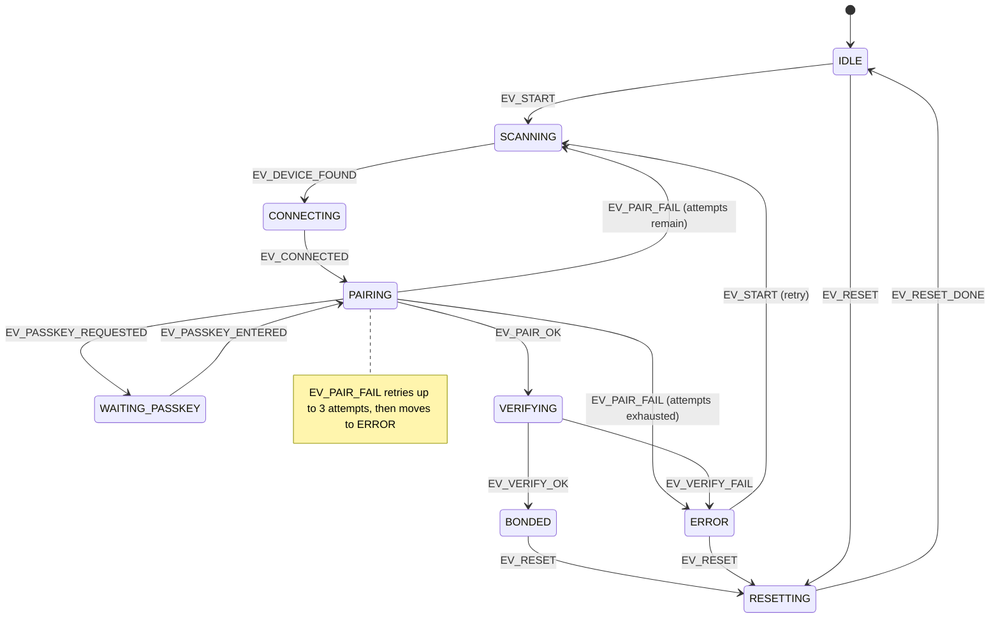

# Guided BLE pairing — the state-machine contract (#154, #157)

**Status:** SM + BlueZ transport + web wizard shipped, mock-tested. **NOT-LIVE-VERIFIED** — the
deliberate live unbond→re-pair at the van is tracked as a checkbox on
[#157](https://github.com/ckeller42/open-california/issues/157), not done yet.

## Purpose

The buspi web GUI needed a CaliforniaOnTour-style guided Bluetooth setup: first-run pairing
*and* a `bluetoothReset`-style re-pair, driven by the user typing the 6-digit passkey the
camper unit displays on its own "Gerät verbinden" screen. Rather than wire that straight into
`pairing_bluez.py`, the flow is factored as a **platform-free state machine**
(`calictl/pairing.py`, `R_PAIRING_SM`) — no strings, no clock, no BLE addresses — so it is
simultaneously: (a) the executable spec for the web wizard today, and (b) the explicit model
for the ESP32 satellite's touchscreen pairing flow (#154), which will port `step()` to C almost
mechanically. The sequence vectors in `tests/vectors/pairing.json` are written so `#154` can
replay them against the C port as a golden-vector differential test, the same pattern already
used for the frame codec (issue #156).

Full design rationale: `docs/superpowers/specs/2026-08-31-guided-pairing-design.md`.

## The state machine

9 states, 13 events, 9 actions — all pinned integer enums (never renumber; the C port and the
vectors depend on the values). `step(state, event, arg) -> (new_state, [(action, arg), ...])` is
pure: unknown `(state, event)` pairs are no-ops, so a late or duplicate transport event can never
derail the flow.

Not drawn (to keep the diagram legible — see `calictl/pairing.py` for the exact guards):
`EV_TIMEOUT` fires from any state with an armed timer straight to `ERROR(ERR_TIMEOUT)`, and
`EV_CANCEL` fires from any active state straight to `IDLE` — both run the same connection
cleanup (`ACT_STOP_SCAN` from `SCANNING`, `ACT_DISCONNECT` from `CONNECTING`/`WAITING_PASSKEY`/
`PAIRING`/`VERIFYING`, nothing from terminal states).

### Timeout table

One source of truth for both platforms; the transport arms **one timer per state change** and
injects `EV_TIMEOUT` — absent from the table means no timer for that state.

| State | Timeout |
|---|---|
| `SCANNING` | 30 s |
| `CONNECTING` | 15 s |
| `WAITING_PASSKEY` | 60 s |
| `PAIRING` | 15 s |
| `VERIFYING` | 10 s |
| `RESETTING` | 10 s |
| `IDLE`, `BONDED`, `ERROR` | none |

## ESP mapping (buspi today, #154's NimBLE port later)

Agent registration / `io_cap=KEYBOARD_ONLY` (BlueZ) or the NimBLE `ble_sm_io` setup are
**transport init, not an SM action** — they happen once, outside `step()`, before any event is
injected.

| SM symbol | BlueZ (buspi, `pairing_bluez.py`) | ESP32 (NimBLE + NVS, #154) |
|---|---|---|
| `EV_DEVICE_FOUND` | bleak scan callback, name == `VWCAMPER` | `BLE_GAP_EVENT_DISC` with a matching name in the adv payload |
| `EV_PASSKEY_REQUESTED` | `org.bluez.Agent1.RequestPasskey` D-Bus call (agent capability `KeyboardOnly`) | `BLE_GAP_EVENT_PASSKEY_ACTION` with `action == BLE_SM_IOACT_INPUT` |
| `ACT_SEND_PASSKEY` | resolve the `asyncio.Future` the agent's `RequestPasskey` is blocked on | `ble_sm_inject_io()` with the typed passkey |
| `EV_PAIR_OK` / `EV_PAIR_FAIL` | `Device1.Pair()` D-Bus call result | `BLE_GAP_EVENT_ENC_CHANGE` status (0 = OK, nonzero = fail) |
| `ACT_VERIFY` | encrypted read of `VERSION_CHAR` + `AUTH_CHAR`, then count all readable state chars | encrypted read of the equivalent auth characteristic (no full-service enumeration needed on the ESP side) |
| `ACT_PERSIST_BOND` | BlueZ auto-persists the bond; we additionally cache the identity address in `~/.local/state/calictl/pairing.json` | NimBLE NVS bond store (`ble_store_util_*`) |
| `ACT_REMOVE_BOND` | `Adapter1.RemoveDevice()` D-Bus call | `ble_store_util_delete_peer()` |

## Verify-policy caveat

`EV_VERIFY_OK` carries `arg = readable-char count` — but the SM treats that count as an opaque
number; it does not know or care what "enough" means. Classifying a readable-char count into
`EV_VERIFY_OK`/`EV_VERIFY_FAIL` is **buspi transport policy** decided inside
`pairing_bluez.py::verify()`, not SM data. The **actual shipped policy**: `verify()` reads
`VERSION_CHAR` + `AUTH_CHAR` (must both succeed) and then attempts every other readable-flagged
characteristic, counting successes; it returns `None` (→ `EV_VERIFY_FAIL`) if the version/auth
reads fail **or** the readable-count comes back `0` (an unbonded RPA link can ACK the connection
and even the version/auth reads yet drop every real state-char read — a bare positive-vs-`None`
check without the zero-count guard would misclassify that as bonded). A positive count returns
as `EV_VERIFY_OK`. The full **20/20-readable-characteristics** signature (all state chars
readable, the strongest bonded/unbonded discriminator seen so far) is a stronger version of this
same check that the #157 van session will confirm live; today's shipped threshold is only
`count > 0`, not `count == 20`. The ESP equivalent almost certainly won't enumerate a whole GATT
table — it would do a single encrypted read of one known auth characteristic and treat
success/failure as `EV_VERIFY_OK`/`EV_VERIFY_FAIL` directly. Port the *shape* (an encrypted read
after `EV_PAIR_OK` that fails closed on any read problem), not the specific count threshold.

## Exclusion model (single BLE owner rule, CLAUDE.md)

A guided-pairing flow can run for minutes — the user has to walk to the camper panel and read
off a passkey — so it deliberately does **not** hold `serve.py`'s `self._ble` lock for the whole
flow; doing so would freeze `/api/state` (and every other read) for that entire window. Instead:

- `pairing_command("start")` parks the persistent-session supervisor
  (`set_mode("disconnect")`) *before* arming the runner, so the supervisor will not open its own
  connection while the wizard owns the radio.
- `poll()` checks `pairing.snapshot()["state"]` and skips the **whole** read cycle (not just
  parts of it) whenever a pairing flow is active (state not in `idle`/`bonded`/`error`) — a
  second bleak `connect()` against `hci0` mid-pairing is exactly what the single-BLE-owner rule
  (`serve` is the only reader — CLAUDE.md) forbids.
- `pairing_bluez.py` never touches `serve.py`'s `_ble` lock at all — the pairing transport opens
  its own `bleak.BleakScanner`/`BleakClient` directly. The `_ble` lock is **never taken** by the
  pairing flow; exclusion is entirely the supervisor-park + poll-skip pair above, not lock
  sharing.

## NOT-LIVE-VERIFIED

Everything above is mock-tested: `tests/test_pairing_sm.py` replays the pure SM against
`tests/vectors/pairing.json`; the BlueZ runner and the `/api/pairing` endpoints are tested
against a fake transport, no real dbus/bleak. **No real unbond→re-pair has been run against the
van yet** — that is a deliberate, human-in-the-loop step (typing a passkey off the camper's own
screen) tracked as a checkbox on
[#157](https://github.com/ckeller42/open-california/issues/157). Until that checkbox is
checked, treat the BlueZ transport (agent registration, `Device1.Pair()`, the verify-policy
read count, `Adapter1.RemoveDevice()`) as **DECOMPILE/mock-tier**, not device-verified — same
evidence-tier convention as `evidence-ledger.md`.
