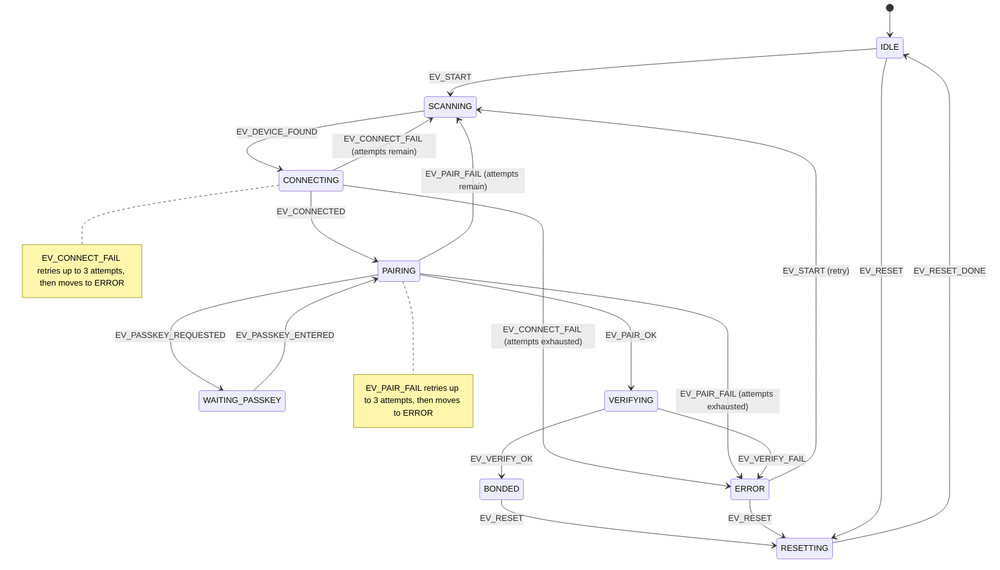

# Guided BLE pairing — the state-machine contract (#154, #157)

**Status:** SM + BlueZ transport + web wizard shipped; unit-tested against a fake transport and
CI-verified against real BlueZ (`pairing-real-stack`, a VM + the Bumble fake unit — see
[Live-verification status](#live-verification-status)). **NOT-LIVE-VERIFIED against a real camper unit** — the
deliberate live unbond→re-pair at the van is tracked as a checkbox on
[#157](https://github.com/ckeller42/open-california/issues/157), not done yet. The one real run so far (a re-pair at the van on 2026-09-18) failed at
`Device1.Pair()` with `AlreadyExists` — the stale local bond the recovery below handles.

## Purpose

The buspi web GUI needed a CaliforniaOnTour-style guided Bluetooth setup: first-run pairing
*and* a `bluetoothReset`-style re-pair, driven by the user typing the 6-digit passkey the
camper unit displays on its own "Gerät verbinden" screen. Rather than wire that straight into
`pairing_bluez.py`, the flow is factored as a **platform-free state machine**
(`calictl/pairing.py`, `R_PAIRING_SM`) — no strings, no clock, no BLE addresses — so it is
simultaneously: (a) the executable spec for the web wizard today, and (b) the explicit model
for the ESP32 satellite's touchscreen pairing flow (#154), which will port `step()` to C almost
mechanically. The sequence vectors in `tests/vectors/pairing.json` are written so `#154` can
replay them against the C port as a golden-vector differential test, the same pattern already
used for the frame codec (issue #156).

Full design rationale: `docs/superpowers/specs/2026-08-31-guided-pairing-design.md` — a
local-only planning document (`docs/superpowers/` is gitignored), not in the repository.

## The state machine

9 states, 14 events, 9 actions — all pinned integer enums (never renumber; the C port and the
vectors depend on the values). `step(state, event, arg) -> (new_state, [(action, arg), ...])` is
pure: unknown `(state, event)` pairs are no-ops, so a late or duplicate transport event can never
derail the flow.

```mermaid
stateDiagram-v2
  [*] --> IDLE
  IDLE --> SCANNING: EV_START
  ERROR --> SCANNING: EV_START (retry)
  SCANNING --> CONNECTING: EV_DEVICE_FOUND
  CONNECTING --> PAIRING: EV_CONNECTED
  CONNECTING --> SCANNING: EV_CONNECT_FAIL (attempts remain)
  CONNECTING --> ERROR: EV_CONNECT_FAIL (attempts exhausted)
  PAIRING --> WAITING_PASSKEY: EV_PASSKEY_REQUESTED
  WAITING_PASSKEY --> PAIRING: EV_PASSKEY_ENTERED
  PAIRING --> VERIFYING: EV_PAIR_OK
  PAIRING --> SCANNING: EV_PAIR_FAIL (attempts remain)
  PAIRING --> ERROR: EV_PAIR_FAIL (attempts exhausted)
  VERIFYING --> BONDED: EV_VERIFY_OK
  VERIFYING --> ERROR: EV_VERIFY_FAIL
  BONDED --> RESETTING: EV_RESET
  ERROR --> RESETTING: EV_RESET
  IDLE --> RESETTING: EV_RESET
  RESETTING --> IDLE: EV_RESET_DONE
  note right of PAIRING
    EV_PAIR_FAIL retries up to 3 attempts, then moves to ERROR
  end note
  note right of CONNECTING
    EV_CONNECT_FAIL retries up to 3 attempts, then moves to ERROR
  end note
```

Not drawn (to keep the diagram legible — see `calictl/pairing.py` for the exact guards):
`EV_TIMEOUT` fires from any state with an armed timer straight to `ERROR(ERR_TIMEOUT)`, and
`EV_CANCEL` fires from any active state straight to `IDLE` — both run the same connection
cleanup (`ACT_STOP_SCAN` from `SCANNING`, `ACT_DISCONNECT` from `CONNECTING`/`WAITING_PASSKEY`/
`PAIRING`/`VERIFYING`, nothing from terminal states).

### Timeout table

One source of truth for both platforms; the transport arms **one timer per state change** and
injects `EV_TIMEOUT` — absent from the table means no timer for that state.

| State | Timeout |
|---|---|
| `SCANNING` | 30 s |
| `CONNECTING` | 20 s — the BlueZ transport splits it: probe an existing bond ≤ 5 s, drop a provably stale one + re-discover ≤ 5 s, final connect ≥ 8 s, 1 s margin |
| `WAITING_PASSKEY` | 60 s |
| `PAIRING` | 15 s |
| `VERIFYING` | 10 s |
| `RESETTING` | 10 s |
| `IDLE`, `BONDED`, `ERROR` | none |

## ESP mapping (buspi today, #154's NimBLE port — console pairing verified on the real unit, web wizard not yet)

Agent registration / `io_cap=KEYBOARD_ONLY` (BlueZ) or NimBLE's `ble_hs_cfg.sm_io_cap` are
**transport init, not an SM action** — they happen once, outside `step()`, before any event is
injected (on the ESP32 side, before the host even syncs — see `R_FW_IO_CAP_BEFORE_LINK` in
[the firmware docs](https://ckeller42.github.io/open-california/firmware.html)).

This mapping is no longer aspirational: `firmware/components/cali_core/runner.c`
(`cali_runner_*`) is the C SM driver, `firmware/components/cali_core/include/cali_transport.h`
(`cali_transport_t`) is the abstract transport it calls, and
`firmware/components/cali_ble_nimble/ble_nimble.c` is the NimBLE implementation of that
transport (Linux host build and ESP-IDF both) — proven against a Bumble fake unit
(`tests/firmware/test_host_e2e.py`) and compiled against ESP-IDF's real esp-nimble
(`firmware-build` CI). Since 2026-10-08 it has also run against the real camper unit: the
satellite bonded to it from its USB console, passkey off the unit's screen (DEVICE, evidence-ledger
2026-10-08). The satellite's web wizard has not been run on the real unit yet.

| SM symbol | BlueZ (buspi, `pairing_bluez.py`) | ESP32 (`ble_nimble.c`, via `cali_transport_t`) |
|---|---|---|
| `EV_DEVICE_FOUND` | bleak scan callback, name == `VWCAMPER` | `BLE_GAP_EVENT_DISC` with a matching name in the adv payload |
| `EV_CONNECT_FAIL` | `BleakClient.connect()` raises (e.g. HCI 0x3e, le-connection-abort-by-local) | `BLE_GAP_EVENT_CONNECT` with nonzero status |
| `EV_PASSKEY_REQUESTED` | `org.bluez.Agent1.RequestPasskey` D-Bus call (agent capability `KeyboardOnly`) | `BLE_GAP_EVENT_PASSKEY_ACTION` with `action == BLE_SM_IOACT_INPUT` |
| `ACT_SEND_PASSKEY` | resolve the `asyncio.Future` the agent's `RequestPasskey` is blocked on | `ble_sm_inject_io()` with the typed passkey (`t_inject_passkey`) |
| `EV_PAIR_OK` / `EV_PAIR_FAIL` | `Device1.Pair()` D-Bus call result | `BLE_GAP_EVENT_ENC_CHANGE` status (0 = OK, nonzero = fail) |
| probe before replace (#201) | `connect()` probes a bond BlueZ holds (connect + auth-gated `1004` read): valid → kept, `pair()` = `EV_PAIR_OK`; stale (auth-class failure, or link up + read timeout) → dropped, re-discover, pair | `t_connect_found` connects by the bonded identity when the found RPA resolves with the bond's IRK; `t_pair` re-encrypts with the stored key: `ENC_OK` → kept (no SMP); HCI `0x05`/`0x06` (encryption result or the unit's disconnect reason) → dropped, fresh SMP; anything else → kept |
| `ACT_VERIFY` | encrypted read of `VERSION_CHAR` + `AUTH_CHAR`, then count all readable state chars | `runner.c`'s `PAIR_ACT_VERIFY`: one encrypted read of `CODEC_CHAR_AUTH` (char `0x1004`, the `vehicle` function) — no full-service enumeration on the ESP side |
| `ACT_PERSIST_BOND` | BlueZ auto-persists the bond; we additionally cache the identity address in `~/.local/state/calictl/pairing.json` | NimBLE bond store callbacks on `cali_kv_*` = NVS (`firmware/components/cali_ble_nimble/ble_store_kv.c`, `cali_ble_store_init()`), not the RAM-only `ble_store_util_*`/`ble_store_config` default |
| `ACT_REMOVE_BOND` | `Adapter1.RemoveDevice()` D-Bus call | `ble_store_util_delete_peer()` (through `ble_store_kv.c`'s `store_delete` callback) |

## Verify-policy caveat

`EV_VERIFY_OK` carries `arg = readable-char count` — but the SM treats that count as an opaque
number; it does not know or care what "enough" means. Classifying a readable-char count into
`EV_VERIFY_OK`/`EV_VERIFY_FAIL` is **buspi transport policy** decided inside
`pairing_bluez.py::verify()`, not SM data. The **actual shipped policy**: `verify()` reads
`VERSION_CHAR` + `AUTH_CHAR` (must both succeed) and then attempts every other readable-flagged
characteristic, counting successes; it returns `None` (→ `EV_VERIFY_FAIL`) if the version/auth
reads fail **or** the readable-count comes back `0` (an unbonded RPA link can ACK the connection
and even the version/auth reads yet drop every real state-char read — a bare positive-vs-`None`
check without the zero-count guard would misclassify that as bonded). A positive count returns
as `EV_VERIFY_OK`. The full **20/20-readable-characteristics** signature (all state chars
readable, the strongest bonded/unbonded discriminator seen so far) is a stronger version of this
same check that the #157 van session will confirm live; today's shipped threshold is only
`count > 0`, not `count == 20`. The ESP equivalent almost certainly won't enumerate a whole GATT
table — it would do a single encrypted read of one known auth characteristic and treat
success/failure as `EV_VERIFY_OK`/`EV_VERIFY_FAIL` directly. Port the *shape* (an encrypted read
after `EV_PAIR_OK` that fails closed on any read problem), not the specific count threshold.

## Environment the wizard needs

Guided pairing is BLE-radio-sensitive in ways that are easy to get wrong on a Pi doing several
Bluetooth jobs at once. The how-to for owners is
[How to pair your camper](../howto-pair-your-camper.md); this is the mechanism behind its
"Before you start" checklist.

- **One radio.** `hci0` on buspi is shared with other BLE clients (the Home Assistant Bluetooth
  integration, BLE readers, calictl's own persistent session). Only one of them can hold the
  adapter's `Discovering` state or a connection at a time.
- **Co-resident scanners break new connections.** `BluezTransport.stop_scan` reads
  `Adapter1.Discovering` right after its own scan stops; if another client kept discovery
  running, `radio_busy` is set and surfaced to the wizard (the banner text in
  `calictl/webui/app.js`). A **btmon capture on buspi (2026-09-25)** caught the mechanism
  directly: `LE Connection Complete`, then BlueZ re-enabled active scanning at **100 % duty**
  (scan window == scan interval, 11.25 ms) because another client still held discovery, and
  ~300 ms later the connection failed to establish with **HCI error 0x3e**. With every other
  scanner stopped, the same connect attempt succeeded. The owner's phone holding the unit's
  single connection blocks a Pi connect the same way, for a different reason (the unit itself
  refuses a second link, not the local radio).
- **One connection slot on the unit.** The camper control unit accepts exactly one BLE central
  at a time; a phone connected via the CaliforniaOnTour app locks the Pi out regardless of the
  local radio's state.
- **A rotating advertising address.** The unit advertises from a private address that changes
  periodically (observed 2026-09-25: **four different addresses in about 45 minutes** of
  continuous scanning). The wizard finds it by name (`VWCAMPER`), not by address; only once
  bonded does the unit's identity address become available, and that is what
  `persist_bond()` stores. Seeing the scanned address change between attempts is expected.
- **The unit refuses Just Works; the agent must exist before the link.** The unit only accepts
  passkey pairing (it DISPLAYS, we type — MITM). A **btmon capture on buspi (2026-09-26)** showed
  the wizard's `Pairing Request` going out as `IO capability: NoInputNoOutput`, `No MITM`, and the
  unit hanging up at once (`Remote User Terminated Connection`, 0x13; calictl saw
  `Authentication Canceled`). BlueZ had switched the adapter to `KeyboardOnly` only when
  `pair()` registered the agent, but the kernel fixes an LE link's IO capability when the link is
  created, and `connect()` had already made it. `start_scan()` now registers the agent before any
  link exists, and the fake unit refuses Just Works so CI catches a regression.
- **Open "Gerät verbinden" before starting the wizard.** On 2026-09-26 (btmon, buspi) links
  failed with 0x3e even with the radio quiet (scanning disabled at every connect) until the
  owner opened the screen; the next link came up at once. Likely the unit ignores an unbonded
  central outside pairing mode — a hypothesis from timing, see the evidence ledger.
- **`Passcode: ---` until a pairing request arrives.** The unit's own "Gerät verbinden" screen
  shows the literal placeholder `---` where the 6-digit passcode goes, and only replaces it once
  a central actually starts a pairing request against it (owner photo, 2026-09-25). A wizard
  stuck in `waiting_passkey` with the unit still showing `---` means the pairing request never
  reached the unit — recheck the checklist, not the typed digits.
- **An existing bond is only dropped on proof.** Opening the wizard over a bond BlueZ already
  holds first probes it (connect + the auth-gated `AUTH_CHAR` read, ≤ 5 s). A working bond is
  kept (no passkey). The bond is removed ONLY when the probe proves the key stale: an auth-class
  failure ("PIN or Key Missing", HCI 0x05/0x06, ATT 0x05/0x0F, `NotPermitted`), or a timeout
  after BlueZ reported `Device1.Connected` = True (the link came up but encryption never
  completed — a unit that forgot us after a Bluetooth reset). Everything else — HCI 0x3e from a
  co-resident scanner, an **asleep unit** (parked, deep sleep) that BlueZ still lists with an old
  RSSI because another client keeps discovering, or no time left to probe — ends as
  `connect_failed` with the bond and `pairing.json` kept, so opening the wizard remotely while
  the van sleeps costs nothing. The in-flow drop keeps `pairing.json` too (the identity doesn't
  change; `persist_bond()` rewrites it); only "Bluetooth reset / re-pair" (`ACT_REMOVE_BOND`)
  clears it.
- **The wizard releases its link.** At flow end (`bonded`, `error`, cancel) the transport
  disconnects the link it used for probe/verify, so the daemon's next poll can take the unit's
  single connection slot straight away.
- **The unpaired-daemon guard.** Before any bond exists, `CamperDevice._session()` refuses to
  even construct a `BleakClient` for the placeholder address (`device.UNPAIRED_ADDR`) — an
  unpaired daemon does not poll or scan at all. This matters here because a daemon that *did*
  scan on every failed poll would itself be one more client competing for discovery, working
  against the very radio the wizard needs quiet. `_meta.paired` reports this state to the UI.

## Exclusion model (single BLE owner rule, AGENTS.md)

A guided-pairing flow can run for minutes — the user has to walk to the camper panel and read
off a passkey — so it deliberately does **not** hold `serve.py`'s `self._ble` lock for the whole
flow; doing so would freeze `/api/state` (and every other read) for that entire window. Instead:

- `pairing_command("start")` parks the persistent-session supervisor
  (`set_mode("disconnect")`) *before* arming the runner, so the supervisor will not open its own
  connection while the wizard owns the radio.
- The runner's `start()` itself runs while holding `self._ble` (briefly), so a poll/command that
  is mid-read finishes first. The HTTP request never waits for that lock — a poll against an
  unreachable unit can hold it ~100 s: "start" sets `_pairing_pending`, schedules "take the lock
  + `start()`" as a task, and answers within `PAIRING_START_WAIT_S` (2 s) with a `scanning`
  snapshot. `poll()` skips while the start is pending, checked before AND after taking the lock.
- `poll()` checks `pairing.snapshot()["state"]` and skips the **whole** read cycle (not just
  parts of it) whenever a pairing flow is active (state not in `idle`/`bonded`/`error`) — a
  second bleak `connect()` against `hci0` mid-pairing is exactly what the single-BLE-owner rule
  (`serve` is the only reader — AGENTS.md) forbids.
- `pairing_bluez.py` never touches `serve.py`'s `_ble` lock at all — the pairing transport opens
  its own `bleak.BleakScanner`/`BleakClient` directly. Past the brief hold around `start()`, the
  `_ble` lock is **not held** by the pairing flow; exclusion is the supervisor-park + poll-skip
  pair above, not lock sharing.

## Stale-bond recovery (#200, `R_PAIRING_STALE_BOND_RECOVERY`)

BlueZ refuses `Device1.Pair()` with `org.bluez.Error.AlreadyExists` when a bond for the device
already exists. After a unit-side Bluetooth reset the unit has forgotten buspi but buspi's own bond
persists, so without recovery the wizard's `Pair()` fails, retries `MAX_ATTEMPTS` times and ends on
a generic `pairing_failed` the user cannot act on. That is exactly what happened on the real re-pair
at the van on 2026-09-18.

`BluezTransport.pair()` (`calictl/pairing_bluez.py`) now handles that one error: it logs a warning,
removes the stale bond (`remove_bond(clear_cache=False)`, i.e. `Adapter1.RemoveDevice()` — the
cached identity in `pairing.json` is kept), re-discovers the unit and retries `Pair()` **exactly once**. Any other error (e.g. an authentication failure) is a
genuine pairing failure and propagates unchanged, so a bond is never wiped to mask a real problem.
Verified by `T_PAIRING_STALE_BOND_RECOVERY` and `T_PAIRING_FAILURE_PROPAGATES` in
`tests/test_pairing_bluez_transport.py` (both stub `remove_bond()`); the real removal +
re-discovery path runs against real BlueZ in the `pairing-real-stack` CI job (a VM + the Bumble
fake unit), not yet against a real camper unit.

## Live-verification status

Two tiers below the real van: `tests/test_pairing_sm.py` replays the pure SM against
`tests/vectors/pairing.json` (no transport at all), and `tests/test_pairing_link.py` drives the
runner + `BluezTransport` against a fake transport / a Bumble `LocalLink` fake unit (no real
dbus/bleak/BlueZ). The `pairing-real-stack` CI job (`tests/realstack/`, non-required check) goes
one tier further: inside a virtme-ng VM, the real dbus/bleak/BlueZ stack — agent registration,
scan, connect, `Device1.Pair()`, verify, `persist_bond`, the link release at flow end (the
daemon reads straight after the wizard), the stale-bond probe/removal, an asleep unit keeping
its bond, and `radio_busy` — runs against the Bumble fake unit over a virtual controller. That still is **not**
a real camper unit: it doesn't exercise RSSI jitter, the unit's own advertising/deep-sleep
policy, WiFi coexistence on buspi's shared radio, or another client scanning at full duty and
starving a real LE connect (HCI 0x3e) — the mechanism the 2026-09-25 btmon capture caught (see
[Environment the wizard needs](#environment-the-wizard-needs)) was observed on real buspi
hardware, but not yet as part of a full pairing run. The one real run so far — a re-pair at the van on 2026-09-18 — failed at `Device1.Pair()` with
`AlreadyExists`, which is what the stale-bond recovery above was written for; **no successful
real unbond→re-pair through the BlueZ wizard has been recorded yet** (the ESP satellite's runner did
pair with the real unit, from its console, 2026-10-08) — that is a deliberate, human-in-the-loop step (typing a passkey off the
camper's own screen) tracked as a checkbox on
[#157](https://github.com/ckeller42/open-california/issues/157). Until that checkbox is
checked, treat the BlueZ transport's behaviour against a **real camper unit** (as opposed to the
VM's fake one) as **DECOMPILE/mock-tier**, not device-verified — same evidence-tier convention as
`evidence-ledger.md`. The [how-to](../howto-pair-your-camper.md) is written from the code and the
real-buspi radio evidence above, not from a completed live pairing.

**Cross-checked against the real app (app lab, 2026-09-27).** The CaliforniaOnTour app, run in
the Android emulator against the same fake unit, uses the same association model as this wizard
(its pairing request is `KEYBOARD_DISPLAY` + MITM + SC → passkey entry, the unit displays),
reconnects over a rotated address with its stored key and no prompt, and — after a unit-side
bond loss — simply starts a fresh pairing 1.4 s after connecting, with no guidance of its own
(a spinner plus the OS "Bluetooth pairing request" notification; unanswered, the link drops
after ~33 s and the app returns to "Connect" silently). When the unit refuses pairing (not in
"Gerät verbinden") the app retries in the background indefinitely and shows nothing. So the
wizard's `connect_failed` / `pairing_failed` hints and the "Bluetooth reset / re-pair" guidance
are this repo's own UX, not a mirror of the app; the model of the unit they rest on is
consistent with what the app does. Table in
[protocol-crosscheck-applab.md](protocol-crosscheck-applab.md) "Pairing".

## The "single connection slot" is not absolute (DEVICE, 2026-10-08)

The slot model above (and across these docs) assumed the unit serves **one** LE central at a
time — every observed symptom fit it. On 2026-10-08 the real unit accepted the ESP satellite's
pairing connect **while buspi's persistent session stayed up**, completed SMP + verify, and then
served state to both links in parallel (buspi polling, the ESP reading and writing — a cooler
write from the ESP landed and buspi's next poll read the changed state from the unit).

What stays true operationally:

- calictl still treats the link as exclusive on its side (`serve` is the single BLE owner on
  buspi; the roof contract still reuses the live session rather than opening a second link).
- The phone app contending for the unit remains a real interference source during *pairing*
  (its reconnect storm after a unit "Bluetooth zurücksetzen" collides with the wizard's window).
- How many links the unit serves (2? more?), and whether a third central is refused, is
  unmeasured — only "two works" is DEVICE-proven.
- Right after every connect the unit sends the central an ATT Exchange MTU Request and ends the
  link (HCI 0x13) when it gets no answer within its 30 s ATT timeout. BlueZ and Android answer it;
  the ESP's NimBLE, built without a GATT server, did not, so the parked unit dropped the ESP's held
  link ~30 s after each connect (2026-10-09). That was read at first as a state-dependent unit
  policy against idle links; it is not (CAPTURE 2026-10-10: the app's and buspi's held links
  stayed up). Fixed by #279 (`faaf7b0`): the ESP now holds its parked link. Its reconnect pacing
  (`CALI_SESSION_KICKED_RECONNECT_MS`, `cali_session.h`, #266) stays as the fallback.
