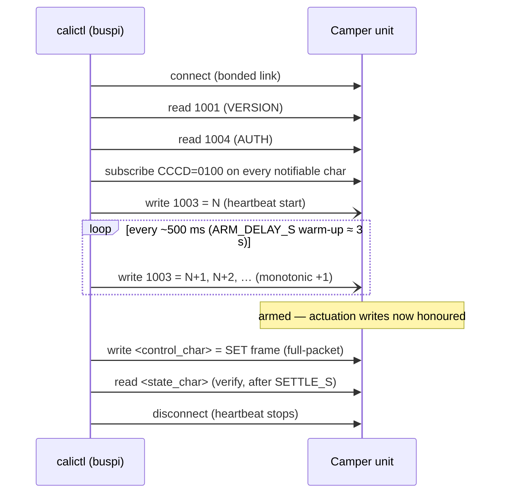
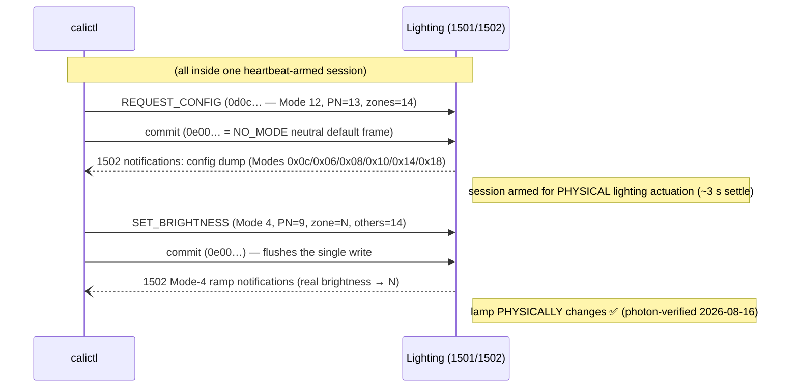
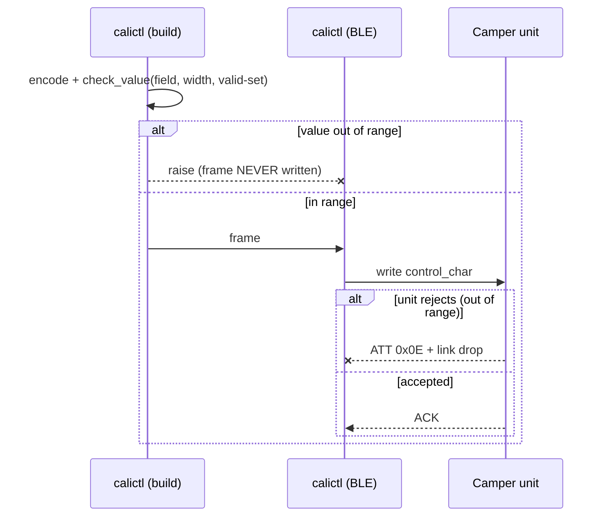
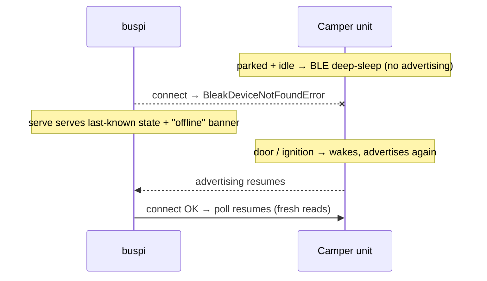

# Protocol sequence diagrams

> This page renders on GitHub. The **canonical, implementation-traced** version is the Sphinx doc
> `docs/sphinx/protocol-sequences.rst` — there each diagram is a `sphinx-needs` `spec` linked to
> the requirement (`R_*`) in the implementing code's docstring (build: `docs/sphinx/README.md`).

The BLE protocol flows calictl speaks to the VW California camper unit, as sequence diagrams.
All are **HCI-verified** against the real CaliforniaOnTour app (`idevicebtlogger` captures) and,
where noted, confirmed on-device via readback. Char short-UUIDs: `1001` VERSION, `1003` HEARTBEAT
(the liveness/arm counter), `1004` AUTH, plus per-function state/control chars
(`1101/1102` cooler, `1201` camping, `1401/1402` roof, `1501` lighting, …).

Implementation: `calictl/device.py` (`actuate`, `actuate_roof`, `read_all`, `_heartbeat`),
`calictl/control.py` (frame builders + `LIGHT_COMMIT`).

## 0. Session foundation — connect, authenticate, subscribe (`device._session` / `_subscribe_all`)

Every read/write session starts on the **bonded** link: connect, read `1001` VERSION + `1004`
AUTH, then subscribe every notifiable/indicatable char. Decompile-confirmed 2026-07-14: order is
1001 → 1004 → subscribe; **1004 AUTH is a passive read** (auth is implicit over the bonded link —
empty read → reconnect; no token/challenge write). The `1002` VIN char is **not** read/validated
during connect (it's an ordinary later state read, not a gate).

```mermaid
sequenceDiagram
    participant C as calictl (buspi)
    participant U as Camper unit
    Note over C,U: link is BONDED (LE pairing done once; the unit's RPA resolved via the bond)
    C->>U: connect (retry on the le-connection-abort cascade)
    C->>U: discoverServices + requestMtu
    C->>U: read 1001 (VERSION)
    Note over C: app aborts the session if VERSION empty or > 2
    C->>U: read 1004 (AUTH — passive read over the bonded link)
    loop every notifiable / indicatable char
        C->>U: write CCCD (0100 notify / 0200 indicate)
    end
    Note over C,U: session ready — state reads fresh, writes can be armed
```

**Notifications:** after subscribing, the unit pushes notifications on state change. calictl
subscribes because it's part of the arm handshake, but **no-ops the payloads** and reads state
chars directly — notifications are a handshake requirement, not calictl's data path.

```mermaid
sequenceDiagram
    participant C as calictl
    participant U as Camper unit
    C->>U: write CCCD=0100 on a status char (subscribe)
    U-->>C: notify(status char, payload)  [on state change]
    Note over C: calictl no-ops the payload; it reads state chars directly
```

## 1. Heartbeat-armed control write (`device.actuate`)

The unit only honours a control write while a **+1 monotonic 4-byte-BE counter ticks on `1003`** —
the liveness/arm gate (issue #2). jadx-confirmed 2026-07-14 (`d2/s` driver, `ag/b` builder): 4-byte
BE uint32, `+1` per tick (`b1/d`), **500 ms** cadence (`zf/d` `J0=500L`), **seed 0** (`d2/s` inits
the counter at 0 — unlike the roof's random seed). calictl ticks it at ~0.6 s from a fixed
arbitrary start, only across the write window — both satisfy the unit's liveness/monotonicity check
(the value doesn't matter; verified on-device). Arm is the 1003 liveness *only* — no
ignition/mode/enable gate (roof is the one exception).



## 2. Lighting SET — REQUEST_CONFIG preamble + SET + commit (cracked 2026-08-16, photon-verified)

calictl's SET frame is **byte-identical to the app's**, yet for over a month a calictl SET was
ACKed (and echoed by the `1502` state char — see the echo caveat below) while the **physical
lamp stayed dark**. The 2026-08-16 HCI capture of the app *physically* lighting a lamp
(`tools/capture_diff.py`) found the missing ingredient: on opening its Lighting screen the app
writes a **REQUEST_CONFIG frame** `0d0c000000000000eeeeeeeeeeeeeeee` (Mode=12,
ProfileNumber=13, all zones=14) followed by the usual `0e00…` commit, to `1501`. **Only in a
session where this preamble has landed does the unit physically drive the lamps on a later
SET_BRIGHTNESS.** Photon-verified on Kochen L7 from buspi: 0→dark, 8→80 %, 0→dark
(owner-watched). calictl sends the preamble via `control.LIGHT_REQUEST_CONFIG` +
`control.preamble_for("lighting")` → `device.actuate(..., pre=…)` (frames spaced
`FOLLOW_DELAY_S` = 0.3 s, then `PRE_SETTLE_S` = 3.0 s arm wait, env `CALICTL_PRE_SETTLE_S`).

**Decompile nuance (2026-07-14, still true) — `0e00…` is NOT an app "commit".** The Lighting Mode
enum (`dg/n`) is `NO_MODE=0, SET_BRIGHTNESS=4, SET_COLOR=6, SET_DOUBLE=8, REQUEST_CONFIG=12,
SET_PROFILE=16, WAKEUP_TIME=20, SYSTEM_TIME=24, PREVIEW=28`, so **Mode 0 = NO_MODE** (neutral) and
`0e00…` is just the builder's **default frame** (ProfileNumber = the `14` "unchanged" sentinel +
NO_MODE + all-brightness-unchanged). The app self-applies by streaming frames continuously;
calictl's single writes need the explicit neutral flush (`control.LIGHT_COMMIT` /
`commit_for("lighting")`).

**Feedback: the `1502` notifications are truthful; the readback echo is not.** After
REQUEST_CONFIG the unit streams a config dump as **notifications on `1502`**, tagged by Mode:
`0x0c` config echo, `0x06` color state, `0x08` SET_DOUBLE, `0x10` profile state (profile 8),
`0x14` wake time, `0x18` system time (ticking unix seconds). After an *applied* SET_BRIGHTNESS
it notifies **Mode-4 "ramp" frames showing the REAL current brightness stepping to the target**
(e.g. 01→03→04→05). A plain read of `1502` remains a **write-through echo** of the last SET —
never proof of actuation.



## 3. Roof actuation — press-and-hold move stream, unit self-gated by a 3 s SafetyCounter (`device.actuate_roof`)

Settled 2026-07-13 from the **decompiled roof class** (authoritative), reconciled against an
at-the-van HCI capture of a full open+close (control char `1401` = ATT handle `0x0037`; frames
`[direction byte][4-byte BE SafetyCounter]`, 5 bytes). **Requires ignition (terminal-15) ON.**
Direction bytes: **open `0x01`** (Up), **close `0x04`** (Down), **stop `0x00`** — byte-for-byte
identical to `control.roof_frame`.

Roof movement is **press-and-hold**: the app streams move frames for as long as the user holds the
on-screen button and stops (sends `0x00`, or just ceases) on release. There is **no protocol
confirmation phase** and **no app-streamed STOP phase** — an earlier capture read of a "safety
hold" was the user releasing the button while reading the safety dialog (press-and-hold dead-man),
not a handshake.

**SafetyCounter is APP-GENERATED, not echoed from the unit.** It is a monotonic BE-uint32 the app
originates: `seed + elapsed_ms/500` from a **random seed**, i.e. **≈ +1 every 500 ms**. The unit
only checks it for **liveness/monotonicity** and reports a `SafetyCounterValid` bit (**`1402`
bit 7**). (The earlier "echoes the unit's counter, ~0.8/frame" reading was wrong — it was two
senders overlapping: a **500 ms counter engine** plus a **1000 ms direction-resend** repeating the
current value, which averaged to ~0.8 increments per observed frame.)

**The safety wait is UNIT-enforced, ~3 s — there is no ~4 s app countdown constant.** The vehicle
**withholds motor actuation until the SafetyCounter validates** (takes ~3 s of a live monotonic
counter). In parallel the app arms a **3000 ms dead-man**: if `SafetyCounterValid` is still false
after 3 s it aborts with an error (and shows a "please wait" dialog,
`dialog_info_popUpRoof_safetyCheck`). The perceived ~4 s before the roof starts ≈ **3 s + BLE
latency**. So while the user holds the button, the app keeps streaming **move** frames from the
start; the roof simply doesn't physically move for the first ~3 s until the unit validates.

The state char `1402` (handle `0x0033`) tracks motion: it emits `03xx` (open side) / `23xx` (close
side) with the low nibble as motion state (`0c` moving, `08` near-limit, `00` stopped) and **bit 7
= `SafetyCounterValid`**.

```mermaid
sequenceDiagram
    participant C as calictl
    participant U as Roof (1401 / state 1402)
    Note over C,U: ignition ON, armed session, roof path clear
    Note over C,U: user presses & HOLDS open/close
    loop press-and-hold, move frames @ ~500 ms
        C->>U: move frame [0x01 open / 0x04 close] + app-generated monotonic SafetyCounter (+1/500 ms)
    end
    Note right of U: unit validates SafetyCounter (~3 s); motor withheld until valid → 1402 bit 7 = SafetyCounterValid
    Note over C,U: after ~3 s the pop-top travels while frames continue
    C->>U: STOP frame [0x00] on release / end (or frames cease → dead-man halt)
    Note right of U: halts
```

> ### ⚠️ Roof actuation model — implemented, but NOT-LIVE-VERIFIED
> `device.actuate_roof` now implements this model (mock-tested only — it has **never driven a
> real roof**), so roof actuation stays **NOT-LIVE-VERIFIED** until a live at-the-van test:
> 1. **Generates a live monotonic BE-uint32 SafetyCounter (~+1 every 500 ms)** from a random
>    seed (`_roof_safety_counter`) — it does **not** echo the unit's counter (that reading was
>    wrong).
> 2. **Accounts for the ~3 s unit self-gate**: streams move frames continuously (no move-then-STOP
>    "hold" phase — press-and-hold model); honours `SafetyCounterValid` (`1402` bit 7) and mirrors
>    the app's **3000 ms** dead-man (`validate_s`, abort to STOP if not valid by 3 s).
> 3. **Cadence ≈ 500 ms** (`CALICTL_ROOF_PERIOD_S`).

## 3b. Range validation & the 0x0E link drop (`protocol.check_value`)

calictl validates every field against its width + curated `valid` set **before** writing. The
unit-side `0x0E` behaviour is **calictl's own on-device observation** (cooler `State=3`, lighting
bad `Mode` → ATT `0x0E` + link drop), not confirmed in the app code — the app's own state fields
carry the same range bounds (`sg.a(default, max)`) so it never emits out-of-range. The build-side
guard keeps a bad frame from ever reaching the vehicle.



## 4. Fresh state read under heartbeat (`device.read`/`read_all`)

Ticking `1003` during a read keeps the link up (a bare read otherwise drops it after ~15 s) and
refreshes the chars the app re-reads (`1102` cooler, `1602` energy, `1902`, `1004`).

**Water is different — push-driven + measurement-gated (decompile + on-device, 2026-07-14).** The
app never gets fresh water from a heartbeat-refreshed *read*; it gets it from a **`1302`
notification** and parses the pushed frame (VM `qg/b`). **Fixed:** `read_all`/`read` now subscribe
with a real handler (`_subscribe_all` sink) and **prefer a pushed value over the bare read**, so
calictl captures the true level whenever the unit pushes it (during water use). While **parked**
the unit pushes nothing (0 `1302` frames in 40 s on-device) — the level is only measured on pump
activity, so no fresh value is fetchable while idle and it falls back to the last read; that
residual staleness is a hardware limit, not a calictl one.

```mermaid
sequenceDiagram
    participant C as calictl
    participant U as Camper unit
    C->>U: connect + subscribe-all (real handler → sink)
    loop ~500 ms (HEARTBEAT_WARMUP_S ≈ 2 s, then read)
        C-)U: write 1003 heartbeat
    end
    U-->>C: notify 1302 → water (push-driven; only on pump activity)
    Note over U: heartbeat keeps link up + refreshes re-read chars (1102/1602/1902/1004)
    C->>U: read <state_char> (prefer a pushed value over the bare read)
    C->>U: disconnect
```

## 5. Reachability / deep-sleep (why access is intermittent)

Parked + idle, the unit **BLE-deep-sleeps and stops advertising** — buspi (bonded, in the van)
can't even connect. Only physical use wakes it. (A one-off root cause on 2026-07-13: Bluetooth
had been *disabled on the unit itself*, so it was unreachable for days despite the van being used.)



Once awake with buspi holding the session (heartbeat ticking), the link is **stable** — a 180 s
spike held 100 % uptime, 0 drops (2026-07-13), and locking the van did not drop it. Intermittent
access is purely the deep-sleep ceiling, not a flaky link.
