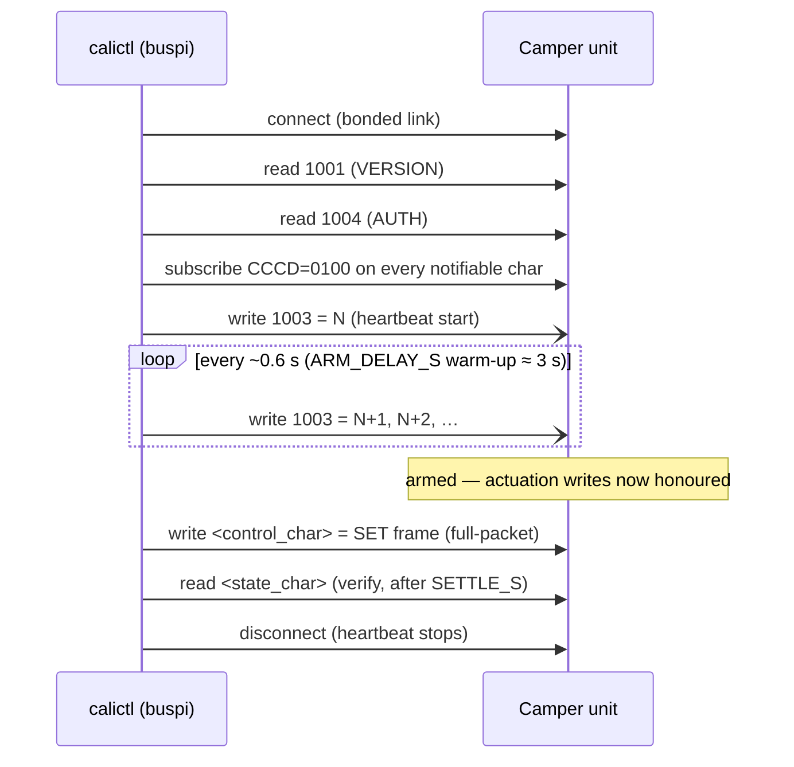
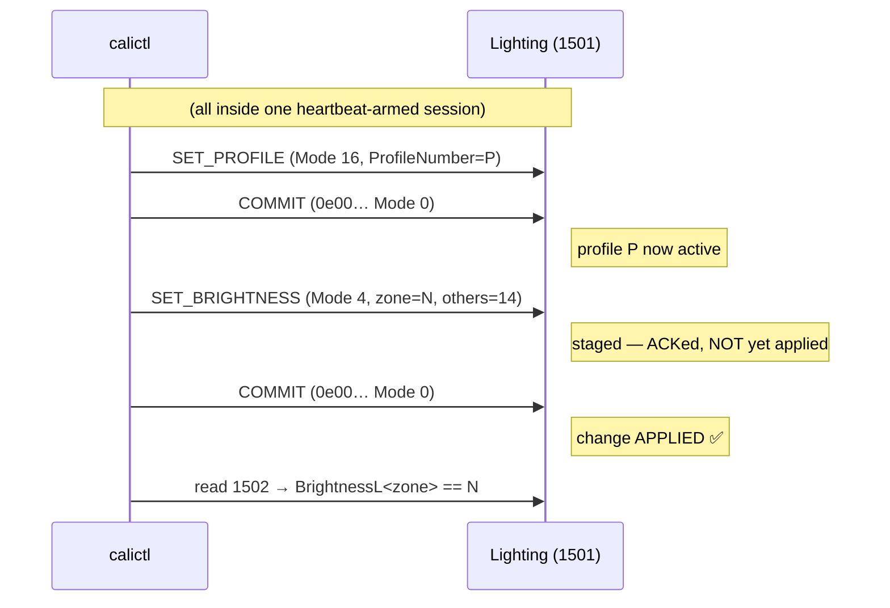
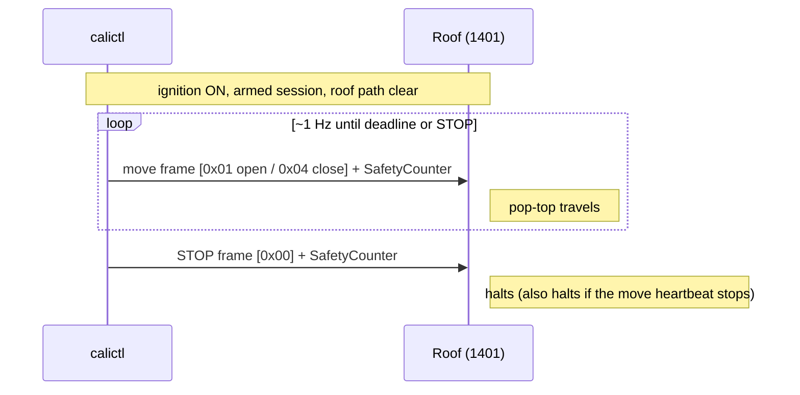
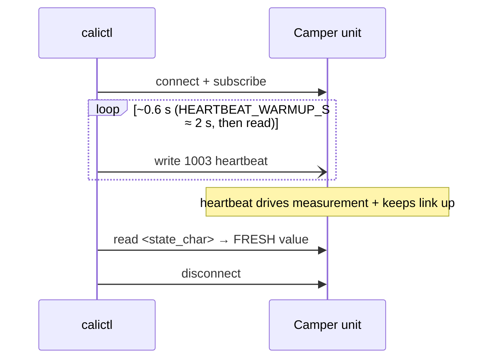
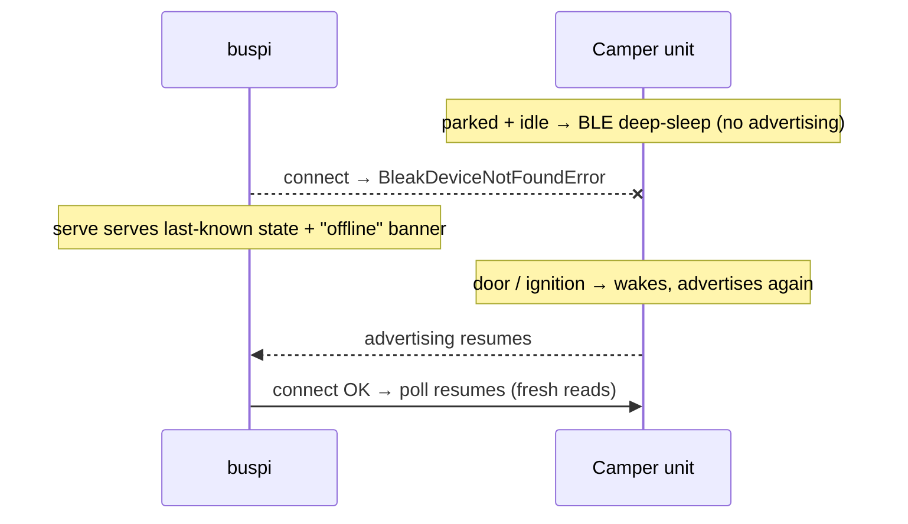

# Protocol sequence diagrams

> This page renders on GitHub. The **canonical, implementation-traced** version is the Sphinx doc
> `docs/sphinx/protocol-sequences.rst` — there each diagram is a `sphinx-needs` `spec` linked to
> the requirement (`R_*`) in the implementing code's docstring (build: `docs/sphinx/README.md`).

The BLE protocol flows calictl speaks to the VW California camper unit, as sequence diagrams.
All are **HCI-verified** against the real CaliforniaOnTour app (`idevicebtlogger` captures) and,
where noted, confirmed on-device via readback. Char short-UUIDs: `1001` VERSION, `1003` HEARTBEAT
(the liveness/arm counter), `1004` AUTH, plus per-function state/control chars
(`1101/1102` cooler, `1201` camping, `1401/1402` roof, `1501` lighting, …).

Implementation: `calictl/device.py` (`actuate`, `actuate_roof`, `read_all`, `_heartbeat`),
`calictl/control.py` (frame builders + `LIGHT_COMMIT`).

## 1. Heartbeat-armed control write (`device.actuate`)

The unit only honours a control write while a **+1 4-byte-BE counter ticks on `1003`** (~0.6 s
cadence) — the liveness/arm gate (issue #2). The write path replays the app's connect handshake,
starts the heartbeat, writes, reads back, then tears down.

## 2. Lighting SET + COMMIT — the apply gate (cracked 2026-07-13)

calictl's SET frame is **byte-identical to the app's**; the missing piece was a trailing
**commit frame** `0e00000000000000eeeeeeeeeeeeeeee` (Mode 0, profile + all zones = the `14`
"unchanged" sentinel). The unit stages the SET and only **applies** it once the commit lands.
A profile must be active first (itself SET_PROFILE + commit). Sent as `actuate(..., follow=LIGHT_COMMIT)`.

Without the commit the SET is ACKed but never applied — the "lighting looks broken" gap that
stood the whole project. `control.commit_for("lighting")` returns the commit; other functions
return `None`.

## 3. Roof move-heartbeat (`device.actuate_roof`)

Verified 2026-07-13. **Requires ignition (terminal-15) ON.** The app drives the pop-top with a
*repeated* move frame — `[direction byte][4-byte SafetyCounter]` — and a final STOP.
Direction bytes: **open `0x01`** (Up), **close `0x04`** (Down), **stop `0x00`**. The unit halts
when the move frames cease (dead-man), so STOP is sent unconditionally at the end.

> ⚠️ **Open gap:** in the capture the SafetyCounter tracked the **unit's own running counter**
> (echoed, ~0.8 increments/frame — not a pure app `+1`). `actuate_roof` currently injects its own
> `+1` from a fixed start; to drive the roof for real, read + echo the unit's live SafetyCounter.

## 4. Fresh state read under heartbeat (`device.read`/`read_all`)

A bare read returns a **stale latched** value (fresh-water 1 L vs the true 11 L) and the unit
drops the link after ~15 s. Ticking `1003` during the read **drives the sensor measurement** and
keeps the link alive, so the value comes back fresh (verified 2026-07-09).

## 5. Reachability / deep-sleep (why access is intermittent)

Parked + idle, the unit **BLE-deep-sleeps and stops advertising** — buspi (bonded, in the van)
can't even connect. Only physical use wakes it. (A one-off root cause on 2026-07-13: Bluetooth
had been *disabled on the unit itself*, so it was unreachable for days despite the van being used.)

Once awake with buspi holding the session (heartbeat ticking), the link is **stable** — a 180 s
spike held 100 % uptime, 0 drops (2026-07-13), and locking the van did not drop it. Intermittent
access is purely the deep-sleep ceiling, not a flaky link.
