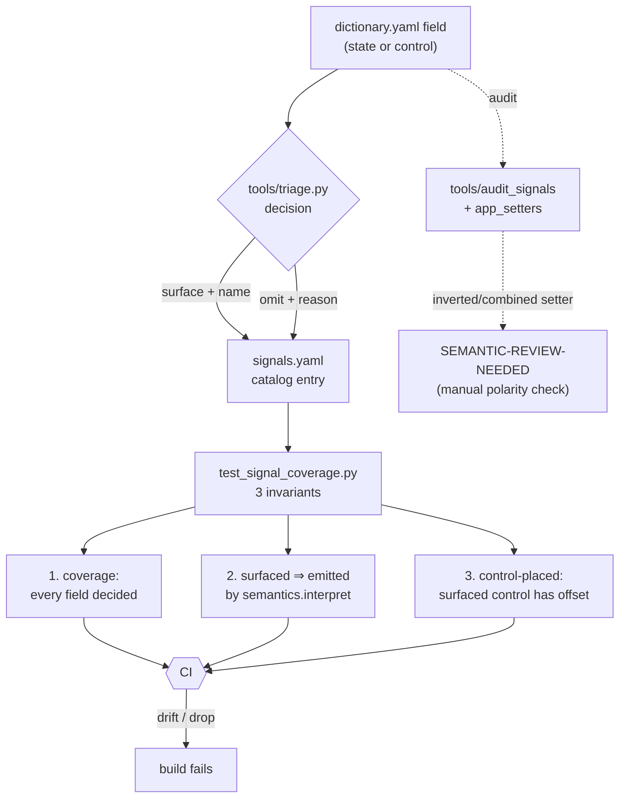

# Signals — the catalog guardrail, coverage, and scales

Two things a decoded BLE signal must never do again: go silently **missing/mislabeled**, or
be published with a **fake unit** on an unverified scale. This doc covers both — the
four-source catalog + coverage guardrail (§1–3), and which scales are verified vs
`UNVERIFIED` (§4–6). The machine-readable catalog is
[`protocol/signals.yaml`](../../protocol/signals.yaml).

---

## 1. The guardrail — every field has a decision

Every protocol field (state + control, all functions) carries an explicit **`surface`**
(with a canonical name) or **`omit`** (with a reason) decision in `signals.yaml`,
cross-validated against four independent sources, enforced by pytest on every commit.

Built after two real gaps surfaced by inspection: the leisure-battery current
(`ITwoBattBemAfs` → `batt2_current`) was decoded but never emitted, and `solar_power` was
briefly mis-suppressed. The audit found **~85 decoded-but-unsurfaced signals**; this catalog
resolved them and prevents recurrence.

### The four sources

1. **Decompiled app** (authoritative): field getters + scales (`×0.1` etc.), debug-log
   names, enum classes. Harvested by [`tools/app_scales.py`](../../tools/app_scales.py).
2. **Live captures**: sampled decoded values across vehicle states, range-checked by `kind`
   (voltage 8–16 V, percent 0–100, …) — the `OUT-OF-RANGE` check in the auditor.
3. **GUI**: `ui/screens/*.yaml` widgets + composeResources string keys. A field the GUI
   displays *must* be surfaced.
4. **VW documentation**: the official T7 California owner's manual (citations only — the
   copyrighted PDF is never committed). Confirms terminology/units: 80-Ah lithium *leisure*
   battery monitored by **voltage and current**, starter+leisure via a split-charge relay
   (the DC-DC "vehicle power"), electrohydraulic hold-to-move pop-up roof, separate
   fresh/waste water indicators.

### The tools

- `python3 -m tools.audit_signals --report` — triangulate + print discrepancies
  (`COVERAGE-GAP`, `STALE`, `GUI-SHOWN-BUT-OMITTED`, `SCALE-MISMATCH`, `OUT-OF-RANGE`,
  `SEMANTIC-REVIEW-NEEDED`). Currently **clean**.
- `python3 -m tools.audit_signals --seed` — add a stub entry for any new field.
- `tools/triage.py` — documents every surface/omit decision (re-runnable, deterministic).
- `tests/test_signal_coverage.py` — **the guardrail**, three invariants:
  1. **Coverage** — every dictionary field has a catalog decision (new field ⇒ CI fails).
  2. **Surfaced ⇒ emitted** — every `surface` state field's canonical name is actually
     emitted by `semantics.interpret` (the check that would have caught `batt2_current`).
  3. **Control-placed** — surfaced control fields have a resolved bit offset.

## 2. Coverage (87 surfaced / 130 omitted of 217 fields)

| function | surface | omit |
|---|---|---|
| airheater | 7 | 17 |
| campingmode | 5 | 5 |
| cooler | 5 | 19 |
| energy | 23 | 15 |
| general | 3 | 0 |
| generalpurposesignals | 0 | 21 |
| lighting | 19 | 21 |
| livingroomheater | 6 | 7 |
| roof | 2 | 5 |
| roofaircondition | 5 | 5 |
| satelliteantenna | 5 | 6 |
| stairs | 3 | 4 |
| water | 4 | 5 |

**Newly surfaced (were dropped):** leisure-battery current + per-source currents
(`dcdc/shore/solar_current`), leisure remaining-time, starter battery, `energy_mode` /
`derating_temp_active` / `sleep_warning`; living-room-heater air/water on + temperatures;
roof-A/C on/mode/fan/target-temp; satellite dish/selection/signal; air-heater
mode/air-distribution/runtime; all 16 lighting zone brightnesses; general SW versions.

**Omitted, with reasons:** `generalpurposesignals` (21 opaque `BitZero*`/`ByteZero*` with no
GUI or getter); `*InfoPopUp` (UI-transient); fault/warning bits (aggregated into `faults[]`);
feature-availability `*Installed` flags (surfaced as `installed`); granular timer detail; and
all **control** fields (definitions captured; command surfacing deferred).

**Delivery:** all 87 surfaced signals flow to InfluxDB (broad, via `numeric_fields`); a
curated subset is exposed as Home Assistant entities (`mqtt.ENTITY_SPECS`); not-installed
functions are `Installed`-gated, so they appear only on vans that have them.

Sources: [VW California owner manuals](https://en.volkswagenclub.net/manuals.php?ddlb_model=45),
[VW California Owners Club — user manuals](https://vwcaliforniaclub.com/resources/categories/california-user-manuals.7/).

## 3. The guardrail checks *presence*, not *semantic correctness* (the camping-lights miss)

**What happened.** `campingmode` was modeled with two separate, non-inverted light booleans
(`interior_light`, `outside_light`). The app actually has **one combined, inverted "Lights"
toggle** (`tf/a.java` `K0(on)` writes `0` to *both* light fields; readback `m2()` = lit iff
both read `0`), and the lights/USB are **only actionable while camping mode (`State`) is on**.
So our reads were split *and* polarity-inverted. It was caught only when the owner toggled the
light in the app and the read disagreed.

**Why cross-validation missed it — the real gap.** The guardrail enforces coverage, presence
(surfaced ⇒ emitted), and control-placement. It does **not** verify that the *interpretation
logic* — polarity, combination, gating — matches the app's setter/getter code.
`interior_light` was surfaced and emitted, so the guardrail was green while the semantics were
wrong. Two compounding causes:
1. **`semantics.campingmode` predated the catalog** and was hand-written with a naive
   `bool(field)` mapping; the signal sweep only *added missing* signals, it never re-validated
   existing interpreters against the GUI setters.
2. **The auditor's GUI cross-check is shallow** — `gui_keys()` only checks that a string key
   *mentions* a field, never reads the setter method (`K0`'s inverted combined write). The
   authoritative facts were in `camping-mode.yaml` / `climate-stairs.md`, but nothing forced
   the interpreter to honor them.

**Fix applied.** `lights_on = master and InteriorLight == 0 and OutsideLight == 0` (combined,
inverted, master-gated); `usb_charger`/`master_on` unchanged (normal); `OutsideLight` omitted
(tied to `InteriorLight`); catalog scale marked `inverted-combined`; HA entity → single
"Camping Lights", USB → "Rear USB Ports".

**Guardrail hardening (done).** `tools/app_setters.py` now flags any field whose app setter is
inverted/combined as **`SEMANTIC-REVIEW-NEEDED`** (the side branch in §1's diagram) — so a
naive `bool(field)` interpreter can't silently disagree with the app. Presence + scale are
still not the same as transform correctness; the review flag is the backstop. Open review
items are in §6.

---

## 4. Scales — verified

`signals.yaml` records a `scale`/`unit` per surfaced signal. Several are **`UNVERIFIED`**: we
decode the raw field correctly, but the multiplier (and thus the human unit) is **not**
confirmed against a live reference. Treat those as *trends*, not calibrated readings, and do
**not** label them with a unit that implies precision (the "fake percentage" trap).

| signal(s) | scale | unit | basis |
|---|---|---|---|
| `batt1_v`, `batt2_v` | ×0.1 | V | app getter + live read; **confirmed over 14 d telemetry**: batt1 12.2–14.8 V (mean 13.08), batt2 ~13.5 V nominal — realistic AGM/lead-acid band |
| `soc1_level`, `soc2_level` | raw | **0–15 level (NOT %)** | **confirmed over 14 d / 2472 samples**: soc1 ranged 6–14, soc2 10–14, mean ~9–10; **never approached 100 and capped at 14** (the 4-bit max). A percentage would show 60–100 on a parked-van drain; instead it behaves as a coarse level. Grafana shows a 0–15 bar gauge. |
| water `fresh/waste_percent` | derived (`Level×100/Volume`) | % | live-verified (11 L / 29 L = 38 %) |

### Sentinels in the telemetry (raw fields carry "no-data" markers)

Confirmed from 14 d of `calictl serve` history — a raw field is only meaningful when its
subsystem is **installed and awake**, otherwise it reports a sentinel:

| sentinel | fields | meaning |
|---|---|---|
| `0x81` (129) | `IOneBattBemAfs` (starter current) | engine-off / no measurement (handled in `semantics.energy`) |
| `511` (0x1FF) | `solar_current` (constant 511, solar **not fitted**), `shore_current` (tops out at 511) | not-installed / no-data marker for the source-current fields |
| constant default | `air_temp`≡20, `water_temp`≡0 (LR-heater **not fitted**) | uninstalled-function placeholder, **not a reading** — scale unlearnable here |

Takeaway: **never verify a raw scale against an uninstalled/asleep subsystem** — its "values"
are sentinels/defaults. `air_temp`/`water_temp`/`target_temp` and the solar/shore currents
stay `UNVERIFIED` because this van can't exercise them live.

## 5. Scales — UNVERIFIED (decode correct, scale not confirmed)

| signal(s) | what we know | do NOT assume |
|---|---|---|
| `batt2_current`, `dcdc_current`, `shore_current`, `solar_current` | mixed signedness: `batt2_current` (ITwoBattBemAfs) and `dcdc_current` (IDcdcAfs) are **signed** 16-bit two's-complement; `shore_current` (ILandAfs) and `solar_current` (IPvAfs) are **unsigned** 16-bit (`sg.a` type 1 = signed vs type 3 = unsigned, `yf/a.java:88-91`). Magnitude scale unknown. 14 d telemetry: batt2_current −49…318 (mean ~0, balanced), dcdc −2…29, dcdc_power 0…45; **solar/shore read the `511` sentinel** when not fitted (§4). | Not confirmed amps. Grafana labels them **"raw, unverified scale"**, not "A". A `511` reading is *no data*, not a huge current. |
| `air_temp`, `water_temp` (LR-heater), `target_temp` (roof-A/C) | **RESOLVED 2026-07-12** (semantics verified against the app): the app applies **no arithmetic scale** — these are **coarse levels** (`air_temp`/`water_temp` 4-bit 0–15, `target_temp` 8-bit), same category as SoC, **not °C**. | **Do NOT label °C** — a level/setpoint index. |
| `energy_mode` | 0=normal / 1=max_charge / 2=eco (3=error, read-only), **CONFIRMED** from source (`bf/c.java` enum + read getter `l()` + setter `d4()`, `xf/d.java`). | Not the old `0=eco` ordering — that was inverted vs source. |

**How to verify a scale.** (1) Drive a known state (a measured shore-charging current, a
thermometer at the heater sensor, a battery monitor's %). (2) `python3 -m calictl get energy`
(raw + interpreted) at that moment. (3) Solve for the multiplier; update the catalog
`scale`/`unit`, flip `confidence` to `high`, and (per the dashboard-sync hook) update the
Grafana panel unit + push. The guardrail keeps these signals surfaced; it does **not** assert
the scale — this doc + a live check do.

## 6. Open review items (inverted readback, not installed → unverifiable)

The `SEMANTIC-REVIEW-NEEDED` auditor check (`tools/app_setters.py`) flags functions whose app
code inverts a field (`!on?1:0` setter or `!((Boolean)…)` readback getter) but whose surfaced
fields don't mark it inverted. After the camping fix, two remain — **not installed on this
van, so polarity cannot be live-verified**:

| function | evidence | status |
|---|---|---|
| `satelliteantenna` | the only `!((Boolean)…)` in `mg/f.java:399` negates the derived `I0` composite (`System==1`), not any surfaced field | surfaced booleans **statically verified non-inverted**: `system_on`=`System==1` (`mg/f.java:162`), `installed`=raw `f17097b` (no negation). Only the uninstalled `Error`-enum granularity stays unconfirmable — a conservative flag |
| `stairs` | inverted setter + readback in `og/b.java` | `extended`/`obstacle_sensor` polarity UNVERIFIED — resolve when a stairs-equipped vehicle is available |

These stay flagged **on purpose** — the check honestly reports real, unresolved risk. Do not
"acknowledge" them by marking a scale `inverted` without verifying which field, or you
re-create the camping mistake in the opposite direction.
