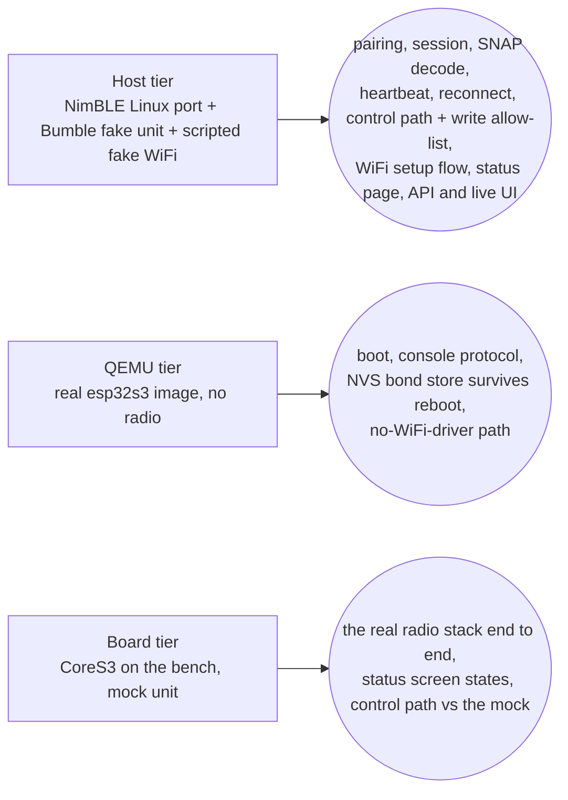
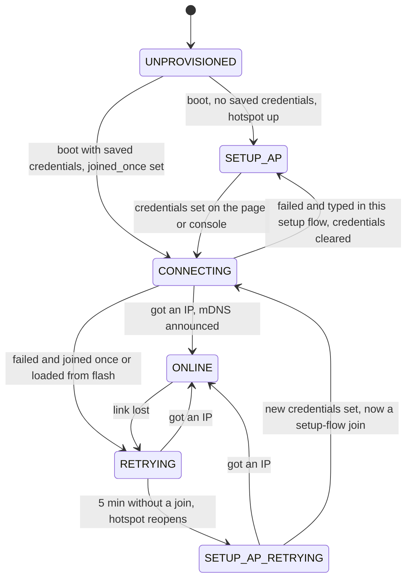

# ESP32 firmware (satellite, #154)

**Status: sub-projects 1 and 2b/3a of #154 + the status display + the control path (#154 B) —
reads everything and controls the cooler, camping mode, lighting (since 2026-10-07 the wake-up
light too, with the web page's clock), air heater and energy mode (no roof). The read side and the
display are bench-tested on a CoreS3 against the mock unit; the control path is proven on the Linux
host tier against the fake unit and on the CoreS3 bench against the mock unit (2026-10-07; the
wake-up light on the host tier only so far); nothing has ever talked to the real unit.** ESP-IDF + NimBLE firmware for an
ESP32-S3 "satellite" (the M5Stack CoreS3) that pairs with the camper unit and reads its state
independently of `calictl`/buspi — the explicit target for the pairing state machine
(`calictl/pairing.py`, `R_PAIRING_SM`) that the web wizard already runs. Its writes are the `1003`
liveness heartbeat (the same one the Pi build uses to keep reads fresh) and, since #154 B, the
control frames of five functions — the same bytes `calictl.control` builds, held identical by
golden vectors, through one write allow-list that never admits the roof's `1401` (see
[Control path](#control-path) below). Everything here is proven on Linux (a NimBLE host build
against a fake unit) and on an emulated chip (QEMU); a real CoreS3 runs the read side on a Linux
bench against the mock camper unit (the Board tier below), but it has never talked to the real
unit — see `firmware/README.md`'s "On-board verification" section for that plan. Since the WiFi/web
slice the firmware also joins a WiFi network (set up through its own hotspot + captive portal) and
serves a status page + JSON state API and, on the home network, the calictl web UI with its
controls live — see [Network: WiFi setup and the status page](#network-wifi-setup-and-the-status-page)
below, and the owner how-to [How to put the ESP32 satellite on your WiFi](howto-esp-wifi-setup.md).

The full build/porting detail (every NimBLE/Bumble adaptation, exact pins, warnings policy) lives
in [`firmware/README.md`](https://github.com/ckeller42/open-california/blob/main/firmware/README.md)
in the repository; this page is the traceability + orientation view.

## Three test tiers



| Tier | What it proves | What it cannot prove | Run locally |
|---|---|---|---|
| **Host + Bumble** (CI `firmware-host-e2e`) | The firmware's C code — pairing runner, session, console — driving the **real upstream NimBLE host stack** (Linux port) over HCI-over-TCP against a Bumble virtual controller linked to the repo's fake unit (`tools/fake_unit_peripheral.py`). Proves pairing (KEYBOARD_ONLY + MITM + SC), bond persistence/reconnect, the full `SNAP` read-all against `calictl.protocol.decode`, the 1003 heartbeat, notification push, link-drop recovery, that the unit sees no control write while no command is sent — and the control path (`tests/firmware/test_control_e2e.py`): every app-recorded cooler/camping/lighting/air-heater/energy action sent through `POST /api/command` reaches the fake unit byte-exact with the lighting commit ≥ 300 ms after its frame (since 2026-10-07 the app's wake-up edits too, the REQUEST_CONFIG pull included), the console `set` too, roof, stairs, clock-less wake-up and unknown commands and a roof, `1003`, wrong-length or empty frame handed straight to the transport write nothing (the allow-list choke point), `403` over the setup hotspot, `409` while a command runs, an ATT refusal is `502` with no commit, the heartbeat keeps ticking through commands. | Nothing about the real esp-nimble port or a real radio — this is upstream NimBLE 1.10 on Linux, not the ESP-IDF-vendored esp-nimble 1.6-based stack (gap documented in `firmware/README.md` Pins). | `firmware/host/fetch_nimble.sh && make -C firmware/host cali-host && python -m pytest tests/firmware -v` (Linux only, needs a 32-bit toolchain — see `firmware/README.md` "Host build notes" for the Docker recipe on macOS) |
| **QEMU boot** (CI `firmware-qemu`) | The **real ESP-IDF image** (compiled for the esp32s3) boots in Espressif's QEMU: the console line protocol on the no-controller path, and the NVS-backed bond store (`cali_kv_*`) surviving a reboot, including a CRC-broken record recovering as "unpaired" instead of crashing. | Bluetooth — QEMU's esp32s3 machine has no radio, so BLE stays with the host tier and hardware. | `docker run --rm -v "$PWD":/project -w /project/firmware espressif/idf:v6.1 bash -c '. $IDF_PATH/export.sh >/dev/null && idf.py -B build-qemu -D SDKCONFIG=build-qemu/sdkconfig -D SDKCONFIG_DEFAULTS="sdkconfig.defaults;qemu/sdkconfig.qemu" build && cd /project && pip install -q pytest && CALI_QEMU=1 python -m pytest tests/firmware/test_qemu_boot.py -v'` |
| **Host web e2e** (CI `firmware-host-e2e`, `tests/firmware/test_web_e2e.py`) | `cali-host --http PORT --fake-wifi SCRIPT`: the WiFi runner, captive DNS and web endpoints on the same 100 ms tick as the BLE session, over `net_host.c` (POSIX sockets on 127.0.0.1 + a scripted fake WiFi radio) and the Bumble fake unit. Proves the setup flow (fresh boot -> setup mode -> POST credentials -> station), a wrong password falling back to setup with the credentials cleared, saved credentials reconnecting after a restart + `DELETE /api/wifi`, `/api/state` equal to the console's `SNAP` after pairing, a WiFi loss leaving the BLE link and heartbeat alone, the page rendering in Chromium (EN + DE), and the setup flow clicked in Chromium (a wrong password shows the wrong-password text, the right one the `http://calictl-esp.local` link; EN + DE). | The real esp_wifi/lwIP/mdns stack, a real phone's captive-portal detection, radio coexistence — the fake WiFi only replays the script's outcomes. | `tools/ci.sh firmware` (Linux; on a Mac see `firmware/README.md` "Host build" for the Docker recipe) |
| **QEMU no-WiFi-driver** (CI `firmware-qemu`, `test_qemu_boot.py::test_no_wifi_driver_boots_and_serves_nothing`) | The QEMU image is built with `CONFIG_CALI_WIFI=n` (no esp_wifi call compiled in): it logs `LOG wifi: driver unavailable` once, keeps WiFi off (`status` has no `wifi` member, `wifi status` -> `LOG wifi: not enabled`), listens on nothing, and does not reboot — the same path a board takes when `esp_wifi_init`/`esp_wifi_start` fails. | Anything about a working WiFi driver (QEMU's esp32s3 has no WiFi). | The QEMU command above |
| **Board** (bench, not CI) | The real CoreS3 on a Linux bench against the mock camper unit (`tools/applab/fake_unit_ble.py` on a USB BLE dongle) and a second WiFi stick: flashing from `flasher_args.json`, the USB-Serial/JTAG console, esp-nimble passkey pairing + reconnect by bond, the setup hotspot -> `POST /api/wifi` -> station join, and the spec's seven status-display states (setup, joining, online, pairing, connected, stale, link lost) + dimming by remote `screenshot` (2026-10-01, `tools/esplab_display_walk.sh`; dated rows in `docs/business-logic/evidence-ledger.md`). **The control path ran on the board 2026-10-07:** `tools/esplab_control_walk.py --url http://calictl-esp.local --fifo … --record …` against the mock unit — every app-recorded action byte-exact at the mock (31 cases, 3 clean walks — a firmware before the wake-up light; 2026-10-08 again with it, 32 cases incl. the app's wake-up edits and a wake-up card edit from Chromium), roof/wake-up refused with no `1401`, console `set`, `403 setup_mode` over the real setup hotspot, the heartbeat through commands, the 30 s water re-read, and a fridge toggle from the UI in Chromium (BOARD rows in `docs/business-logic/evidence-ledger.md`). | The real camper unit (only the mock so far), a phone's captive portal, the van's radio environment, the control path against a real unit's ACK timing and refusals (the mock ACKs at once), the water *stale push then correct read* ordering (not stageable with the mock's console; session-fake tier only), and the hardware watch items below that need the real unit. | `tools/esplab_display_walk.sh` on the bench (header lists its env); `firmware/README.md` "Status display" |
| **Pure-C unit tests** (in the normal `test`/`pytest` job, no BLE) | The pairing state machine (`pairing_sm.c`) replays the same golden vectors as `calictl.pairing`; the runner and the session+console compile and run against scripted fake transports on any host with a C compiler (macOS included). The network pieces too: the WiFi SM replays `tests/vectors/wifi_sm.json` from its Python twin (`tools/wifi_sm_ref.py`), the HTTP core (`http_core.c`), captive DNS (`captive_dns.c`), web handlers (`web.c`, incl. `POST /api/command` against a fake sequencer), JSON writer and the host `cali_net` (`net_host.c`) each run under a small C driver, and the WiFi runner runs next to the BLE session in `test_session_fake.py`. The control twin (`control.c`) replays every vector of `tests/vectors/control.json` byte for byte and its allow-list is scanned exhaustively (`test_control_parity.py`; the Linux host tier repeats both with an i686 `-m32` build, the ESP32-S3's 32-bit `long`); the sequencer (`control_run.c`) runs against the scripted transport in `test_session_fake.py` (arming, one at a time, ATT error, link drop, late ACK, interleaved heartbeat/notify, the follow delay). | Real NimBLE call sequencing (that's the host tier's job); real sockets under load; any radio. | `python -m pytest tests/firmware/test_pairing_sm_parity.py tests/firmware/test_runner_fake.py tests/firmware/test_session_fake.py tests/firmware/test_wifi_sm_parity.py tests/firmware/test_http_core.py tests/firmware/test_captive_dns.py tests/firmware/test_web_handlers.py tests/firmware/test_json.py tests/firmware/test_net_host.py tests/firmware/test_control_parity.py -v` |

CI also builds the release esp32s3 image compile-only (job `firmware-build`, container
`espressif/idf:v6.1`, uploads the images + `flasher_args.json`) — it does not run the image
anywhere, just proves `cali_core` + `cali_ble_nimble` (unchanged from the host build) compile
clean against ESP-IDF's real esp-nimble under the host's `-Wall -Wextra -Werror` strictness.

## Console line protocol

Identical on the host build (stdin/stdout) and the device (UART/USB-Serial-JTAG console) —
`firmware/components/cali_core/include/cali_console.h`:

- **In**, one command per line: `pair` (start pairing), `passkey N` (the code the unit displays,
  ignored unless waiting for one), `forget` (drop the bond), `status` (reprint `STATE`), `quit`
  (host only — exits the process; no-op on the device), the WiFi commands `wifi set <ssid>
  <psk>`, `wifi status`, `wifi forget`, `wifi scan` (see [the network section](#network-wifi-setup-and-the-status-page);
  `LOG wifi: not enabled` while WiFi is off), and `set <function> <what> [value]` — a control
  command in calictl's `set` vocabulary (`set cooler power on`, `set lighting kitchen 5`,
  `set lighting save_profile 3 amber`; the value is the rest of the line, `""` when absent), see
  [Control path](#control-path). The console is physical access (USB), so `set` works in every WiFi
  mode; it answers `LOG control: <fn>/<what> …` lines — `sending` then `sent`, or `refused: <reason>`,
  `bad value`, `no such control`, `not ready (no armed link or no state yet)`, `busy`, or a
  failure (`failed: the unit refused the write`, `failed: write not issued`, `failed: link lost`,
  `timed out`).
- **Out**, one line each: `STATE {json}` (the pairing state machine's snapshot — the same keys as
  calictl's `/api/pairing`; the `status` command's line gains a `"wifi"` member once WiFi runs), `SNAP {"t":ms,"fn":{...}}` (every function the session holds a frame
  for, `codec_decode`d, in `CODEC_CHARS` order), `LOG text` (everything else, including every
  watch item below).

The session's read-all follows `calictl.device.read_all`: subscribe every notifying state char,
let the 1003 heartbeat run `CODEC_HEARTBEAT_WARMUP_MS` (generated from
`calictl.device.HEARTBEAT_WARMUP_S`'s default, 2 s) so the liveness registers and sensors refresh,
then read every function in order. A read completion and a notification both replace the
function's frame, so the **last frame to arrive wins** — the app's order (it subscribes, then
reads, and one decoder takes both; decompile 2026-10-07, calictl `R_READ_LAST_FRAME_WINS`). The
old "a notification beats the read latch" rule (the session skipped the read of a pushed function)
is gone: a stale water push on the subscribe no longer hides the correct read. The first `SNAP` of
a link follows that pass.

While the link stays up, **water (`1302`) is re-read every `CALI_SESSION_WATER_REREAD_MS` (30 s)**
after the read-all; its completion replaces the frame and prints a `SNAP`. 30 s is calictl's
`POLL_INTERVAL`, at which calictl reads 1302 on every poll; the ESP has no other periodic re-read
(it holds one link and otherwise lives on notifications), so this is the one timer. A parked latch
served at connect is corrected on the same link, no reconnect needed. Only water is re-read here.
This is a calictl-ism, not the app's: the app has no 1302 re-read timer at all (its only periodic
re-reads are screen pollers for 1102/1602/1902/1004 while those screens are open); it gets a fresh
1302 read on every reconnect instead.

## Network: WiFi setup and the status page

The firmware joins a WiFi network and serves a status page, a JSON state API and — in station mode
— the calictl web UI with `POST /api/command` on port 80 — the same C code on the host tier
(`cali-host --http`) and the device. Owner-facing steps:
[How to put the ESP32 satellite on your WiFi](howto-esp-wifi-setup.md).

**Pieces** (`firmware/components/cali_core/`, all platform-free C99, no malloc, reaching the network
only through the `cali_net_t` socket/WiFi table in `include/cali_net.h`):

| File | Role |
|---|---|
| `wifi_sm.c` | The WiFi provisioning/connectivity state machine — a line-for-line C twin of `tools/wifi_sm_ref.py` (no strings, radio or clock; time only as `WEV_TICK`'s argument). |
| `wifi_run.c` | The WiFi runtime: feeds `cali_net` events + ticks into the SM, runs its actions on `cali_net`, the captive DNS and the kv store, and owns the one BLE-coex gate (scans). |
| `http_core.c` | A single-connection HTTP/1.1 responder (below). |
| `captive_dns.c` | The setup hotspot's DNS: every A query answered with `192.168.4.1`, plus the table of OS captive-portal probe paths. |
| `web.c` | The endpoints and the page. |
| `snapshot.c` | The `fn` object shared by the console's `SNAP` and `/api/state`. |
| `status.c` (`include/cali_status.h`) | `cali_status_get()`: one `cali_status_t` snapshot (pairing state + bonded address, link up, last-`SNAP` age, WiFi mode/SSID/IP/RSSI/last failure, uptime, fw). `/api/state`'s `device` block and the screen both read it, so they cannot disagree. |
| `display_model.c` (`include/cali_display_model.h`) | The pure status-display model: a `cali_status_t` in, three rows (colour + EN/DE text), the footer mode and the brightness out — no LVGL, no clock (`R_FW_STATUS_DISPLAY`). |
| `components/cali_display/` (board build only) | The CoreS3 painter: the `espressif/m5stack_core_s3` board package + LVGL, ticked every `DISPLAY_REFRESH_MS` from the main loop, plus the `screenshot` console command (`shot.c`). Excluded from the host and QEMU builds (`CONFIG_CALI_DISPLAY`). |

Platforms: `components/platform/host/net_host.c` (POSIX sockets on 127.0.0.1 + a scripted fake WiFi,
`cali_net_host.h`) and `components/platform/esp/net_esp.c` (esp_wifi + esp_netif + lwIP sockets +
the `espressif/mdns` component, pinned `==1.13.1`). The constants are generated into
`csrc/net_consts.h` from `tools/wifi_consts.py` (`R_NET_CONSTS_SINGLE_SOURCE`): setup SSID
`calictl-esp-setup`, passphrase `calictl-setup`, address `192.168.4.1`, hostname `calictl-esp`
(DHCP + mDNS `calictl-esp.local`, `_http._tcp` on port 80), `NET_AP_CLOSE_MS` 30000,
`NET_RETRY_MIN_MS` 1000 -> `NET_RETRY_MAX_MS` 60000, `NET_SETUP_AFTER_MS` 300000, page poll
`NET_PAGE_POLL_MS` 2000, `NET_JSON_MAX` 8192, SSID 1–32 bytes, PSK 8–63 bytes.

### The WiFi state machine



Not drawn: `CREDS_FORGET` (console `wifi forget`, `DELETE /api/wifi`) goes from **every** state to
`SETUP_AP` — station stopped, credentials erased, hotspot up. Rules the diagram compresses:

- **Retry.** In `RETRYING`/`SETUP_AP_RETRYING` the station re-joins on a backoff that starts at
  1000 ms and doubles to a 60000 ms cap; saved credentials are **never** wiped by a failure there.
- **Credentials from flash count as "joined once"** (ruling R6): booting with saved credentials and
  an unreachable router retries forever — after 5 min the setup hotspot opens alongside
  (`SETUP_AP_RETRYING`), the retries go on. Only credentials typed in the current setup flow are
  cleared by a failed join (a typo never bricks setup: back to `SETUP_AP`, hotspot still up).
- **Hotspot close.** Once `ONLINE`, a hotspot that is still up closes 30000 ms later (the phone that
  did the setup gets to see the "connected as" answer first).
- **Replacing credentials** (`wifi set` or a `POST /api/wifi` while online/retrying/mid-join,
  rulings R14/R16): the runner takes the SM through a forget that keeps the new credentials (station
  down, hotspot up) and joins them as a setup-flow join — a typo lands the device back in setup,
  like a first-time flow, and the old network is not restored.
- **Mode** reported by the page and console (`cali_wifi_mode`): `setup` in `SETUP_AP` /
  `SETUP_AP_RETRYING`; `station` in `ONLINE`, and in `CONNECTING`/`RETRYING` when `joined_once`;
  `off` otherwise (`UNPROVISIONED` = WiFi off, and a setup-flow join in progress).

Console lines (`LOG wifi: …`, exact texts from `cali_wifi_run.h`/`console.c`): `setup hotspot up
(calictl-esp-setup)`, `setup hotspot closed`, `joining <ssid>`, `online <a.b.c.d>`, `lost`,
`failed <not_found|auth|other>`, `credentials cleared`, `credential erase failed`, `credentials
replaced, reconnecting`, `setup hotspot failed to start`, `captive DNS unavailable`; from `wifi set`
also `usage: wifi set <ssid> <psk>`, `bad ssid`, `bad psk`, `storing credentials failed`; before the
WiFi runtime booted `not enabled`; on the device also `driver unavailable`. `wifi status` answers `LOG wifi:
<setup|station|off> ssid=<ssid|-> ip=<a.b.c.d|-> rssi=<dBm|-> scan=<n>`. The passphrase is never
printed: the console does not echo input, an unknown/mistyped `wifi` line is logged by its first
word(s) only, and the line buffers are wiped after every command (on the ESP the console queue's
slot keeps its copy until a later line reuses it).

### Endpoints (`web.c`, contract in `include/cali_web.h`)

| Method + path | Answer |
|---|---|
| `GET /` | Station mode: 200 `text/html; charset=utf-8` — the calictl web UI bundle, `app_bundle_gen.h`'s `WEB_APP_HTML_GZ` with `Content-Encoding: gzip` and `Cache-Control: no-cache` (see [the satellite UI](#the-satellite-ui-r_fw_shared_ui)). Setup/off mode: the status/setup page (as `GET /device`). |
| `GET /device` | 200 `text/html` in every mode — the status/setup page: `strings_gen.h`'s `WEB_INDEX_HTML`, the byte array generated from `firmware/web/index.html` + `page.js` + `strings.json` (EN + DE) by `tools/gen_c_dict.py`; in station mode it links back with "Open the camper UI". One source of bytes on both tiers; no `EMBED_FILES`, no LittleFS. |
| `GET /api/state` | 200 JSON `{"t","fn","device"}` — `fn` = the `SNAP` object (every function the session holds a frame for, `codec_decode`d, `CODEC_CHARS` order); `device` = `pairing {state,address}`, `link {up,last_snap_age_ms}`, `wifi {mode,ssid,ip,rssi}`, `control {writes}` (`POST /api/command` accepted: station mode), `uptime_ms`, `fw`. Built whole in one handler call into the `NET_JSON_MAX` (8192 B) buffer (a full 14-function snapshot is ~4.5 KB); overflow -> 500 + `LOG http: overflow`. |
| `GET /api/wifi` | 200 JSON `{"mode","ssid","ip","rssi","last_error","scan":[{"ssid","rssi","secure"}]}` (the last scan's list, up to 16); `last_error` is why the last join failed (`"not_found"`, `"auth"`, `"other"`) or `null` (none yet, or cleared by new credentials or by joining) — the setup page turns it into one of three texts; in setup mode it also asks for a fresh scan for the next GET. |
| `POST /api/wifi` | Body exactly `{"ssid":"…","psk":"…"}` (fixed-shape parser). SSID 1–32 bytes, PSK 8–63 bytes (open networks unsupported) -> stored in the kv store, handed to the runner -> 200 `{"ok":true}`; else 400 `{"ok":false,"error":"json"|"ssid"|"psk"}`, a kv failure 500 `"store"`. |
| `DELETE /api/wifi` | Forget the WiFi (-> `SETUP_AP`) -> 200 `{"ok":true}`. |
| `POST /api/command` | calictl's control request `{"function","what","value","confirm"}` plus the optional `local_now` (the page's clock for `lighting wakeup`, see [Control path](#control-path)) (`value` a string, integer or null — booleans/fractions/nesting 400 `bad_json`). **Station mode only**: anywhere else 403 `setup_mode` (ruling B: never over the setup hotspot). Then web.py's 400 `missing_function_or_what` / `confirm_required` (airheater, roof), then the sequencer (`cali_control.h`): accepted -> the answer waits for the write ACKs (`CALI_HTTP_PENDING`, <= `CALI_CTL_DEADLINE_MS`) -> 200 `{"ok":true,"applied":null,"state":null,"error":null,"function":fn}` (`applied` never true: no readback) or 502 `write_failed` / 504 `write_timeout`; a gate or "Only via buspi or the app" -> 200 `{"ok":true,"applied":false,"refused":<text>,…}`; 400 `bad_value` / `unknown_control`, 409 `busy`, 503 `not_connected`. The core caps a pending answer at `CALI_HTTP_PENDING_MAX_MS` (2 x the deadline; 504 text/plain) so a handler that never answers cannot wedge the single connection. Deliberate differences from calictl: Content-Type is not checked (calictl: 415), `-0` passes as the text `"-0"` (refused as not on/off where calictl reads OFF — the safe direction), a >= 64-byte value is `bad_json` before the gates (the console `set` gates first; both refuse). |
| other method on `/api/state`, `/api/wifi` or `/api/command` | 405 `{"ok":false,"error":"method"}` |
| an OS captive-portal probe path (setup mode) | 302 `Location: http://192.168.4.1/` — `/generate_204`, `/gen_204` (Android), `/hotspot-detect.html`, `/library/test/success.html` (Apple), `/connecttest.txt`, `/ncsi.txt` (Windows), `/canonical.html`, `/success.txt` (Firefox) |
| any other path | setup mode: 302 `Location: /`; station mode: 404 |

**HTTP core** (`include/cali_http.h`):
one connection at a time, one request per connection, every response `Connection: close`;
requests up to `NET_HTTP_REQ_MAX` (2048 B) of headers, no chunked bodies (400), 413/431 on
oversize; the response is streamed across as many ticks as the socket needs (`tcp_send` "would
block" = retry next poll — never blocks, never spins); a connection idle for `CALI_HTTP_IDLE_MS`
(5000 ms) is closed, except while a handler's answer is pending (`CALI_HTTP_PENDING`, below). The
page polls `/api/state` every 2000 ms; while a command pends the single connection is held, so a
poll waits up to the command's deadline (the UI shows "Sending…", never the offline banner).

### Control path

The satellite sends control frames for **five functions — cooler (`1101`), camping mode (`1201`),
lighting (`1501`), energy (`1601`), air heater (`1701`)** — and nothing else. **Not the roof:** it
answers the refusal `Only via buspi or the app` (the UI greys it with the same words), an owner
ruling (a motor on a satellite with no ignition gate of its own). Every lighting command is
carried: `door_contact`, `profile`, `save_profile N [colour]` (with the SET_COLOR preface), the
zones, `power`, `all` and, since 2026-10-07, `wakeup` (below).

**The wake-up light** (`R_FW_WAKEUP`, spec `2026-10-07-esp-wakeup`). *Decision 3 of the control-path
plan — "the wake-up light stays with buspi or the app, the ESP has no clock and no latch" — was
superseded on 2026-10-07 by spec 2026-10-07-esp-wakeup.* The edit needs two things the ESP does not
have on its own, and gets them like this:

- **The clock is the web page's.** The shared UI adds `local_now` to every `lighting wakeup`
  request: the browser's wall clock read as UTC, `Math.floor((Date.now() - new
  Date().getTimezoneOffset() * 60000) / 1000)`, the same "local time packed as UTC" the app uses, so
  the unit wakes at the HH:MM the user typed in the browser's own time zone. calictl accepts and
  ignores it; the C twin's wake-up builder uses it as its only clock (no SNTP, no time-zone
  setting). `local_now` must be a JSON integer ≥ `1767225600` (2026-01-01T00:00Z), else `400
  bad_value`; missing or `null` → refused with *the wake-up light needs the time from the web page —
  set it there*. There is no skew check (owner ruling R1): a wrong browser clock gives a wrong
  wake-up time, as in the app. The console `set lighting wakeup …` has no page, so it is always
  refused with that clock reason.
- **The rest of the edit comes from the unit's own config.** The session latches the unit's
  lighting config (wake-up time + light value, door contact, stored favourites — a C twin of
  `semantics.lighting_config`, held to it by `T_FW_LIGHT_CFG_PARITY`) from every 1502 frame the unit
  sends (READ or NOTIFY), never from a write. The latch is **shown across links** (`/api/state`
  `fn.lighting` carries the four raw latch keys, interpreted by `semantics.js`, so the wake-up card
  keeps its values over a reconnect) but **gates and fills commands per link**: a previous link's
  config never fills an edit on the new one. A change of the bonded identity (forget, or a bond to
  another unit) drops the stored frames and the latch, so another unit's config is never shown. The
  favourite gate reads the same latch.
- **The REQUEST_CONFIG pull, inside one command** (calictl's ruling R5). When the edit needs a
  config field this link has not seen, the sequencer first writes `LIGHT_REQUEST_CONFIG` + the
  commit (after `CODEC_FOLLOW_DELAY_MS`), waits up to `CODEC_CONFIG_PULL_MS` (2000 ms) for the
  unit's reply, re-plans with `local_now` + the seconds elapsed, then writes the wake-up frame + its
  commit — or, still unknown, refuses with `WAKEUP_UNKNOWN` (*wake-up config not known yet (the unit
  has not reported it): give on|off with the edit*) and writes nothing more. The default-filled
  frame, which would silently disarm a phone-set alarm, is never written. A pulling command has one
  deadline of `CALI_CTL_DEADLINE_MS` + `CODEC_CONFIG_PULL_MS` = 6 s, under the HTTP core's 8 s
  pending cap; the sequencer stays `busy` for all of it.

**Python is the authority** (`R_FW_CONTROL_TWIN`). `tools/gen_c_dict.py` emits every constant,
table and gate text the C twin needs into `csrc/control_consts.h` (the allow-list `CALI_CTL_CHARS`
with each function's control char + exact frame length, `CALI_LIGHT_COMMIT`, zone/colour/mode
tables, `CALI_REASON_*` = `control.REASON_*`), and `tools/gen_control_vectors.py` asks
`control.command_precondition` / `build` / `preface_for` / `commit_for` over a value grid × state
variants and over every app-recorded action, in `device.actuate`'s write order, into
`tests/vectors/control.json`. `control.c` (`cali_ctl_plan`) is a hand-written C99 port of the five
builders and the six gates and must reproduce every vector byte for byte
(`tests/firmware/test_control_parity.py`); both generators have `--check`, so a wording or builder
change in Python fails CI until the header/vectors are regenerated. The ESP's bytes equal calictl's,
and calictl's equal the app's on every recorded action (since ruling R1 the cooler frames are
app-identical too — every untargeted field at the app's leave-unchanged value, `State=3` in the
level/mode/timer frames; that frame has not reached the real unit yet: van check #230,
`docs/business-logic/control-and-actuation.md` §3/§5). A value that is not `on`/`off`/`true`/`false`/
`1`/`0` for an on/off command is refused, never read as OFF (R3), and cooler `night_on`/`night_off`
are refused while no cooler state is known (R4) — the same `REASON_*` texts on both sides.

**Allow-list choke point** (`R_FW_WRITE_ALLOWLIST`). One function, `cali_ctl_write_ok(char, len)`,
admits exactly `1101`/6, `1201`/1, `1501`/16, `1601`/1, `1701`/6 bytes; the sequencer calls it
before every write and the NimBLE transport's `write` (`ble_nimble.c` `t_write`) calls it again for
any caller, so a roof frame (`1401`), the heartbeat char through the control path (`1003`), an
oversize/short or empty frame are refused before NimBLE sees them (`LOG ble: write …/… refused: not
on the control allow-list`). No roof builder exists; the generator asserts `1401` is absent. The
`1003` heartbeat has its own fixed-target write (`write_heartbeat`); CCCD writes only enable
notifications. The old read-only guard (`-DCODEC_NO_ENCODE` + an `nm` check, `R_FW_READ_ONLY`) is
retired — the C builders need `codec_encode`.

**Arming and sequencing** (`R_FW_CONTROL_API`, `control_run.c`). The ESP session writes the `1003`
heartbeat for the whole life of a link, so there is no per-write arm: a command is accepted when
`cali_session_ready()` — link up, first read-all done, and the link up for at least
`CODEC_ARM_DELAY_MS` (3000, from calictl's `ARM_DELAY_S`) — and the target function's state was read
**on this link** (a frame from a previous link is kept for display but never trusted by a gate or a
builder); otherwise `not_connected`. The gates read the latest frame, so a notification that flips a
gating field is honoured by the very next command. One command at a time (`busy` otherwise, also
while a timed-out write still awaits its ACK); the planned frames go out one at a time with
response; a lighting commit (`0e00…`) follows each frame at least `CODEC_FOLLOW_DELAY_MS` (300)
after the previous write's ACK — the sequencer runs on the 100 ms tick and cannot see the ACK's own
time, so the real gap is 300–400 ms, never less (the app streams at ~500 ms). An ATT error fails the
command with no further frame (no commit after a refused frame); a link drop mid-command fails it;
the whole command gives up after `CALI_CTL_DEADLINE_MS` (4 s; 6 s for a wake-up that pulls the
config first, above). Success means every write was ACKed —
the ESP does no readback check (`applied: null`). The UI then confirms from the unit's own state:
it watches the next `/api/state` polls (up to 5 s) for the field the control shows (a toggle, a
slider, a select, or the All-lights master) to reach the sent value, and says "✓ Applied". When
the value does not appear in time, or the control has no such field, it says "Sent — the unit
didn't confirm it" ("Sent — check the lamp" for lighting).

**`POST /api/command`** takes calictl's request shape and answers in calictl's response shape, so
the shared UI works unchanged (route table above; contract in `cali_web.h`). The answer is deferred
until the sequencer is done (`CALI_HTTP_PENDING`: the handler is re-asked every poll, no idle
timeout meanwhile, capped at `CALI_HTTP_PENDING_MAX_MS` = 8 s with a text/plain 504), so a refused or
timed-out write is never reported as "Sent". **Station mode only:** over the setup hotspot, during a
setup-flow join or unprovisioned the endpoint answers `403 setup_mode` before anything reaches the
control module, and `/api/state` reports `device.control.writes: false` so the UI greys every control.
The endpoint has **no login**, like calictl's `/api/command`: the project owner's ruling is that every
device on the local network is trusted, so the web UI gets no authentication, origin check or
write-path hardening (the same stance as the WiFi how-to's "no login" paragraph).

| Status | Body | When |
|---|---|---|
| 200 | `{"ok":true,"applied":null,"state":null,"error":null,"function":fn}` | every write ACKed (`applied` never `true`) |
| 200 | `{"ok":true,"applied":false,"refused":<reason>,"state":null,"error":null,"function":fn}` | a `command_precondition` gate; "Only via buspi or the app" (roof, any other function); a wake-up without `local_now` (the clock reason); a wake-up whose config the REQUEST_CONFIG pull did not bring (`WAKEUP_UNKNOWN`) |
| 400 | `{"ok":false,"error":"bad_json"}` | not the fixed shape; `value` a boolean, fraction, nested, or ≥ 64 bytes; unknown or duplicate key |
| 400 | `missing_function_or_what` / `confirm_required` | calictl's own codes (`confirm` is required for `airheater` and `roof`) |
| 400 | `bad_value` / `unknown_control` | `control.build` would raise (`CommandError` or `TypeError`) / would return `None`; `bad_value` also for a `local_now` that is not a JSON integer ≥ `1767225600` (ESP-only key; calictl ignores it) |
| 403 | `setup_mode` | not in station mode (ESP-only) |
| 405 | `method` | anything but POST |
| 409 | `busy` | a command is running, or a timed-out write still awaits its ACK (ESP-only) |
| 502 | `write_failed` | the unit refused a write (ATT error) — no commit follows (ESP-only) |
| 503 | `not_connected` | no armed link, or the function's state not read on this link (ESP-only) |
| 504 | `write_timeout` | no ACK within `CALI_CTL_DEADLINE_MS` (+ `CODEC_CONFIG_PULL_MS` for a wake-up that pulls the config) (ESP-only) |

Deliberate differences from calictl (all in the refusing direction, the UI never sends them):
Content-Type is not checked (calictl answers 415); an integer `value` is passed as its decimal text
and `-0` stays `"-0"` (refused as not on/off where calictl reads OFF); a ≥ 64-byte value is
`bad_json` before the gates (the console `set` gates first — a long `timer_set` with the fridge on
is *refused* there, *bad* here; both refuse); `CommandError` is `400 bad_value` instead of the
message, and `TypeError` (e.g. `level` with `null`) is a 400 where calictl answers 500.

The UI turns the three codes the owner can act on into sentences (`setup_mode`, `busy`,
`not_connected`); every other code shows `Command failed: <code>`. **Proof tiers:** vectors
(`tests/test_control_vectors.py`) → pure-C parity (`test_control_parity.py`) → the sequencer on
the scripted transport (`test_session_fake.py`) → the endpoint on a fake sequencer
(`test_web_handlers.py`, `test_http_core.py`) → the real HTTP core + NimBLE against the Bumble fake
unit (`test_control_e2e.py`, `test_web_e2e.py` with the UI in Chromium) → the CoreS3 bench
(**BOARD** 2026-10-07, against the mock unit) → the real unit (**never**: the satellite has not talked to it; the bytes are calictl's).

### The satellite UI (`R_FW_SHARED_UI`)

In station mode `GET /` serves calictl's own web UI — the same `calictl/webui` bytes buspi serves,
inlined into one document by `tools/gen_c_dict.py` (`render_app_bundle`), gzipped with `mtime=0`
(reproducible bytes) into `firmware/web/app_bundle_gen.h`; `--check` compares the decompressed
document, so a stale bundle fails CI. The browser does the interpretation: the firmware's raw
`/api/state` goes through `calictl/webui/semantics.js`, the JavaScript twin of
`calictl/semantics.py`, pinned to it by the golden vectors in `tests/vectors/semantics.json`.
`adaptSatellite` turns the body into the daemon's state shape and synthesizes `_meta`; `online` =
link up and snapshot age ≤ 10 s (`SAT_STALE_S`), the same instant the CoreS3 screen goes stale.
`_meta.read_only` is the inverse of the firmware's `device.control.writes` (`writes` is true in station
mode; `read_only = !writes`): with `writes` true the controls are **live** — the page POSTs calictl's `/api/command` body and requests nothing but `/`,
`/api/state` and `/api/command` — except the pop-top roof, which stays greyed
with the hint `Only via buspi or the app`; without it (setup mode, or an older firmware without the
field) every control is greyed and the "Satellite — display only" banner shows. The firmware's
own answers get a sentence: `403 setup_mode` → "Controls work only on your home WiFi — not over
the setup hotspot", `409 busy` → "The satellite is still sending the previous command — try again
in a moment", `503 not_connected` → "Not connected to the camper unit yet — try again in a few
seconds"; a success is "✓ Applied" once the unit's state shows the sent value, otherwise
"Sent — the unit didn't confirm it" (no readback on the ESP — see above). The wake-up card is
live since 2026-10-07: it shows the config the unit last reported (the latch keys in `fn.lighting`,
also from a previous link). Until the unit has reported one it shows *Wake-up settings not known
yet — the unit has not reported them*: only the time is live (empty, never an invented 00:00) and
an edit sends the time alone, so the sequencer pulls the config and writes with it, or refuses with
`WAKEUP_UNKNOWN`, which the page shows; the switch, areas, brightness and lead time stay disabled
(empty fields would look like "no area set"). The same holds on the daemon's page. Every edit sends
`local_now` (so does the daemon's page, which ignores it) and is confirmed from the unit's state —
time, switch, areas, brightness and lead time all matching — else "Sent — the unit didn't confirm
it". The UI sends
at most one `/api/state` poll at a time (WebKit would otherwise stack one per tick on the
single-connection core while a command pends). The German texts of these four satellite-only
strings are **proposals** (the app has none of them; `strings.de.js`): *Nur über buspi oder die
App*, *Steuerung nur im eigenen WLAN — nicht über den Einrichtungs-Hotspot*, *Der Satellit sendet
noch den vorherigen Befehl — gleich noch einmal versuchen*, *Noch nicht mit der Camper-Einheit
verbunden — in ein paar Sekunden noch einmal versuchen*. The two wake-up refusals (no app string
either) are owner-confirmed (2026-10-08): *Das Wecklicht braucht die Uhrzeit der Webseite — dort einstellen* (the clock reason) and
*Wecklicht-Einstellungen noch nicht bekannt (die Einheit hat sie nicht gemeldet): Ein/Aus mit
angeben* (`WAKEUP_UNKNOWN`, which calictl answers too). Device and WiFi details stay on `/device`
(⋮ menu "Device & WiFi").

Known gaps (accepted):

- No roof from the satellite (above); no `applied: true` — the UI confirms
  from the unit's reported state instead (above).
- No water stale-hold: a parked, latched-low fresh tank shows unflagged on the satellite (calictl
  holds it via `freshness.implausible_water_drop` + a persisted baseline; whether that guard is still
  needed now that both read 1302 after subscribing is open until a van trace, #230).
- The wake-up light takes the browser's clock unchecked (ruling R1): a phone or laptop with a wrong
  clock or time zone sets a wrong wake-up time, as the app would.
- No battery history chart; no pairing wizard (ESP pairs via console); no auto-camper.
- UI changes reach the satellite only with a firmware rebuild + reflash.

**Measured first load** (2026-10-02, thinky → CoreS3 over a 2.4 GHz home network, bench mock unit,
`tools/esplab_ui_load.py`, 5 cold runs, fresh browser context each): median `loadEventEnd`
**960 ms**, median time to a live state **1065 ms** (curl of the 51,574 B gzip body alone: median
0.91 s). The bundle is 51,574 B gzipped, 79 % of `WEB_APP_GZ_MAX` (65,536 B). Re-measured with the live
controls (2026-10-07, 3 cold runs): median `loadEventEnd` **1030 ms**, live state **1138 ms**.

**Where the credentials live:** the kv store keys `wifi_ssid` / `wifi_psk` — NVS namespace `cali`
on the device (esp_wifi's own NVS copy is off: `WIFI_STORAGE_RAM`, `CONFIG_ESP_WIFI_NVS_ENABLED=n`),
`<store>/wifi_ssid.kv` / `wifi_psk.kv` on the host — in plain text (CRC-framed, not encrypted), per
the project's trusted-LAN stance.

**BLE coexistence** (ruling R15): WiFi events never reach the BLE session or its heartbeat — they
share only the tick. The one gate is scans: `cali_wifi_run_scan()` holds a scan back while a BLE
pairing flow is **active** (runner state not idle/bonded/error — a failed pairing does not block
it) and starts it on the first tick after the flow ends.

**Size** (ruling R18): the WiFi stack (net80211, wpa_supplicant + PSA crypto, lwIP, pp/phy, mdns)
adds ~615 KB (+615,632 B) to the release image — `cali_fw.bin` 463,248 B -> 1,078,880 B — so `partitions.csv`
gives the factory app **3 MB** on the 16 MB flash (66 % free); the plan's ~250 KB estimate was off
by about 2.5x. Details: `firmware/README.md` "WiFi build".

## CI jobs (`.github/workflows/ci.yml`)

| Job | Runs |
|---|---|
| `test` (the normal matrix) | `tests/firmware`'s pure-C tests (pairing + WiFi SM parity, runner fake, session fake incl. the control sequencer, HTTP core, captive DNS, web handlers incl. `POST /api/command`, JSON, host `cali_net`, the control twin's vector parity + allow-list scan) via `-m "not linux_only"` — no BLE, runs on every Python version; plus the control vectors' freshness (`tests/test_control_vectors.py`) and the satellite UI e2e over a stub (`tests/e2e/test_satellite.py`) |
| `codec-parity` | `gen_c_dict` / `gen_codec_vectors` / `gen_control_vectors --check` and the C parity modules (`test_control_parity.py` among them) with `gcc` |
| `firmware-host-e2e` | The NimBLE-Linux + Bumble end-to-end tier, incl. the WiFi/web e2e, the control path (`test_control_e2e.py`) and the page in Chromium with a live fridge toggle reaching the fake unit (`tools/ci.sh firmware`) |
| `firmware-build` | Compiles the release esp32s3 image against ESP-IDF's real esp-nimble; uploads the flashable images |
| `firmware-qemu` | Builds the QEMU-probe variant (no WiFi driver) and boots it in QEMU |

## Hardware watch items (unresolved until the CoreS3 board runs)

These are called out explicitly because none of them can be exercised by the host or QEMU tiers —
each is a genuine gap between "compiles and passes on Linux/QEMU" and "runs correctly on the real
chip":

1. **Bond-store guard.** ESP-IDF's esp-nimble can silently swap our NVS-backed bond store for a
   RAM-only one at host sync (`CONFIG_BT_NIMBLE_STATIC_TO_DYNAMIC`, see ruling below) unless
   guarded. Two guards ship (`STATIC_TO_DYNAMIC=n` in `sdkconfig.defaults`, plus
   `cali_ble_store_ensure()` re-installing the callbacks and logging `LOG store: ERROR bond store
   callbacks were replaced by the BLE stack, re-installed`), but whether esp-nimble itself leaves
   the store alone on real hardware is unverified — **first flash: pair, reboot, the unit must
   reconnect by bond with no passkey and no `store: ERROR` line.**
2. **Local-IRK `WARN`.** With the guard above (`STATIC_TO_DYNAMIC=n`), NimBLE still asks the
   store for a `BLE_STORE_OBJ_TYPE_LOCAL_IRK` object at every sync; `ble_store_kv.c` answers
   `ENOTSUP` for it, so NimBLE generates a new random local IRK every boot and logs `WARN Failed
   to persist local IRK (rc=…)`. Believed benign (we connect by the *unit's* identity address, not
   our own), but unverified on real hardware.
3. **Host-task stack size.** `CONFIG_BT_NIMBLE_HOST_TASK_STACK_SIZE=8192` (the NimBLE host task
   runs all of `cali_core` — SM, runner, session, console) is a guess, not measured; check the
   high-water mark on hardware before trusting it under load.
4. **USB-Serial/JTAG console.** The CoreS3's USB-C is the S3's native USB, not UART0 (UART0 only
   reaches the M5-Bus header) — ruling R9 below. The release build uses
   `CONFIG_ESP_CONSOLE_USB_SERIAL_JTAG=y`; this has never been tried against a real
   `/dev/cu.usbmodem*` port.
5. **`esp_bt_controller_init` under QEMU.** Not a hardware item but a QEMU limitation worth
   knowing before it's mistaken for one: QEMU's esp32s3 machine has no BT low-power clock, so
   `esp_bt_controller_init` **asserts** (reboot loop) instead of returning an error — the QEMU
   probe build (`CONFIG_CALI_QEMU_PROBE`) skips `nimble_port_init()` entirely rather than relying
   on the no-controller fallback path. The no-controller fallback itself (`LOG ble: controller
   unavailable`, console still answers) is what a real board would take if its radio genuinely
   failed to init, and *that* path is what QEMU exercises.
6. **Device-only NimBLE options (final review I1).** esp-nimble has options upstream NimBLE (the
   host tier) lacks or defaults differently; `sdkconfig.defaults` pins them to the host syscfg:
   `CONFIG_BT_NIMBLE_ENABLE_CONN_REATTEMPT=n` (else a 0x3e establishment failure — this unit's
   known failure — is re-attempted inside the stack and comes up unencrypted),
   `CONFIG_BT_NIMBLE_MAX_CONNECTIONS=1`, `CONFIG_BT_NIMBLE_EXT_ADV=n`/`EXT_SCAN=n` (extended
   discovery events are not handled) and NimBLE log level WARNING. On the board: a failed connect
   must show as one `CONNECT_FAIL`-driven retry of the SM/session (no silent second link), the
   unit must be found by the legacy scan, and no NimBLE INFO lines may appear between the console
   lines.
7. **The control path on real esp-nimble (BOARD 2026-10-07, against the mock unit).** Everything about writes was
   first proven on upstream NimBLE 1.10 on Linux: the write-with-response op, the `WRITTEN` completion
   (which can fire inside the `write()` call when the op fails at once — the sequencer sets
   in-flight before writing for that reason), the ACK timing behind the heartbeat on the one ATT
   queue, and `py_int`'s saturation at `LONG_MAX` (32-bit `long` on the ESP32, 64-bit on the host;
   every bound is ≤ 255 so no outcome should change). On the board (CI image of `8b1eda0`):
   `tools/esplab_control_walk.py` against the mock unit reported `"problems": []` three times (31
   cases), roof/wake-up were refused with no `1401` in the mock's recording (that firmware predates the
   satellite's wake-up light), a POST over the setup
   hotspot was `403`, and a fridge toggle from the UI landed as one `1101` write. The lighting
   commit followed its frame by 399–550 ms (≥ 300 ms as required; measured write to write at the mock, so the
   tail above 400 ms is likely the ACK lagging the write — ACK times were not measured). **2026-10-08** (CI
   image of `6ac867c`, the satellite's wake-up light): 3 clean walks of 32 cases incl. the app's 4 wake-up
   edits (`:239` as the REQUEST_CONFIG pull + refusal), no `1401`, commits 397–550 ms after their frame; a
   wake-up card edit from Chromium landed byte-exact with the config latched and, with none, as the pull
   then the frame (*✓ Applied*). Still open: a real unit's ACK timing and refusals.

## Network watch items (board only)

The host tier replays scripted WiFi outcomes and QEMU has no WiFi, so these wait for the CoreS3:

1. **BLE + WiFi coexistence.** The S3 shares one 2.4 GHz radio (IDF's default software coex).
   With the setup hotspot up and a phone attached, the BLE link must hold, the `1003` heartbeat keep
   its period and `SNAP`s keep their cadence; the same while the station scans and joins.
2. **Captive portal per OS.** Join `calictl-esp-setup` from iOS, macOS, Android and Windows: the
   sign-in sheet should open the page by itself (DNS answers everything with `192.168.4.1`, probe
   paths get a 302). Record per OS whether it pops, and that `http://192.168.4.1` always works.
3. **mDNS.** `http://calictl-esp.local` from iOS, macOS and Android (Android's `.local` support
   varies — the router list and `wifi status` are the documented fallbacks).
4. **Single-connection HTTP.** Browsers open several parallel connections; the core serves one at
   a time. Check the page stays responsive with one tab, and how it degrades with two or three.
5. **ESP event behaviours assumed from the IDF docs** (`net_esp.c`, join generations): our own
   `esp_wifi_disconnect` ends an attempt with reason `ASSOC_LEAVE` (8); the disconnect event carries
   the SSID; `esp_wifi_connect` straight after `esp_wifi_disconnect` works; a `SCAN_DONE` arrives
   when a join aborts a running scan (the 15 s scan watchdog is the backstop).
6. **Typo, then the fix.** Type a wrong password, then the right one within ~2 s: `LOG wifi:
   online` must follow and no `LOG wifi: failed auth`.
7. **Out of range and back.** Leave the saved network out of range for minutes, then restore it:
   at most one `esp_wifi_connect` per driver attempt (`LOG net:` stays quiet), `ONLINE` within one
   retry period of the AP returning, the hotspot opening after 5 min and closing 30 s after the join.
8. **Size + heap.** The 1,078,880 B image in the 3 MB partition flashes from the build's own
   flasher args; DIRAM use (160,018 B, 46.8 %) leaves the NimBLE host task and the 8 KB JSON buffer
   room under real traffic.

## Design rulings worth knowing

- **R9 — device console is USB-Serial/JTAG, not UART0.** The plan originally assumed UART0; a
  console nobody can type into makes pairing impossible on the CoreS3 (its USB-C is the native
  USB, UART0 only reaches the M5-Bus header). The QEMU variant keeps UART0 (QEMU emulates UART,
  not USB-Serial/JTAG) via its own `sdkconfig.qemu` overlay — same console line protocol either
  way, different driver at compile time.
- **R5 — host build pins upstream NimBLE 1.10, not the IDF's 1.6.** ESP-IDF v6.1 vendors
  esp-nimble based on NimBLE 1.6.0, whose Linux TCP socket transport doesn't link
  (`ble_hci_sock_cmdevt_tx` missing); 1.10.0 is the first release with a complete `linux_tcp`
  port. The GAP/SM/GATT API used here is unchanged across that gap, and Task 8 (the
  `firmware-build` job) compiles the same `cali_ble_nimble.c`/`ble_store_kv.c` unmodified against
  the real esp-nimble 1.6-based tree to catch any skew at compile time.
- **R7 — no SM transition for a link drop while waiting for a passkey.** Both the C port and
  `calictl.pairing.py` end `WAITING_PASSKEY` only via the 60 s timeout, not an immediate retry on
  disconnect. Kept intentionally identical (golden-vector parity between the two); flagged as a
  shared follow-up, not a firmware-only gap.
- **R8 — `STATE` mirrors calictl, not the link.** After booting with a stored bond the pairing
  state machine is `idle` (address = the bonded identity) even before any link is up — whether
  the *session* actually holds a connection is a separate concern the console does not report
  (the same split calictl's `/api/pairing` vs `/api/state _meta` makes).
- **R10 — a corrupt bond record on real NVS boots unpaired, not crashed.** Proven end to end only
  on the QEMU/host tiers (`test_qemu_boot.py`'s `kvprobe corrupt`, `test_ble_store_kv.py`); the
  ESP path exercises the same `platform_esp.c` CRC check, so this is the strongest evidence short
  of hardware.

## Traceability

Requirements are authored as `sphinx-needs` objects next to the code they constrain (or, where the
implementation is C — not autodoc'd — in the docstring of the Python test module that verifies
it, a "shim" `sphinx-needs` can parse; see `firmware/README.md`'s own traceability section for the
human-readable version of the same trace). `docs/api.rst` pulls those test modules in via
`.. automodule::` so their objects are collected here.

```{eval-rst}
.. req:: The firmware writes no control frame: its only characteristic-value write is the 1003 heartbeat
   :id: R_FW_READ_ONLY
   :status: retired

   **Retired 2026-10-06 (#154 B, the ESP control path):** superseded by ``R_FW_WRITE_ALLOWLIST``
   (what may be written) and ``R_FW_CONTROL_API`` (when and how). ``-DCODEC_NO_ENCODE`` and both
   ``nm`` link checks are gone — ``control.c`` needs ``codec_encode`` — and no test links here any
   more. The text below is kept as the history of the read-only firmware (#154 A).

   The firmware never actuates the vehicle. Three mechanisms, each with a stated scope:

   - **Compile time (every firmware build: ``cali-host``, ``cali-host-jw``, the ESP-IDF release and
     QEMU images).** ``csrc/codec.c`` is compiled with ``-DCODEC_NO_ENCODE`` (``firmware/host/Makefile``'s
     ``codec.o`` rule, which both host binaries link; ``PUBLIC`` on the ESP-IDF ``csrc``
     component). The macro was introduced for this firmware; with it ``codec_encode`` is neither
     declared nor defined, so any firmware reference fails to build (implicit declaration under
     ``-Werror``). This is the primary guard.
   - **Link time (``cali-host`` and every ``cali_fw.elf`` — release and QEMU variants; not
     ``cali-host-jw``, which is covered by the shared ``codec.o`` above).** A post-link ``nm`` check
     (``firmware/host/Makefile``'s ``cali-host`` rule, ``firmware/CMakeLists.txt``'s ``POST_BUILD``)
     fails the build if the symbol ``codec_encode`` is in the binary. It is a secondary check:
     should ``nm`` itself fail, it passes (fails open).
   - **Transport surface (structural, both builds).** ``cali_transport_t``
     (``firmware/components/cali_core/include/cali_transport.h``) has no generic write: its only
     characteristic-value write is ``write_heartbeat``, whose target ``ble_nimble.c`` fixes to
     ``CODEC_CHAR_HEARTBEAT`` (``0x1003``) — the liveness counter ``calictl/device.py`` also runs on
     the Pi to keep reads fresh. The only other ATT writes are the CCCD descriptor writes of
     ``subscribe`` (``0x0001``: enable notifications on a state char). No control characteristic is
     ever written; the host e2e tier observes this at the fake unit (zero control writes over a
     whole pair + read-all + heartbeat run).

.. req:: The firmware's control frames and gates are byte-identical to calictl's
   :id: R_FW_CONTROL_TWIN
   :status: implemented
   :tags: esp32, control

   For cooler, campingmode, lighting (power, zones, ``all``, ``profile``, ``save_profile`` with its
   SET_COLOR preface, ``door_contact``), airheater and energy, the firmware shall plan exactly the
   writes ``calictl.control`` would — the same ``command_precondition`` refusal texts, the same
   frames from ``control.build``, the same lighting commit after each frame — on every vector of
   ``tests/vectors/control.json`` (generated from the Python, ``--check`` in CI). The roof is
   answered "Only via buspi or the app"; ``lighting wakeup`` follows ``R_FW_WAKEUP``. The twin is
   ``firmware/components/cali_core/control.c`` (``cali_ctl_plan``), pure C99 over the generated
   ``csrc/control_consts.h``.

.. req:: The satellite sets the wake-up light with the page's clock and the unit's own config
   :id: R_FW_WAKEUP
   :status: implemented
   :tags: esp32, control, lighting

   ``lighting wakeup`` shall be planned exactly as ``calictl.control`` would with its clock pinned to
   the request's ``local_now`` (the page's wall clock read as UTC); without ``local_now`` it shall be
   refused with the clock reason. The edit's unit-reported fields come only from the unit's own 1502
   frames on the current link; with none known the firmware shall pull them with REQUEST_CONFIG, wait
   at most ``CODEC_CONFIG_PULL_MS`` and then build or refuse with ``WAKEUP_UNKNOWN``.

.. req:: The firmware writes only the five control chars at their frame length, and the 1003 heartbeat
   :id: R_FW_WRITE_ALLOWLIST
   :status: implemented
   :tags: esp32, control, safety

   The firmware's only characteristic-value writes shall be the ``1003`` liveness heartbeat
   (``write_heartbeat``) and control frames to the five chars of ``CALI_CTL_CHARS``
   (``csrc/control_consts.h``, generated from ``tools/gen_c_dict.ESP_CONTROL_FUNCTIONS``: ``1101``
   cooler, ``1201`` camping mode, ``1501`` lighting, ``1601`` energy, ``1701`` air heater), each at
   exactly its control frame length. One function, ``cali_ctl_write_ok``
   (``firmware/components/cali_core/control.c``), decides it, and both the sequencer
   (``control_run.c``, before every write) and the NimBLE transport's ``write`` (``ble_nimble.c``
   ``t_write``, for any caller) call it. The roof's ``1401`` is never on the list (the generator
   asserts it); no roof builder exists. CCCD writes only enable notifications.

.. req:: Control commands: armed link, one at a time, station mode only
   :id: R_FW_CONTROL_API
   :status: implemented
   :tags: esp32, control, web

   The firmware shall accept a control command from ``POST /api/command`` (calictl's request and
   response shape) only in station mode, and from the console ``set <fn> <what> [value]``; a
   command is accepted only on an armed link (up ``CODEC_ARM_DELAY_MS`` with its first read-all
   done) and when the function's state has been read on that link; it writes the planned frames
   one at a time with response, a lighting commit at least ``CODEC_FOLLOW_DELAY_MS`` after the
   previous ACK; it reports
   success only after every write was ACKed, a refused write or a lost link as a failure (no
   further frame), and gives up after ``CALI_CTL_DEADLINE_MS``; a second command while one runs
   — or while a timed-out write still awaits its ACK — is refused (busy). The sequencer is
   ``firmware/components/cali_core/control_run.c``, ticked by the session. ``POST /api/command``
   (``web.c``) answers in calictl's request and response shape — ``applied`` never ``true`` (no
   readback check), a gate's refusal as ``{"applied":false,"refused":<text>}`` — and only after the
   sequencer's done callback: the HTTP core holds the connection (``CALI_HTTP_PENDING``, no idle
   timeout meanwhile) so a refused or timed-out write is a 502/504, never "Sent". Outside station
   mode (setup hotspot, setup-flow join, unprovisioned) it is ``403 setup_mode`` before anything
   reaches the control module; ``/api/state`` reports it as ``device.control.writes``.

.. req:: SM I/O capability and MITM must be set before any link exists
   :id: R_FW_IO_CAP_BEFORE_LINK

   NimBLE reads ``ble_hs_cfg.sm_io_cap``/``sm_mitm`` when it builds or answers the first SMP
   Pairing Request, so those fields must be set **before the host syncs**, i.e. before any link
   is opened — not inside the pairing action itself. Setting them late (io/MITM applied only once
   pairing is already under way) makes NimBLE negotiate Just Works instead of the
   passkey-entry method the unit requires, and the unit refuses it. This is the exact 2026-09-26
   ``calictl`` bug (the pairing agent registered its I/O capability after ``Device1.Pair()`` had
   already started SMP): ``firmware/components/cali_ble_nimble/ble_nimble.c``'s
   ``cali_ble_nimble_init()`` sets ``sm_io_cap = BLE_HS_IO_KEYBOARD_ONLY`` / ``sm_mitm = 1`` at
   init time, before ``nimble_port_run()``. A host-only regression build,
   ``make cali-host-jw`` (``-DCALI_TEST_LATE_IO_CAP``), reproduces the bug on purpose — it
   installs Just Works at init and only switches to keyboard-only inside the pairing call, one
   step too late — so the fake unit refuses it and ``test_just_works_build_is_refused`` proves the
   firmware (and the test setup) would actually catch this class of regression, not just assert
   it away. Never compiled into a device build (``#error`` if ``ESP_PLATFORM`` is also defined).

.. req:: WiFi provisioning — setup hotspot, captive portal, station join with retry, credentials in the kv store
   :id: R_FW_WIFI_PROVISION

   A satellite with no saved WiFi opens a WPA2 setup hotspot (``calictl-esp-setup``, fixed
   passphrase, address ``192.168.4.1``) whose DNS answers every A query with its own address and whose
   HTTP server redirects the OS captive-portal probe paths to the setup page, so a phone that joins
   is led to it. Credentials entered there (or with the console's ``wifi set``) are validated (SSID
   1-32 bytes, PSK 8-63 bytes — open networks unsupported), stored in the kv store (``wifi_ssid`` /
   ``wifi_psk``) and joined as a station; on success mDNS announces ``calictl-esp.local`` and the
   hotspot closes ``NET_AP_CLOSE_MS`` later. A failed join of credentials typed in the current setup
   flow clears them and returns to the hotspot; credentials that joined before or were loaded from
   flash are never wiped by a failure — the station retries on a 1 s to 60 s doubling backoff and
   reopens the hotspot alongside after ``NET_SETUP_AFTER_MS`` (5 min) without a join. ``wifi forget``
   / ``DELETE /api/wifi`` erase them and reopen the hotspot from any state. The state machine is a
   pure C twin of ``tools/wifi_sm_ref.py`` (golden-vector parity). A board whose WiFi driver cannot
   start boots with WiFi off and the BLE side unaffected.

.. req:: Status page and JSON state over a bounded, non-blocking, single-connection HTTP server
   :id: R_FW_HTTP_STATUS

   The firmware serves, on both tiers from the same C code, a status/setup page (one generated byte
   array from ``firmware/web/index.html`` + ``page.js`` + ``strings.json``, EN + DE) and ``GET /api/state``: the
   ``fn`` object of the console's ``SNAP`` line plus the device's pairing, link, WiFi, uptime and
   firmware version, built as one consistent snapshot into a fixed ``NET_JSON_MAX`` (8192 B) buffer
   — an overflow answers 500, never a truncated body. The HTTP core serves one connection at a
   time, one request each, ``Connection: close``, with bounded request/body sizes, and streams a
   response across ticks without ever blocking or spinning the tick that also drives BLE. Its only
   control endpoint is ``POST /api/command`` (``R_FW_CONTROL_API``), whose answer may stay pending
   across polls (``CALI_HTTP_PENDING``) but never beyond ``CALI_HTTP_PENDING_MAX_MS``.

.. req:: The CoreS3 screen shows device, WiFi and camper-unit status
   :id: R_FW_STATUS_DISPLAY
   :status: implemented
   :tags: esp32, display

   The satellite's screen shall show three rows — device running, WiFi (setup hotspot / joining /
   online with SSID, IP and signal / off with reason), camper unit (not paired / pairing / connected
   with data age / stale after 10 s / link lost) — in German or English, at full brightness for 60 s
   after any change and dimmed otherwise, using the same status snapshot as ``/api/state``.

.. req:: WiFi never disturbs the BLE session; scans wait for an active pairing flow
   :id: R_FW_WIFI_BLE_COEX

   WiFi events (join, loss, retries, hotspot up/down) never call into the BLE session: the link,
   the ``1003`` heartbeat cadence and notification-driven ``SNAP`` lines continue unchanged through a
   WiFi loss and reconnect. The only coupling is scans: a WiFi scan is deferred while a BLE pairing
   flow is **active** (runner state not idle, bonded or error — a failed pairing does not block it)
   and started on the first tick after it ends.

.. req:: The satellite serves the calictl web UI from its own BLE data, controls live except the roof
   :id: R_FW_SHARED_UI
   :status: implemented
   :tags: esp32, web

   In station mode the firmware shall serve at ``GET /`` the calictl web UI — the same
   ``calictl/webui`` sources inlined and gzipped into one generated byte array — which interprets
   the firmware's raw ``/api/state`` in the browser with ``calictl/webui/semantics.js``, a twin of
   ``calictl/semantics.py`` held equal by golden vectors. The UI shows its controls live when the
   firmware reports ``device.control.writes`` (station mode), posting calictl's ``/api/command``
   body (with the page's clock ``local_now`` on every wake-up edit), except the pop-top roof, which
   stays greyed with the firmware's own refusal text ("Only via buspi or the app"); without the
   flag every control is greyed. The
   firmware status/setup page stays at ``GET /device``, and at ``GET /`` outside station mode.
```

- **`R_FW_PAIRING_SM`** (C twin of the pairing state machine, `firmware/components/cali_core/pairing_sm.c`)
  — verified by `T_FW_PAIRING_SM_PARITY` (`tests/firmware/test_pairing_sm_parity.py`): replays
  `tests/vectors/pairing.json` through both the Python and C implementations.
- **`R_FW_PAIRING_RUNNER`** (`firmware/components/cali_core/runner.c`, drives the SM from BLE
  transport events per `docs/business-logic/guided-pairing.md`'s "ESP mapping") — verified by
  `T_FW_RUNNER_FAKE` (`tests/firmware/test_runner_fake.py`).
- **`R_FW_SESSION`** (`firmware/components/cali_core/session.c` + `console.c`) — verified by
  `T_FW_SESSION_FAKE` (`tests/firmware/test_session_fake.py`, a scripted fake transport) and end to
  end by `T_FW_HOST_E2E` (`tests/firmware/test_host_e2e.py`).
- **`R_FW_READ_ONLY`** — retired 2026-10-06 (#154 B): superseded by `R_FW_WRITE_ALLOWLIST` and
  `R_FW_CONTROL_API`; nothing verifies it any more.
- **`R_FW_CONTROL_TWIN`** — verified by `T_CONTROL_VECTORS` (`tests/test_control_vectors.py`: the
  vectors and `control_consts.h` are fresh, every recorded app action of the five functions is a
  vector, none is refused but the time-only wake-up edit with no config known (`WAKEUP_UNKNOWN`), the frames are the app's byte for byte, the roof never appears),
  `T_FW_CONTROL_PARITY` (`tests/firmware/test_control_parity.py`: every grid and app vector through
  the C twin) and on the wire by `T_FW_CONTROL_E2E` (below); on the CoreS3 bench by the walk
  (BOARD 2026-10-07, evidence ledger).
- **`R_FW_WAKEUP`** — verified by `T_FW_LIGHT_CFG_PARITY` (`tests/firmware/test_control_parity.py`:
  the C latch equals `semantics.lighting_config` on every Mode × ProfileNumber × LightValue ×
  Timestamp case), `T_FW_CONTROL_PARITY` (the wake-up grid × clocks × latch variants and the app's
  wake-up actions through the C twin), `T_FW_LIGHT_LATCH` (`tests/firmware/test_session_fake.py`:
  latched from the unit's frames; its neighbours pin that an own write is never latched and a
  previous link's latch is shown but never gates), `T_FW_WAKEUP_PULL` (same module: the
  REQUEST_CONFIG pull inside one command; its neighbours pin the `WAKEUP_UNKNOWN` refusal with
  nothing more written, `busy` meanwhile, the 6 s deadline, a link drop during the pull, a pull
  again after a reconnect, the console's clock refusal), `T_FW_LOCAL_NOW`
  (`tests/firmware/test_web_handlers.py`: a missing or implausible page clock never reaches the
  builder), `T_SAT_UI_WAKEUP` (`tests/e2e/test_satellite.py`: the live card sends the browser's
  wall clock, Auckland time zone) and `T_FW_UI_LIVE_WAKEUP` (`tests/firmware/test_web_e2e.py`: a
  card edit in Chromium lands at the fake unit byte-exact); end to end over real NimBLE by
  `T_FW_CONTROL_E2E` (the app's wake-up edits byte-exact, `lighting-wakeup.jsonl:239` as the pull
  + refusal and as `07:00 off`); on the CoreS3 bench **BOARD 2026-10-08** (CI image of `6ac867c`, the
  walk + a card edit from Chromium with and without a latched config, evidence ledger).
- **`R_FW_WRITE_ALLOWLIST`** — verified by `T_FW_WRITE_ALLOWLIST_PURE` (exhaustive scan),
  `T_FW_SESSION_FAKE` + `test_control_roof_and_others_are_refused_without_a_write`, and
  `T_FW_HOST_E2E` (no command, no control write at the unit), and `T_FW_CONTROL_E2E`
  (`tests/firmware/test_control_e2e.py`: roof, stairs, a wake-up without `local_now` and unknown
  commands never reach the fake unit,
  and a roof, `1003`, wrong-length or empty frame handed straight to the NimBLE transport's
  `write` — cali-host's test-only `twrite` line — is refused at `t_write`).
- **`R_FW_CONTROL_API`** — verified by `T_FW_CONTROL_READY`, `T_FW_CONTROL_ATT_ERROR`,
  `T_FW_CONTROL_INTERLEAVE`, `T_FW_CONTROL_LATE_ACK` and `T_FW_CONTROL_LINK_DROP`
  (`tests/firmware/test_session_fake.py`, the sequencer against the scripted transport),
  `T_FW_COMMAND_API` + `T_FW_COMMAND_STATION_ONLY` (`tests/firmware/test_web_handlers.py`: the
  endpoint's shape, every status code, the station-mode gate, against a fake sequencer) and
  `T_FW_HTTP_PENDING` (`tests/firmware/test_http_core.py`: the deferred answer); end to end over
  the real HTTP core + NimBLE + the Bumble fake unit by `T_FW_CONTROL_E2E`
  (`tests/firmware/test_control_e2e.py`: every app-recorded action byte-exact at the unit with the
  commit's spacing, console `set`, `403` in setup mode, the heartbeat ticking through commands, an
  ATT error = `502` with no commit, ACK-and-ignore = `applied: null`, `409 busy`), which also
  verifies `R_FW_CONTROL_TWIN` on the wire, and from the browser by `T_FW_UI_LIVE_CONTROL`
  (`tests/firmware/test_web_e2e.py`: a fridge toggle in Chromium lands as calictl's frame at the
  fake unit; the same module shows a real `409 busy` as its sentence) and `T_SAT_UI_LIVE`
  (`tests/e2e/test_satellite.py`, over a stub firmware), and on the CoreS3 bench against the mock
  unit (BOARD 2026-10-07, evidence ledger).
- **`R_FW_IO_CAP_BEFORE_LINK`** — verified by `T_FW_HOST_E2E`'s
  `test_just_works_build_is_refused`, which runs the `-DCALI_TEST_LATE_IO_CAP` regression build
  against the fake unit and asserts pairing ends in `error` (the unit refusing Just Works).

- **`R_FW_WIFI_PROVISION`** — verified by `T_WIFI_SM_REF` (`tests/test_wifi_sm_ref.py`, the Python
  twin's transition rules), `T_FW_WIFI_SM_PARITY` (`tests/firmware/test_wifi_sm_parity.py`, the C SM
  replaying `tests/vectors/wifi_sm.json`), `T_FW_CAPTIVE_DNS` (`tests/firmware/test_captive_dns.py`),
  `T_FW_NET_HOST` (`tests/firmware/test_net_host.py`, the host `cali_net` + fake-WiFi script),
  `T_FW_WEB_E2E` (`tests/firmware/test_web_e2e.py`, the setup flow end to end on the host tier) and
  `T_FW_QEMU_NO_WIFI_DRIVER` (`tests/firmware/test_qemu_boot.py`, the no-driver path on the real
  image). The runner's rules (typo, retry, forget, replace) are also exercised in
  `test_session_fake.py`'s `test_wifi_*` cases.
- **`R_FW_HTTP_STATUS`** — verified by `T_FW_HTTP_CORE` (`tests/firmware/test_http_core.py`),
  `T_FW_WEB_HANDLERS` (`tests/firmware/test_web_handlers.py`), `T_FW_JSON_WRITER`
  (`tests/firmware/test_json.py`), `T_FW_WEB_STRINGS` (`tests/test_web_strings.py`, the page's
  generated strings), `T_FW_ESP_SCREENSHOT_FIXTURES` (`tests/test_ux_gallery_esp_fixtures.py`, the
  docs screenshots' fixtures keep the handlers' JSON shape) and `T_FW_WEB_E2E`.
- **`R_FW_WIFI_BLE_COEX`** — verified by `T_FW_WIFI_LOSS_SESSION` (`tests/firmware/test_session_fake.py`)
  and `T_FW_WEB_E2E`'s `test_wifi_loss_keeps_ble_link`; the scan gate by `test_session_fake.py`'s
  `test_wifi_scan_deferred_while_ble_pairing_is_active` / `test_wifi_scan_not_blocked_by_pairing_error`.
  Real radio coexistence is board-only ([network watch item 1](#network-watch-items-board-only)).
- **`R_FW_SHARED_UI`** — verified by `T_SEMANTICS_JS_PARITY` (`tests/test_semantics_js_parity.py`,
  `semantics.js` vs the Python golden vectors), `T_FW_APP_BUNDLE` (`tests/test_app_bundle.py`, the
  generated bundle) and `T_FW_SHARED_UI_HOST` (`tests/firmware/test_web_e2e.py`, the host tier's
  `STATE` equals Python's), `T_SAT_UI_LIVE` (`tests/e2e/test_satellite.py`: controls live, calictl's
  body posted, the roof greyed with the reason in EN and DE, the firmware's 403/409/503
  sentences, no offline banner while a command pends) and `T_FW_UI_LIVE_CONTROL`
  (`tests/firmware/test_web_e2e.py`, the same against the real firmware + fake unit), plus the
  board run of the display-only UI (`tools/esplab_ui_load.py`, see
  [the satellite UI](#the-satellite-ui-r_fw_shared_ui)) and of the live UI (2026-10-07: a fridge
  toggle lands as one `1101` write, roof + wake-up greyed — a firmware before the wake-up light;
  evidence ledger).
- **`R_FW_STATUS_DISPLAY`** — verified by `T_FW_DISPLAY_MODEL` (`tests/firmware/test_display_model.py`,
  every row state, the 10 s stale rule, the setup footer and the bright/dim timing through a C driver
  over `display_model.c`), `T_FW_DISPLAY_FONT` (`tests/test_display_font.py`, every EN/DE screen
  string drawable with the generated fonts) and on the board by `tools/esplab_display_walk.sh`
  (screenshots of the spec's seven states + dimming, decoded by `tools/esp_shot.py`, `tests/test_esp_shot.py`; BOARD rows
  in `docs/business-logic/evidence-ledger.md`).

The full needs table for the whole project, not just firmware, is at the bottom of
[the docs home page](index.md).
