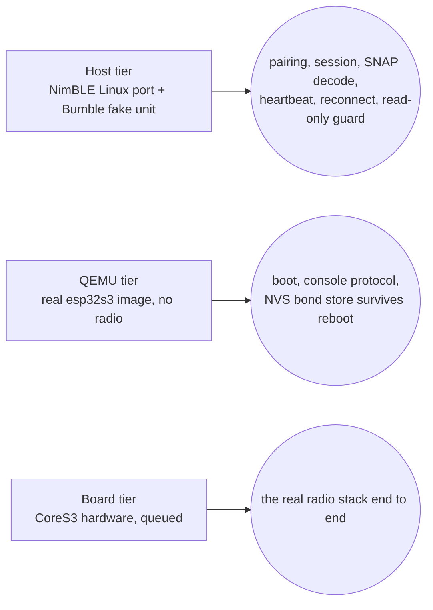

# ESP32 firmware (satellite, #154)

**Status: sub-project 1 of #154 — read-only, no hardware run yet.** ESP-IDF + NimBLE firmware for
a planned ESP32-S3 "satellite" (the M5Stack CoreS3) that pairs with the camper unit and reads its
state independently of `calictl`/buspi — the explicit target for the pairing state machine
(`calictl/pairing.py`, `R_PAIRING_SM`) that the web wizard already runs. The firmware **only ever
sends the `1003` liveness write** (the same heartbeat the Pi build uses to keep reads fresh); it
never actuates anything. Everything here is proven on Linux (a NimBLE host build against a fake
unit) and on an emulated chip (QEMU); the real CoreS3 board has not arrived yet, so nothing below
is hardware-verified — see `firmware/README.md`'s "On-board verification (queued until the CoreS3
arrives)" section for the exact plan.

The full build/porting detail (every NimBLE/Bumble adaptation, exact pins, warnings policy) lives
in [`firmware/README.md`](https://github.com/ckeller42/open-california/blob/main/firmware/README.md)
in the repository; this page is the traceability + orientation view.

## Three test tiers



| Tier | What it proves | What it cannot prove | Run locally |
|---|---|---|---|
| **Host + Bumble** (CI `firmware-host-e2e`) | The firmware's C code — pairing runner, session, console — driving the **real upstream NimBLE host stack** (Linux port) over HCI-over-TCP against a Bumble virtual controller linked to the repo's fake unit (`tools/fake_unit_peripheral.py`). Proves pairing (KEYBOARD_ONLY + MITM + SC), bond persistence/reconnect, the full `SNAP` read-all against `calictl.protocol.decode`, the 1003 heartbeat, notification push, link-drop recovery, and the read-only guard (`codec_encode` absent from the link). | Nothing about the real esp-nimble port or a real radio — this is upstream NimBLE 1.10 on Linux, not the ESP-IDF-vendored esp-nimble 1.6-based stack (gap documented in `firmware/README.md` Pins). | `firmware/host/fetch_nimble.sh && make -C firmware/host cali-host && python -m pytest tests/firmware -v` (Linux only, needs a 32-bit toolchain — see `firmware/README.md` "Host build notes" for the Docker recipe on macOS) |
| **QEMU boot** (CI `firmware-qemu`) | The **real ESP-IDF image** (compiled for the esp32s3) boots in Espressif's QEMU: the console line protocol on the no-controller path, and the NVS-backed bond store (`cali_kv_*`) surviving a reboot, including a CRC-broken record recovering as "unpaired" instead of crashing. | Bluetooth — QEMU's esp32s3 machine has no radio, so BLE stays with the host tier and hardware. | `docker run --rm -v "$PWD":/project -w /project/firmware espressif/idf:v6.1 bash -c '. $IDF_PATH/export.sh >/dev/null && idf.py -B build-qemu -D SDKCONFIG=build-qemu/sdkconfig -D SDKCONFIG_DEFAULTS="sdkconfig.defaults;qemu/sdkconfig.qemu" build && cd /project && pip install -q pytest && CALI_QEMU=1 python -m pytest tests/firmware/test_qemu_boot.py -v'` |
| **Board** (queued) | Nothing yet — no hardware. Once the CoreS3 arrives: flashing, the real esp-nimble port against the real unit, the USB-Serial/JTAG console, and every hardware watch item below. | — | See `firmware/README.md` "On-board verification (queued until the CoreS3 arrives)" |
| **Pure-C unit tests** (in the normal `test`/`pytest` job, no BLE) | The pairing state machine (`pairing_sm.c`) replays the same golden vectors as `calictl.pairing`; the runner and the session+console compile and run against scripted fake transports on any host with a C compiler (macOS included). | Real NimBLE call sequencing (that's the host tier's job). | `python -m pytest tests/firmware/test_pairing_sm_parity.py tests/firmware/test_runner_fake.py tests/firmware/test_session_fake.py -v` |

CI also builds the release esp32s3 image compile-only (job `firmware-build`, container
`espressif/idf:v6.1`, uploads the images + `flasher_args.json`) — it does not run the image
anywhere, just proves `cali_core` + `cali_ble_nimble` (unchanged from the host build) compile
clean against ESP-IDF's real esp-nimble under the host's `-Wall -Wextra -Werror` strictness, and
that `codec_encode` still does not reach the ELF.

## Console line protocol

Identical on the host build (stdin/stdout) and the device (UART/USB-Serial-JTAG console) —
`firmware/components/cali_core/include/cali_console.h`:

- **In**, one command per line: `pair` (start pairing), `passkey N` (the code the unit displays,
  ignored unless waiting for one), `forget` (drop the bond), `status` (reprint `STATE`), `quit`
  (host only — exits the process; no-op on the device).
- **Out**, one line each: `STATE {json}` (the pairing state machine's snapshot — the same keys as
  calictl's `/api/pairing`), `SNAP {"t":ms,"fn":{...}}` (every function the session holds a frame
  for, `codec_decode`d, in `CODEC_CHARS` order), `LOG text` (everything else, including every
  watch item below).

## CI jobs (`.github/workflows/ci.yml`)

| Job | Runs |
|---|---|
| `test` (the normal matrix) | `tests/firmware`'s pure-C tests (SM parity, runner fake, session fake) via `-m "not linux_only"` — no BLE, runs on every Python version |
| `firmware-host-e2e` | The NimBLE-Linux + Bumble end-to-end tier (`tools/ci.sh firmware`) |
| `firmware-build` | Compiles the release esp32s3 image against ESP-IDF's real esp-nimble; uploads the flashable images |
| `firmware-qemu` | Builds the QEMU-probe variant and boots it in QEMU |

## Hardware watch items (unresolved until the CoreS3 board runs)

These are called out explicitly because none of them can be exercised by the host or QEMU tiers —
each is a genuine gap between "compiles and passes on Linux/QEMU" and "runs correctly on the real
chip":

1. **Bond-store guard.** ESP-IDF's esp-nimble can silently swap our NVS-backed bond store for a
   RAM-only one at host sync (`CONFIG_BT_NIMBLE_STATIC_TO_DYNAMIC`, see ruling below) unless
   guarded. Two guards ship (`STATIC_TO_DYNAMIC=n` in `sdkconfig.defaults`, plus
   `cali_ble_store_ensure()` re-installing the callbacks and logging `LOG store: ERROR bond store
   callbacks were replaced by the BLE stack, re-installed`), but whether esp-nimble itself leaves
   the store alone on real hardware is unverified — **first flash: pair, reboot, the unit must
   reconnect by bond with no passkey and no `store: ERROR` line.**
2. **Local-IRK `WARN`.** With the guard above (`STATIC_TO_DYNAMIC=n`), NimBLE still asks the
   store for a `BLE_STORE_OBJ_TYPE_LOCAL_IRK` object at every sync; `ble_store_kv.c` answers
   `ENOTSUP` for it, so NimBLE generates a new random local IRK every boot and logs `WARN Failed
   to persist local IRK (rc=…)`. Believed benign (we connect by the *unit's* identity address, not
   our own), but unverified on real hardware.
3. **Host-task stack size.** `CONFIG_BT_NIMBLE_HOST_TASK_STACK_SIZE=8192` (the NimBLE host task
   runs all of `cali_core` — SM, runner, session, console) is a guess, not measured; check the
   high-water mark on hardware before trusting it under load.
4. **USB-Serial/JTAG console.** The CoreS3's USB-C is the S3's native USB, not UART0 (UART0 only
   reaches the M5-Bus header) — ruling R9 below. The release build uses
   `CONFIG_ESP_CONSOLE_USB_SERIAL_JTAG=y`; this has never been tried against a real
   `/dev/cu.usbmodem*` port.
5. **`esp_bt_controller_init` under QEMU.** Not a hardware item but a QEMU limitation worth
   knowing before it's mistaken for one: QEMU's esp32s3 machine has no BT low-power clock, so
   `esp_bt_controller_init` **asserts** (reboot loop) instead of returning an error — the QEMU
   probe build (`CONFIG_CALI_QEMU_PROBE`) skips `nimble_port_init()` entirely rather than relying
   on the no-controller fallback path. The no-controller fallback itself (`LOG ble: controller
   unavailable`, console still answers) is what a real board would take if its radio genuinely
   failed to init, and *that* path is what QEMU exercises.

## Design rulings worth knowing

- **R9 — device console is USB-Serial/JTAG, not UART0.** The plan originally assumed UART0; a
  console nobody can type into makes pairing impossible on the CoreS3 (its USB-C is the native
  USB, UART0 only reaches the M5-Bus header). The QEMU variant keeps UART0 (QEMU emulates UART,
  not USB-Serial/JTAG) via its own `sdkconfig.qemu` overlay — same console line protocol either
  way, different driver at compile time.
- **R5 — host build pins upstream NimBLE 1.10, not the IDF's 1.6.** ESP-IDF v6.1 vendors
  esp-nimble based on NimBLE 1.6.0, whose Linux TCP socket transport doesn't link
  (`ble_hci_sock_cmdevt_tx` missing); 1.10.0 is the first release with a complete `linux_tcp`
  port. The GAP/SM/GATT API used here is unchanged across that gap, and Task 8 (the
  `firmware-build` job) compiles the same `cali_ble_nimble.c`/`ble_store_kv.c` unmodified against
  the real esp-nimble 1.6-based tree to catch any skew at compile time.
- **R7 — no SM transition for a link drop while waiting for a passkey.** Both the C port and
  `calictl.pairing.py` end `WAITING_PASSKEY` only via the 60 s timeout, not an immediate retry on
  disconnect. Kept intentionally identical (golden-vector parity between the two); flagged as a
  shared follow-up, not a firmware-only gap.
- **R8 — `STATE` mirrors calictl, not the link.** After booting with a stored bond the pairing
  state machine is `idle` (address = the bonded identity) even before any link is up — whether
  the *session* actually holds a connection is a separate concern the console does not report
  (the same split calictl's `/api/pairing` vs `/api/state _meta` makes).
- **R10 — a corrupt bond record on real NVS boots unpaired, not crashed.** Proven end to end only
  on the QEMU/host tiers (`test_qemu_boot.py`'s `kvprobe corrupt`, `test_ble_store_kv.py`); the
  ESP path exercises the same `platform_esp.c` CRC check, so this is the strongest evidence short
  of hardware.

## Traceability

Requirements are authored as `sphinx-needs` objects next to the code they constrain (or, where the
implementation is C — not autodoc'd — in the docstring of the Python test module that verifies
it, a "shim" `sphinx-needs` can parse; see `firmware/README.md`'s own traceability section for the
human-readable version of the same trace). `docs/api.rst` pulls those test modules in via
`.. automodule::` so their objects are collected here.

```{eval-rst}
.. req:: The firmware only ever writes the 1003 heartbeat
   :id: R_FW_READ_ONLY

   The firmware never actuates the vehicle. ``csrc/codec.c`` is compiled with
   ``-DCODEC_NO_ENCODE`` in every firmware build (host and ESP-IDF) — the same macro the Pi's
   cross-language codec uses to prove a read-only caller never links an encoder — and a
   ``POST_BUILD`` step fails the link if the symbol ``codec_encode`` reaches the output binary
   (``firmware/host/Makefile``'s ``cali-host`` rule and ``firmware/CMakeLists.txt``'s
   ``cali_fw.elf`` rule both run this check; the QEMU probe variant has its own twin check for the
   ``kvprobe`` probe command, so it can never ship in the release image either). The only write
   the transport ever issues is the ``1003`` liveness heartbeat
   (``firmware/components/cali_core/session.c``), the same mechanism ``calictl/device.py`` uses on
   the Pi to keep reads fresh — never a control frame.

.. req:: SM I/O capability and MITM must be set before any link exists
   :id: R_FW_IO_CAP_BEFORE_LINK

   NimBLE reads ``ble_hs_cfg.sm_io_cap``/``sm_mitm`` when it builds or answers the first SMP
   Pairing Request, so those fields must be set **before the host syncs**, i.e. before any link
   is opened — not inside the pairing action itself. Setting them late (io/MITM applied only once
   pairing is already under way) makes NimBLE negotiate Just Works instead of the
   passkey-entry method the unit requires, and the unit refuses it. This is the exact 2026-09-26
   ``calictl`` bug (the pairing agent registered its I/O capability after ``Device1.Pair()`` had
   already started SMP): ``firmware/components/cali_ble_nimble/ble_nimble.c``'s
   ``cali_ble_nimble_init()`` sets ``sm_io_cap = BLE_HS_IO_KEYBOARD_ONLY`` / ``sm_mitm = 1`` at
   init time, before ``nimble_port_run()``. A host-only regression build,
   ``make cali-host-jw`` (``-DCALI_TEST_LATE_IO_CAP``), reproduces the bug on purpose — it
   installs Just Works at init and only switches to keyboard-only inside the pairing call, one
   step too late — so the fake unit refuses it and ``test_just_works_build_is_refused`` proves the
   firmware (and the test setup) would actually catch this class of regression, not just assert
   it away. Never compiled into a device build (``#error`` if ``ESP_PLATFORM`` is also defined).
```

- **`R_FW_PAIRING_SM`** (C twin of the pairing state machine, `firmware/components/cali_core/pairing_sm.c`)
  — verified by `T_FW_PAIRING_SM_PARITY` (`tests/firmware/test_pairing_sm_parity.py`): replays
  `tests/vectors/pairing.json` through both the Python and C implementations.
- **`R_FW_PAIRING_RUNNER`** (`firmware/components/cali_core/runner.c`, drives the SM from BLE
  transport events per `docs/business-logic/guided-pairing.md`'s "ESP mapping") — verified by
  `T_FW_RUNNER_FAKE` (`tests/firmware/test_runner_fake.py`).
- **`R_FW_SESSION`** (`firmware/components/cali_core/session.c` + `console.c`) — verified by
  `T_FW_SESSION_FAKE` (`tests/firmware/test_session_fake.py`, a scripted fake transport, and also
  compiles with `-DCODEC_NO_ENCODE` — a second, independent check that `cali_core` never
  references `codec_encode`) and end to end by `T_FW_HOST_E2E`
  (`tests/firmware/test_host_e2e.py`).
- **`R_FW_READ_ONLY`** — verified by `T_FW_SESSION_FAKE` (compiles `cali_core` linked against a
  codec built `-DCODEC_NO_ENCODE`) and by `T_FW_HOST_E2E` (builds and runs `cali-host`, whose own
  Makefile rule fails the build were `codec_encode` ever to reach the link).
- **`R_FW_IO_CAP_BEFORE_LINK`** — verified by `T_FW_HOST_E2E`'s
  `test_just_works_build_is_refused`, which runs the `-DCALI_TEST_LATE_IO_CAP` regression build
  against the fake unit and asserts pairing ends in `error` (the unit refusing Just Works).

The full needs table for the whole project, not just firmware, is at the bottom of
[the docs home page](index.md).
