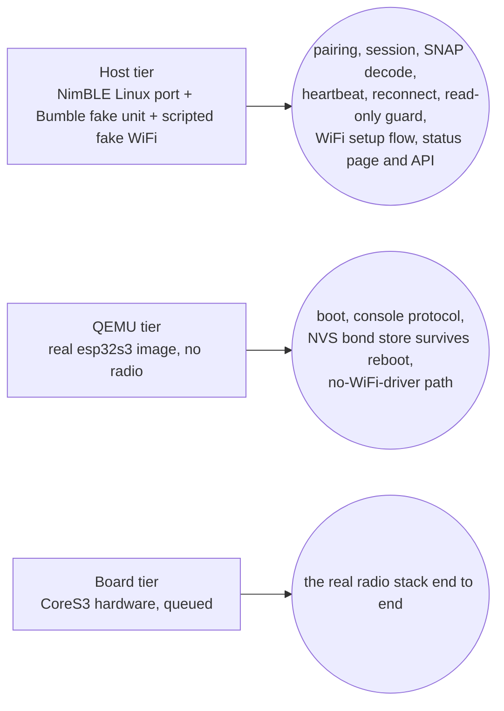
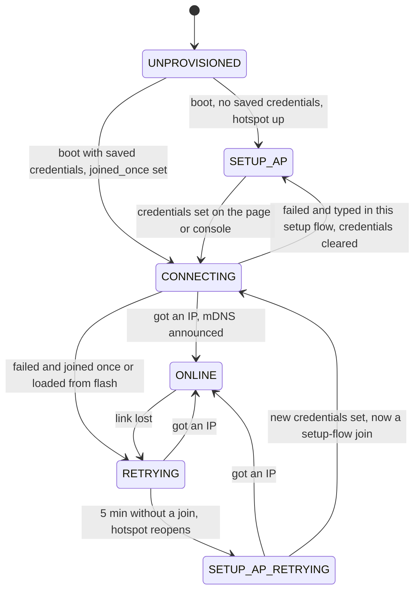

# ESP32 firmware (satellite, #154)

**Status: sub-projects 1 and 2b/3a of #154 — read-only, no hardware run yet.** ESP-IDF + NimBLE firmware for
a planned ESP32-S3 "satellite" (the M5Stack CoreS3) that pairs with the camper unit and reads its
state independently of `calictl`/buspi — the explicit target for the pairing state machine
(`calictl/pairing.py`, `R_PAIRING_SM`) that the web wizard already runs. The firmware **only ever
sends the `1003` liveness write** (the same heartbeat the Pi build uses to keep reads fresh); it
never actuates anything. Everything here is proven on Linux (a NimBLE host build against a fake
unit) and on an emulated chip (QEMU); the real CoreS3 board has not arrived yet, so nothing below
is hardware-verified — see `firmware/README.md`'s "On-board verification (queued until the CoreS3
arrives)" section for the exact plan. Since the WiFi/web slice the firmware also joins a WiFi
network (set up through its own hotspot + captive portal) and serves a read-only status page +
JSON state API — see [Network: WiFi setup and the status page](#network-wifi-setup-and-the-status-page)
below, and the owner how-to [How to put the ESP32 satellite on your WiFi](howto-esp-wifi-setup.md).

The full build/porting detail (every NimBLE/Bumble adaptation, exact pins, warnings policy) lives
in [`firmware/README.md`](https://github.com/ckeller42/open-california/blob/main/firmware/README.md)
in the repository; this page is the traceability + orientation view.

## Three test tiers



| Tier | What it proves | What it cannot prove | Run locally |
|---|---|---|---|
| **Host + Bumble** (CI `firmware-host-e2e`) | The firmware's C code — pairing runner, session, console — driving the **real upstream NimBLE host stack** (Linux port) over HCI-over-TCP against a Bumble virtual controller linked to the repo's fake unit (`tools/fake_unit_peripheral.py`). Proves pairing (KEYBOARD_ONLY + MITM + SC), bond persistence/reconnect, the full `SNAP` read-all against `calictl.protocol.decode`, the 1003 heartbeat, notification push, link-drop recovery, and the read-only guard (`codec_encode` absent from the link). | Nothing about the real esp-nimble port or a real radio — this is upstream NimBLE 1.10 on Linux, not the ESP-IDF-vendored esp-nimble 1.6-based stack (gap documented in `firmware/README.md` Pins). | `firmware/host/fetch_nimble.sh && make -C firmware/host cali-host && python -m pytest tests/firmware -v` (Linux only, needs a 32-bit toolchain — see `firmware/README.md` "Host build notes" for the Docker recipe on macOS) |
| **QEMU boot** (CI `firmware-qemu`) | The **real ESP-IDF image** (compiled for the esp32s3) boots in Espressif's QEMU: the console line protocol on the no-controller path, and the NVS-backed bond store (`cali_kv_*`) surviving a reboot, including a CRC-broken record recovering as "unpaired" instead of crashing. | Bluetooth — QEMU's esp32s3 machine has no radio, so BLE stays with the host tier and hardware. | `docker run --rm -v "$PWD":/project -w /project/firmware espressif/idf:v6.1 bash -c '. $IDF_PATH/export.sh >/dev/null && idf.py -B build-qemu -D SDKCONFIG=build-qemu/sdkconfig -D SDKCONFIG_DEFAULTS="sdkconfig.defaults;qemu/sdkconfig.qemu" build && cd /project && pip install -q pytest && CALI_QEMU=1 python -m pytest tests/firmware/test_qemu_boot.py -v'` |
| **Host web e2e** (CI `firmware-host-e2e`, `tests/firmware/test_web_e2e.py`) | `cali-host --http PORT --fake-wifi SCRIPT`: the WiFi runner, captive DNS and web endpoints on the same 100 ms tick as the BLE session, over `net_host.c` (POSIX sockets on 127.0.0.1 + a scripted fake WiFi radio) and the Bumble fake unit. Proves the setup flow (fresh boot -> setup mode -> POST credentials -> station), a wrong password falling back to setup with the credentials cleared, saved credentials reconnecting after a restart + `DELETE /api/wifi`, `/api/state` equal to the console's `SNAP` after pairing, a WiFi loss leaving the BLE link and heartbeat alone, the page rendering in Chromium (EN + DE), and the setup flow clicked in Chromium (a wrong password shows the wrong-password text, the right one the `http://calictl-esp.local` link; EN + DE). | The real esp_wifi/lwIP/mdns stack, a real phone's captive-portal detection, radio coexistence — the fake WiFi only replays the script's outcomes. | `tools/ci.sh firmware` (Linux; on a Mac see `firmware/README.md` "Host build" for the Docker recipe) |
| **QEMU no-WiFi-driver** (CI `firmware-qemu`, `test_qemu_boot.py::test_no_wifi_driver_boots_and_serves_nothing`) | The QEMU image is built with `CONFIG_CALI_WIFI=n` (no esp_wifi call compiled in): it logs `LOG wifi: driver unavailable` once, keeps WiFi off (`status` has no `wifi` member, `wifi status` -> `LOG wifi: not enabled`), listens on nothing, and does not reboot — the same path a board takes when `esp_wifi_init`/`esp_wifi_start` fails. | Anything about a working WiFi driver (QEMU's esp32s3 has no WiFi). | The QEMU command above |
| **Board** (queued) | Nothing yet — no hardware. Once the CoreS3 arrives: flashing, the real esp-nimble port against the real unit, the USB-Serial/JTAG console, and every hardware watch item below. | — | See `firmware/README.md` "On-board verification (queued until the CoreS3 arrives)" |
| **Pure-C unit tests** (in the normal `test`/`pytest` job, no BLE) | The pairing state machine (`pairing_sm.c`) replays the same golden vectors as `calictl.pairing`; the runner and the session+console compile and run against scripted fake transports on any host with a C compiler (macOS included). The network pieces too: the WiFi SM replays `tests/vectors/wifi_sm.json` from its Python twin (`tools/wifi_sm_ref.py`), the HTTP core (`http_core.c`), captive DNS (`captive_dns.c`), web handlers (`web.c`), JSON writer and the host `cali_net` (`net_host.c`) each run under a small C driver, and the WiFi runner runs next to the BLE session in `test_session_fake.py`. | Real NimBLE call sequencing (that's the host tier's job); real sockets under load; any radio. | `python -m pytest tests/firmware/test_pairing_sm_parity.py tests/firmware/test_runner_fake.py tests/firmware/test_session_fake.py tests/firmware/test_wifi_sm_parity.py tests/firmware/test_http_core.py tests/firmware/test_captive_dns.py tests/firmware/test_web_handlers.py tests/firmware/test_json.py tests/firmware/test_net_host.py -v` |

CI also builds the release esp32s3 image compile-only (job `firmware-build`, container
`espressif/idf:v6.1`, uploads the images + `flasher_args.json`) — it does not run the image
anywhere, just proves `cali_core` + `cali_ble_nimble` (unchanged from the host build) compile
clean against ESP-IDF's real esp-nimble under the host's `-Wall -Wextra -Werror` strictness, and
that `codec_encode` still does not reach the ELF.

## Console line protocol

Identical on the host build (stdin/stdout) and the device (UART/USB-Serial-JTAG console) —
`firmware/components/cali_core/include/cali_console.h`:

- **In**, one command per line: `pair` (start pairing), `passkey N` (the code the unit displays,
  ignored unless waiting for one), `forget` (drop the bond), `status` (reprint `STATE`), `quit`
  (host only — exits the process; no-op on the device), and the WiFi commands `wifi set <ssid>
  <psk>`, `wifi status`, `wifi forget`, `wifi scan` (see [the network section](#network-wifi-setup-and-the-status-page);
  `LOG wifi: not enabled` while WiFi is off).
- **Out**, one line each: `STATE {json}` (the pairing state machine's snapshot — the same keys as
  calictl's `/api/pairing`; the `status` command's line gains a `"wifi"` member once WiFi runs), `SNAP {"t":ms,"fn":{...}}` (every function the session holds a frame
  for, `codec_decode`d, in `CODEC_CHARS` order), `LOG text` (everything else, including every
  watch item below).

The session's read-all follows `calictl.device.read_all`: subscribe every notifying state char,
let the 1003 heartbeat run `CODEC_HEARTBEAT_WARMUP_MS` (generated from
`calictl.device.HEARTBEAT_WARMUP_S`'s default, 2 s) so the liveness registers and sensors refresh,
then read the functions in order — skipping any the unit pushed since the subscribe, and never
letting a read completion overwrite a frame pushed while that read was outstanding (a
notification is fresher than the read latch). The first `SNAP` of a link follows that pass.

## Network: WiFi setup and the status page

The firmware joins a WiFi network and serves a **read-only** status page and JSON state API on
port 80 — the same C code on the host tier (`cali-host --http`) and the device. Owner-facing steps:
[How to put the ESP32 satellite on your WiFi](howto-esp-wifi-setup.md).

**Pieces** (`firmware/components/cali_core/`, all platform-free C99, no malloc, reaching the network
only through the `cali_net_t` socket/WiFi table in `include/cali_net.h`):

| File | Role |
|---|---|
| `wifi_sm.c` | The WiFi provisioning/connectivity state machine — a line-for-line C twin of `tools/wifi_sm_ref.py` (no strings, radio or clock; time only as `WEV_TICK`'s argument). |
| `wifi_run.c` | The WiFi runtime: feeds `cali_net` events + ticks into the SM, runs its actions on `cali_net`, the captive DNS and the kv store, and owns the one BLE-coex gate (scans). |
| `http_core.c` | A single-connection HTTP/1.1 responder (below). |
| `captive_dns.c` | The setup hotspot's DNS: every A query answered with `192.168.4.1`, plus the table of OS captive-portal probe paths. |
| `web.c` | The endpoints and the page. |
| `snapshot.c` | The `fn` object shared by the console's `SNAP` and `/api/state`. |

Platforms: `components/platform/host/net_host.c` (POSIX sockets on 127.0.0.1 + a scripted fake WiFi,
`cali_net_host.h`) and `components/platform/esp/net_esp.c` (esp_wifi + esp_netif + lwIP sockets +
the `espressif/mdns` component, pinned `==1.13.1`). The constants are generated into
`csrc/net_consts.h` from `tools/wifi_consts.py` (`R_NET_CONSTS_SINGLE_SOURCE`): setup SSID
`calictl-esp-setup`, passphrase `calictl-setup`, address `192.168.4.1`, hostname `calictl-esp`
(DHCP + mDNS `calictl-esp.local`, `_http._tcp` on port 80), `NET_AP_CLOSE_MS` 30000,
`NET_RETRY_MIN_MS` 1000 -> `NET_RETRY_MAX_MS` 60000, `NET_SETUP_AFTER_MS` 300000, page poll
`NET_PAGE_POLL_MS` 2000, `NET_JSON_MAX` 8192, SSID 1–32 bytes, PSK 8–63 bytes.

### The WiFi state machine



Not drawn: `CREDS_FORGET` (console `wifi forget`, `DELETE /api/wifi`) goes from **every** state to
`SETUP_AP` — station stopped, credentials erased, hotspot up. Rules the diagram compresses:

- **Retry.** In `RETRYING`/`SETUP_AP_RETRYING` the station re-joins on a backoff that starts at
  1000 ms and doubles to a 60000 ms cap; saved credentials are **never** wiped by a failure there.
- **Credentials from flash count as "joined once"** (ruling R6): booting with saved credentials and
  an unreachable router retries forever — after 5 min the setup hotspot opens alongside
  (`SETUP_AP_RETRYING`), the retries go on. Only credentials typed in the current setup flow are
  cleared by a failed join (a typo never bricks setup: back to `SETUP_AP`, hotspot still up).
- **Hotspot close.** Once `ONLINE`, a hotspot that is still up closes 30000 ms later (the phone that
  did the setup gets to see the "connected as" answer first).
- **Replacing credentials** (`wifi set` or a `POST /api/wifi` while online/retrying/mid-join,
  rulings R14/R16): the runner takes the SM through a forget that keeps the new credentials (station
  down, hotspot up) and joins them as a setup-flow join — a typo lands the device back in setup,
  like a first-time flow, and the old network is not restored.
- **Mode** reported by the page and console (`cali_wifi_mode`): `setup` in `SETUP_AP` /
  `SETUP_AP_RETRYING`; `station` in `ONLINE`, and in `CONNECTING`/`RETRYING` when `joined_once`;
  `off` otherwise (`UNPROVISIONED` = WiFi off, and a setup-flow join in progress).

Console lines (`LOG wifi: …`, exact texts from `cali_wifi_run.h`/`console.c`): `setup hotspot up
(calictl-esp-setup)`, `setup hotspot closed`, `joining <ssid>`, `online <a.b.c.d>`, `lost`,
`failed <not_found|auth|other>`, `credentials cleared`, `credentials replaced, reconnecting`,
`captive DNS unavailable`; on the device also `driver unavailable`. `wifi status` answers `LOG wifi:
<setup|station|off> ssid=<ssid|-> ip=<a.b.c.d|-> rssi=<dBm|-> scan=<n>`. The passphrase is never
printed: the console does not echo input, an unknown/mistyped `wifi` line is logged by its first
word(s) only, and the line buffer is wiped after every command.

### Endpoints (`web.c`, contract in `include/cali_web.h`)

| Method + path | Answer |
|---|---|
| `GET /` | 200 `text/html` — the status/setup page: `strings_gen.h`'s `WEB_INDEX_HTML`, the byte array generated from `firmware/web/index.html` + `page.js` + `strings.json` (EN + DE) by `tools/gen_c_dict.py`. One source of bytes on both tiers; no `EMBED_FILES`, no LittleFS. |
| `GET /api/state` | 200 JSON `{"t","fn","device"}` — `fn` = the `SNAP` object (every function the session holds a frame for, `codec_decode`d, `CODEC_CHARS` order); `device` = `pairing {state,address}`, `link {up,last_snap_age_ms}`, `wifi {mode,ssid,ip,rssi}`, `uptime_ms`, `fw`. Built whole in one handler call into the `NET_JSON_MAX` (8192 B) buffer (a full 14-function snapshot is ~4.5 KB); overflow -> 500 + `LOG http: overflow`. |
| `GET /api/wifi` | 200 JSON `{"mode","ssid","ip","rssi","last_error","scan":[{"ssid","rssi","secure"}]}` (the last scan's list, up to 16); `last_error` is why the last join failed (`"not_found"`, `"auth"`, `"other"`) or `null` (none yet, or cleared by new credentials or by joining) — the setup page turns it into one of three texts; in setup mode it also asks for a fresh scan for the next GET. |
| `POST /api/wifi` | Body exactly `{"ssid":"…","psk":"…"}` (fixed-shape parser). SSID 1–32 bytes, PSK 8–63 bytes (open networks unsupported) -> stored in the kv store, handed to the runner -> 200 `{"ok":true}`; else 400 `{"ok":false,"error":"json"|"ssid"|"psk"}`, a kv failure 500 `"store"`. |
| `DELETE /api/wifi` | Forget the WiFi (-> `SETUP_AP`) -> 200 `{"ok":true}`. |
| other method on `/api/state` or `/api/wifi` | 405 `{"ok":false,"error":"method"}` |
| an OS captive-portal probe path (setup mode) | 302 `Location: http://192.168.4.1/` — `/generate_204`, `/gen_204` (Android), `/hotspot-detect.html`, `/library/test/success.html` (Apple), `/connecttest.txt`, `/ncsi.txt` (Windows), `/canonical.html`, `/success.txt` (Firefox) |
| any other path | setup mode: 302 `Location: /`; station mode: 404 |

No control endpoint exists, by design (`R_FW_READ_ONLY`). **HTTP core** (`include/cali_http.h`):
one connection at a time, one request per connection, every response `Connection: close`;
requests up to `NET_HTTP_REQ_MAX` (2048 B) of headers, no chunked bodies (400), 413/431 on
oversize; the response is streamed across as many ticks as the socket needs (`tcp_send` "would
block" = retry next poll — never blocks, never spins); a connection idle for `CALI_HTTP_IDLE_MS`
(5000 ms) is closed. The page polls `/api/state` every 2000 ms.

**Where the credentials live:** the kv store keys `wifi_ssid` / `wifi_psk` — NVS namespace `cali`
on the device (esp_wifi's own NVS copy is off: `WIFI_STORAGE_RAM`, `CONFIG_ESP_WIFI_NVS_ENABLED=n`),
`<store>/wifi_ssid.kv` / `wifi_psk.kv` on the host — in plain text (CRC-framed, not encrypted), per
the project's trusted-LAN stance.

**BLE coexistence** (ruling R15): WiFi events never reach the BLE session or its heartbeat — they
share only the tick. The one gate is scans: `cali_wifi_run_scan()` holds a scan back while a BLE
pairing flow is **active** (runner state not idle/bonded/error — a failed pairing does not block
it) and starts it on the first tick after the flow ends.

**Size** (ruling R18): the WiFi stack (net80211, wpa_supplicant + PSA crypto, lwIP, pp/phy, mdns)
adds ~614 KB to the release image — `cali_fw.bin` 463,248 B -> 1,078,880 B — so `partitions.csv`
gives the factory app **3 MB** on the 16 MB flash (66 % free); the plan's ~250 KB estimate was off
by about 2.5x. Details: `firmware/README.md` "WiFi build".

## CI jobs (`.github/workflows/ci.yml`)

| Job | Runs |
|---|---|
| `test` (the normal matrix) | `tests/firmware`'s pure-C tests (pairing + WiFi SM parity, runner fake, session fake, HTTP core, captive DNS, web handlers, JSON, host `cali_net`) via `-m "not linux_only"` — no BLE, runs on every Python version |
| `firmware-host-e2e` | The NimBLE-Linux + Bumble end-to-end tier, incl. the WiFi/web e2e and the page in Chromium (`tools/ci.sh firmware`) |
| `firmware-build` | Compiles the release esp32s3 image against ESP-IDF's real esp-nimble; uploads the flashable images |
| `firmware-qemu` | Builds the QEMU-probe variant (no WiFi driver) and boots it in QEMU |

## Hardware watch items (unresolved until the CoreS3 board runs)

These are called out explicitly because none of them can be exercised by the host or QEMU tiers —
each is a genuine gap between "compiles and passes on Linux/QEMU" and "runs correctly on the real
chip":

1. **Bond-store guard.** ESP-IDF's esp-nimble can silently swap our NVS-backed bond store for a
   RAM-only one at host sync (`CONFIG_BT_NIMBLE_STATIC_TO_DYNAMIC`, see ruling below) unless
   guarded. Two guards ship (`STATIC_TO_DYNAMIC=n` in `sdkconfig.defaults`, plus
   `cali_ble_store_ensure()` re-installing the callbacks and logging `LOG store: ERROR bond store
   callbacks were replaced by the BLE stack, re-installed`), but whether esp-nimble itself leaves
   the store alone on real hardware is unverified — **first flash: pair, reboot, the unit must
   reconnect by bond with no passkey and no `store: ERROR` line.**
2. **Local-IRK `WARN`.** With the guard above (`STATIC_TO_DYNAMIC=n`), NimBLE still asks the
   store for a `BLE_STORE_OBJ_TYPE_LOCAL_IRK` object at every sync; `ble_store_kv.c` answers
   `ENOTSUP` for it, so NimBLE generates a new random local IRK every boot and logs `WARN Failed
   to persist local IRK (rc=…)`. Believed benign (we connect by the *unit's* identity address, not
   our own), but unverified on real hardware.
3. **Host-task stack size.** `CONFIG_BT_NIMBLE_HOST_TASK_STACK_SIZE=8192` (the NimBLE host task
   runs all of `cali_core` — SM, runner, session, console) is a guess, not measured; check the
   high-water mark on hardware before trusting it under load.
4. **USB-Serial/JTAG console.** The CoreS3's USB-C is the S3's native USB, not UART0 (UART0 only
   reaches the M5-Bus header) — ruling R9 below. The release build uses
   `CONFIG_ESP_CONSOLE_USB_SERIAL_JTAG=y`; this has never been tried against a real
   `/dev/cu.usbmodem*` port.
5. **`esp_bt_controller_init` under QEMU.** Not a hardware item but a QEMU limitation worth
   knowing before it's mistaken for one: QEMU's esp32s3 machine has no BT low-power clock, so
   `esp_bt_controller_init` **asserts** (reboot loop) instead of returning an error — the QEMU
   probe build (`CONFIG_CALI_QEMU_PROBE`) skips `nimble_port_init()` entirely rather than relying
   on the no-controller fallback path. The no-controller fallback itself (`LOG ble: controller
   unavailable`, console still answers) is what a real board would take if its radio genuinely
   failed to init, and *that* path is what QEMU exercises.
6. **Device-only NimBLE options (final review I1).** esp-nimble has options upstream NimBLE (the
   host tier) lacks or defaults differently; `sdkconfig.defaults` pins them to the host syscfg:
   `CONFIG_BT_NIMBLE_ENABLE_CONN_REATTEMPT=n` (else a 0x3e establishment failure — this unit's
   known failure — is re-attempted inside the stack and comes up unencrypted),
   `CONFIG_BT_NIMBLE_MAX_CONNECTIONS=1`, `CONFIG_BT_NIMBLE_EXT_ADV=n`/`EXT_SCAN=n` (extended
   discovery events are not handled) and NimBLE log level WARNING. On the board: a failed connect
   must show as one `CONNECT_FAIL`-driven retry of the SM/session (no silent second link), the
   unit must be found by the legacy scan, and no NimBLE INFO lines may appear between the console
   lines.

## Network watch items (board only)

The host tier replays scripted WiFi outcomes and QEMU has no WiFi, so these wait for the CoreS3:

1. **BLE + WiFi coexistence.** The S3 shares one 2.4 GHz radio (IDF's default software coex).
   With the setup hotspot up and a phone attached, the BLE link must hold, the `1003` heartbeat keep
   its period and `SNAP`s keep their cadence; the same while the station scans and joins.
2. **Captive portal per OS.** Join `calictl-esp-setup` from iOS, macOS, Android and Windows: the
   sign-in sheet should open the page by itself (DNS answers everything with `192.168.4.1`, probe
   paths get a 302). Record per OS whether it pops, and that `http://192.168.4.1` always works.
3. **mDNS.** `http://calictl-esp.local` from iOS, macOS and Android (Android's `.local` support
   varies — the router list and `wifi status` are the documented fallbacks).
4. **Single-connection HTTP.** Browsers open several parallel connections; the core serves one at
   a time. Check the page stays responsive with one tab, and how it degrades with two or three.
5. **ESP event behaviours assumed from the IDF docs** (`net_esp.c`, join generations): our own
   `esp_wifi_disconnect` ends an attempt with reason `ASSOC_LEAVE` (8); the disconnect event carries
   the SSID; `esp_wifi_connect` straight after `esp_wifi_disconnect` works; a `SCAN_DONE` arrives
   when a join aborts a running scan (the 15 s scan watchdog is the backstop).
6. **Typo, then the fix.** Type a wrong password, then the right one within ~2 s: `LOG wifi:
   online` must follow and no `LOG wifi: failed auth`.
7. **Out of range and back.** Leave the saved network out of range for minutes, then restore it:
   at most one `esp_wifi_connect` per driver attempt (`LOG net:` stays quiet), `ONLINE` within one
   retry period of the AP returning, the hotspot opening after 5 min and closing 30 s after the join.
8. **Size + heap.** The 1,078,880 B image in the 3 MB partition flashes from the build's own
   flasher args; DIRAM use (160,018 B, 46.8 %) leaves the NimBLE host task and the 8 KB JSON buffer
   room under real traffic.

## Design rulings worth knowing

- **R9 — device console is USB-Serial/JTAG, not UART0.** The plan originally assumed UART0; a
  console nobody can type into makes pairing impossible on the CoreS3 (its USB-C is the native
  USB, UART0 only reaches the M5-Bus header). The QEMU variant keeps UART0 (QEMU emulates UART,
  not USB-Serial/JTAG) via its own `sdkconfig.qemu` overlay — same console line protocol either
  way, different driver at compile time.
- **R5 — host build pins upstream NimBLE 1.10, not the IDF's 1.6.** ESP-IDF v6.1 vendors
  esp-nimble based on NimBLE 1.6.0, whose Linux TCP socket transport doesn't link
  (`ble_hci_sock_cmdevt_tx` missing); 1.10.0 is the first release with a complete `linux_tcp`
  port. The GAP/SM/GATT API used here is unchanged across that gap, and Task 8 (the
  `firmware-build` job) compiles the same `cali_ble_nimble.c`/`ble_store_kv.c` unmodified against
  the real esp-nimble 1.6-based tree to catch any skew at compile time.
- **R7 — no SM transition for a link drop while waiting for a passkey.** Both the C port and
  `calictl.pairing.py` end `WAITING_PASSKEY` only via the 60 s timeout, not an immediate retry on
  disconnect. Kept intentionally identical (golden-vector parity between the two); flagged as a
  shared follow-up, not a firmware-only gap.
- **R8 — `STATE` mirrors calictl, not the link.** After booting with a stored bond the pairing
  state machine is `idle` (address = the bonded identity) even before any link is up — whether
  the *session* actually holds a connection is a separate concern the console does not report
  (the same split calictl's `/api/pairing` vs `/api/state _meta` makes).
- **R10 — a corrupt bond record on real NVS boots unpaired, not crashed.** Proven end to end only
  on the QEMU/host tiers (`test_qemu_boot.py`'s `kvprobe corrupt`, `test_ble_store_kv.py`); the
  ESP path exercises the same `platform_esp.c` CRC check, so this is the strongest evidence short
  of hardware.

## Traceability

Requirements are authored as `sphinx-needs` objects next to the code they constrain (or, where the
implementation is C — not autodoc'd — in the docstring of the Python test module that verifies
it, a "shim" `sphinx-needs` can parse; see `firmware/README.md`'s own traceability section for the
human-readable version of the same trace). `docs/api.rst` pulls those test modules in via
`.. automodule::` so their objects are collected here.

```{eval-rst}
.. req:: The firmware writes no control frame: its only characteristic-value write is the 1003 heartbeat
   :id: R_FW_READ_ONLY

   The firmware never actuates the vehicle. Three mechanisms, each with a stated scope:

   - **Compile time (every firmware build: ``cali-host``, ``cali-host-jw``, the ESP-IDF release and
     QEMU images).** ``csrc/codec.c`` is compiled with ``-DCODEC_NO_ENCODE`` (``firmware/host/Makefile``'s
     ``codec.o`` rule, which both host binaries link; ``PUBLIC`` on the ESP-IDF ``csrc``
     component). The macro was introduced for this firmware; with it ``codec_encode`` is neither
     declared nor defined, so any firmware reference fails to build (implicit declaration under
     ``-Werror``). This is the primary guard.
   - **Link time (``cali-host`` and every ``cali_fw.elf`` — release and QEMU variants; not
     ``cali-host-jw``, which is covered by the shared ``codec.o`` above).** A post-link ``nm`` check
     (``firmware/host/Makefile``'s ``cali-host`` rule, ``firmware/CMakeLists.txt``'s ``POST_BUILD``)
     fails the build if the symbol ``codec_encode`` is in the binary. It is a secondary check:
     should ``nm`` itself fail, it passes (fails open).
   - **Transport surface (structural, both builds).** ``cali_transport_t``
     (``firmware/components/cali_core/include/cali_transport.h``) has no generic write: its only
     characteristic-value write is ``write_heartbeat``, whose target ``ble_nimble.c`` fixes to
     ``CODEC_CHAR_HEARTBEAT`` (``0x1003``) — the liveness counter ``calictl/device.py`` also runs on
     the Pi to keep reads fresh. The only other ATT writes are the CCCD descriptor writes of
     ``subscribe`` (``0x0001``: enable notifications on a state char). No control characteristic is
     ever written; the host e2e tier observes this at the fake unit (zero control writes over a
     whole pair + read-all + heartbeat run).

.. req:: SM I/O capability and MITM must be set before any link exists
   :id: R_FW_IO_CAP_BEFORE_LINK

   NimBLE reads ``ble_hs_cfg.sm_io_cap``/``sm_mitm`` when it builds or answers the first SMP
   Pairing Request, so those fields must be set **before the host syncs**, i.e. before any link
   is opened — not inside the pairing action itself. Setting them late (io/MITM applied only once
   pairing is already under way) makes NimBLE negotiate Just Works instead of the
   passkey-entry method the unit requires, and the unit refuses it. This is the exact 2026-09-26
   ``calictl`` bug (the pairing agent registered its I/O capability after ``Device1.Pair()`` had
   already started SMP): ``firmware/components/cali_ble_nimble/ble_nimble.c``'s
   ``cali_ble_nimble_init()`` sets ``sm_io_cap = BLE_HS_IO_KEYBOARD_ONLY`` / ``sm_mitm = 1`` at
   init time, before ``nimble_port_run()``. A host-only regression build,
   ``make cali-host-jw`` (``-DCALI_TEST_LATE_IO_CAP``), reproduces the bug on purpose — it
   installs Just Works at init and only switches to keyboard-only inside the pairing call, one
   step too late — so the fake unit refuses it and ``test_just_works_build_is_refused`` proves the
   firmware (and the test setup) would actually catch this class of regression, not just assert
   it away. Never compiled into a device build (``#error`` if ``ESP_PLATFORM`` is also defined).

.. req:: WiFi provisioning — setup hotspot, captive portal, station join with retry, credentials in the kv store
   :id: R_FW_WIFI_PROVISION

   A satellite with no saved WiFi opens a WPA2 setup hotspot (``calictl-esp-setup``, fixed
   passphrase, address ``192.168.4.1``) whose DNS answers every A query with its own address and whose
   HTTP server redirects the OS captive-portal probe paths to the setup page, so a phone that joins
   is led to it. Credentials entered there (or with the console's ``wifi set``) are validated (SSID
   1-32 bytes, PSK 8-63 bytes — open networks unsupported), stored in the kv store (``wifi_ssid`` /
   ``wifi_psk``) and joined as a station; on success mDNS announces ``calictl-esp.local`` and the
   hotspot closes ``NET_AP_CLOSE_MS`` later. A failed join of credentials typed in the current setup
   flow clears them and returns to the hotspot; credentials that joined before or were loaded from
   flash are never wiped by a failure — the station retries on a 1 s to 60 s doubling backoff and
   reopens the hotspot alongside after ``NET_SETUP_AFTER_MS`` (5 min) without a join. ``wifi forget``
   / ``DELETE /api/wifi`` erase them and reopen the hotspot from any state. The state machine is a
   pure C twin of ``tools/wifi_sm_ref.py`` (golden-vector parity). A board whose WiFi driver cannot
   start boots with WiFi off and the BLE side unaffected.

.. req:: Read-only status page and JSON state over a bounded, non-blocking, single-connection HTTP server
   :id: R_FW_HTTP_STATUS

   The firmware serves, on both tiers from the same C code, a status/setup page (one generated byte
   array from ``firmware/web/index.html`` + ``page.js`` + ``strings.json``, EN + DE) and ``GET /api/state``: the
   ``fn`` object of the console's ``SNAP`` line plus the device's pairing, link, WiFi, uptime and
   firmware version, built as one consistent snapshot into a fixed ``NET_JSON_MAX`` (8192 B) buffer
   — an overflow answers 500, never a truncated body. The HTTP core serves one connection at a
   time, one request each, ``Connection: close``, with bounded request/body sizes, and streams a
   response across ticks without ever blocking or spinning the tick that also drives BLE. It
   exposes no control endpoint (``R_FW_READ_ONLY``).

.. req:: WiFi never disturbs the BLE session; scans wait for an active pairing flow
   :id: R_FW_WIFI_BLE_COEX

   WiFi events (join, loss, retries, hotspot up/down) never call into the BLE session: the link,
   the ``1003`` heartbeat cadence and notification-driven ``SNAP`` lines continue unchanged through a
   WiFi loss and reconnect. The only coupling is scans: a WiFi scan is deferred while a BLE pairing
   flow is **active** (runner state not idle, bonded or error — a failed pairing does not block it)
   and started on the first tick after it ends.
```

- **`R_FW_PAIRING_SM`** (C twin of the pairing state machine, `firmware/components/cali_core/pairing_sm.c`)
  — verified by `T_FW_PAIRING_SM_PARITY` (`tests/firmware/test_pairing_sm_parity.py`): replays
  `tests/vectors/pairing.json` through both the Python and C implementations.
- **`R_FW_PAIRING_RUNNER`** (`firmware/components/cali_core/runner.c`, drives the SM from BLE
  transport events per `docs/business-logic/guided-pairing.md`'s "ESP mapping") — verified by
  `T_FW_RUNNER_FAKE` (`tests/firmware/test_runner_fake.py`).
- **`R_FW_SESSION`** (`firmware/components/cali_core/session.c` + `console.c`) — verified by
  `T_FW_SESSION_FAKE` (`tests/firmware/test_session_fake.py`, a scripted fake transport, and also
  compiles with `-DCODEC_NO_ENCODE` — a second, independent check that `cali_core` never
  references `codec_encode`) and end to end by `T_FW_HOST_E2E`
  (`tests/firmware/test_host_e2e.py`).
- **`R_FW_READ_ONLY`** — verified by `T_FW_SESSION_FAKE` (compiles `cali_core` with
  `-DCODEC_NO_ENCODE` under `-Werror`, so a `codec_encode` reference fails that compile) and by
  `T_FW_HOST_E2E` (builds `cali-host`, whose link rule runs the `nm` check, and asserts the fake
  unit saw zero control-characteristic writes). The ESP-IDF images' `POST_BUILD` `nm` check runs in
  the `firmware-build`/`firmware-qemu` CI jobs; no test proves the transport surface on the device
  build beyond compiling the same `ble_nimble.c`.
- **`R_FW_IO_CAP_BEFORE_LINK`** — verified by `T_FW_HOST_E2E`'s
  `test_just_works_build_is_refused`, which runs the `-DCALI_TEST_LATE_IO_CAP` regression build
  against the fake unit and asserts pairing ends in `error` (the unit refusing Just Works).

- **`R_FW_WIFI_PROVISION`** — verified by `T_WIFI_SM_REF` (`tests/test_wifi_sm_ref.py`, the Python
  twin's transition rules), `T_FW_WIFI_SM_PARITY` (`tests/firmware/test_wifi_sm_parity.py`, the C SM
  replaying `tests/vectors/wifi_sm.json`), `T_FW_CAPTIVE_DNS` (`tests/firmware/test_captive_dns.py`),
  `T_FW_NET_HOST` (`tests/firmware/test_net_host.py`, the host `cali_net` + fake-WiFi script),
  `T_FW_WEB_E2E` (`tests/firmware/test_web_e2e.py`, the setup flow end to end on the host tier) and
  `T_FW_QEMU_NO_WIFI_DRIVER` (`tests/firmware/test_qemu_boot.py`, the no-driver path on the real
  image). The runner's rules (typo, retry, forget, replace) are also exercised in
  `test_session_fake.py`'s `test_wifi_*` cases.
- **`R_FW_HTTP_STATUS`** — verified by `T_FW_HTTP_CORE` (`tests/firmware/test_http_core.py`),
  `T_FW_WEB_HANDLERS` (`tests/firmware/test_web_handlers.py`), `T_FW_JSON_WRITER`
  (`tests/firmware/test_json.py`), `T_FW_WEB_STRINGS` (`tests/test_web_strings.py`, the page's
  generated strings), `T_FW_ESP_SCREENSHOT_FIXTURES` (`tests/test_ux_gallery_esp_fixtures.py`, the
  docs screenshots' fixtures keep the handlers' JSON shape) and `T_FW_WEB_E2E`.
- **`R_FW_WIFI_BLE_COEX`** — verified by `T_FW_WIFI_LOSS_SESSION` (`tests/firmware/test_session_fake.py`)
  and `T_FW_WEB_E2E`'s `test_wifi_loss_keeps_ble_link`; the scan gate by `test_session_fake.py`'s
  `test_wifi_scan_deferred_while_ble_pairing_is_active` / `test_wifi_scan_not_blocked_by_pairing_error`.
  Real radio coexistence is board-only ([network watch item 1](#network-watch-items-board-only)).

The full needs table for the whole project, not just firmware, is at the bottom of
[the docs home page](index.md).
