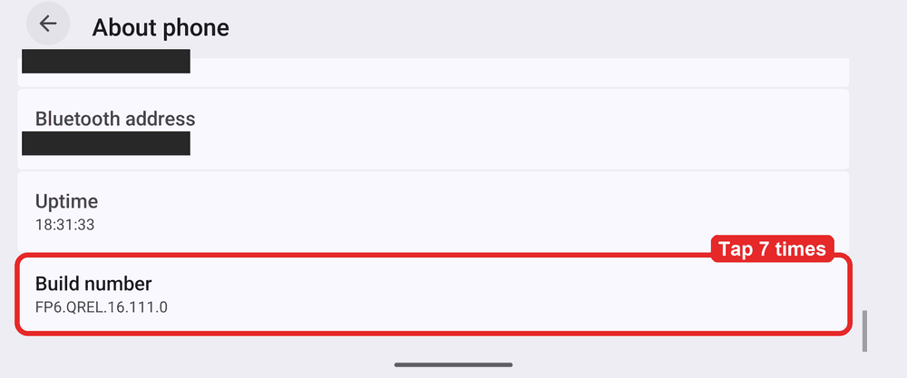
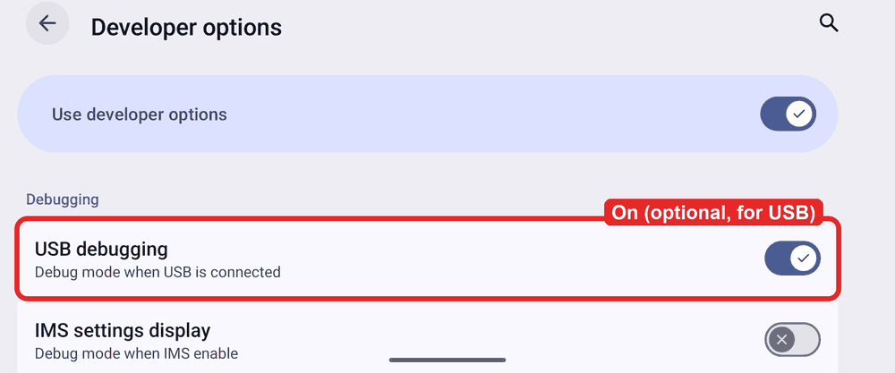
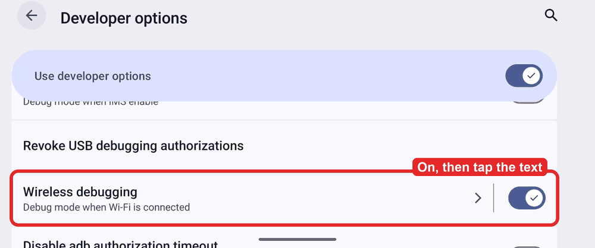
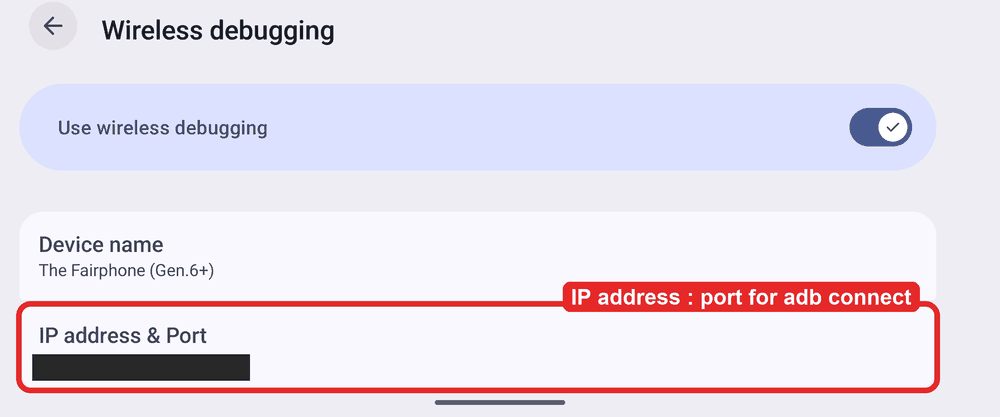
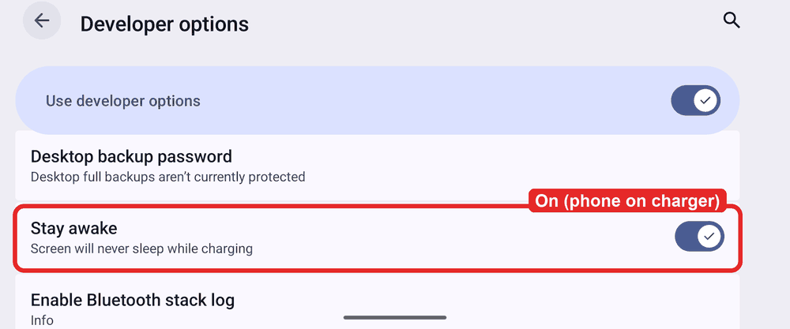
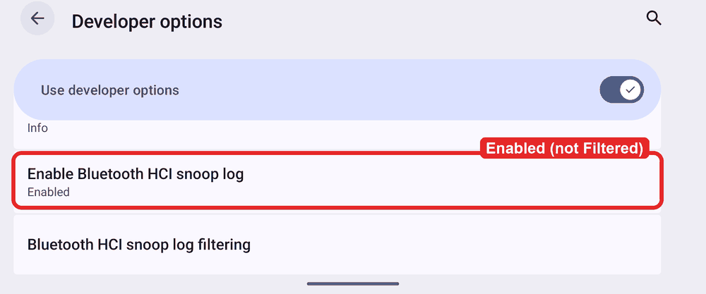
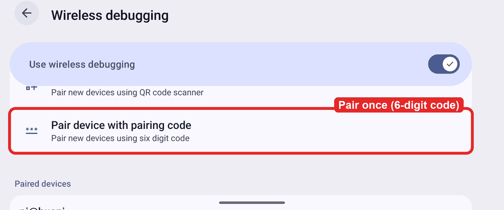
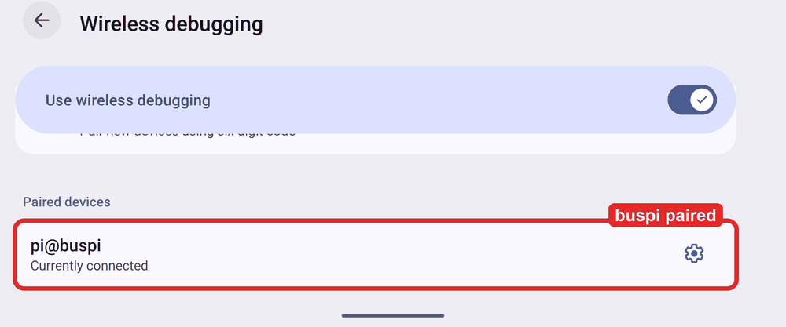

# How to set up your Android phone for the app lab

This sets up your own Android phone so that the Raspberry Pi ("buspi") can watch and drive the
real CaliforniaOnTour app over WiFi and record the app's Bluetooth traffic with the camper unit.
The recording is Android's **Bluetooth HCI snoop log**: every frame the app writes to the unit and
every frame the unit sends back. We decode it and compare it byte for byte with the frames calictl
builds. A match is evidence tier **CAPTURE** in the
[evidence ledger](https://github.com/ckeller42/open-california/blob/main/docs/business-logic/evidence-ledger.md).

- Runbook for the agent that drives the phone (commands, rules, common mistakes):
  [`.claude/skills/phone-app-lab/SKILL.md`](https://github.com/ckeller42/open-california/blob/main/.claude/skills/phone-app-lab/SKILL.md)
- Decoders: [`tools/applab/phone/`](https://github.com/ckeller42/open-california/tree/main/tools/applab/phone)
  (`snoop_att.py` lists the ATT reads/writes/notifications, `snoop_links.py` the link events).
- Sibling lab without a van or a phone (the app in an emulator against a fake unit):
  [`tools/applab/README.md`](https://github.com/ckeller42/open-california/blob/main/tools/applab/README.md).
- Captures still owed and app-vs-calictl findings:
  [remaining captures](https://github.com/ckeller42/open-california/blob/main/docs/business-logic/remaining-captures.md),
  [protocol cross-check](https://github.com/ckeller42/open-california/blob/main/docs/business-logic/protocol-crosscheck-applab.md).

The screenshots are from the reference phone: a **Fairphone 6, stock Android 16** (build
FP6.QREL.16.111.0), app **5.4.0.3036**. Other Android phones use the same names; the order of the
rows can differ. IP addresses, ports and hardware addresses are blacked out.

## What to install

**On buspi** (once):

```sh
sudo apt-get install -y adb      # Debian / Raspberry Pi OS ship adb 34.0.5
```

Python 3 is already there, and so is the open-california checkout (`~/open-california`). The
decoders are stdlib only: `python3 -m tools.applab.phone.snoop_att …` from the checkout.

**On the phone:** only the **CaliforniaOnTour** app from the Play Store, set up and paired with
your van as usual. Nothing else. Write down its version with every capture:

```sh
adb shell dumpsys package de.volkswagen.CaliforniaOnTour | grep versionName
```

**USB cable?** Not on the reference setup: USB from the Pi 4 failed
(`usb 1-1-port2: Cannot enable. Maybe the USB cable is bad?`, plus an undervoltage warning).
**Wireless adb is the supported path.** A powered USB hub and a known data cable may work, but
that is untested.

## Phone settings

Do these once, on the phone, in this order.

### 1. Turn on Developer options

**Settings → About phone**, scroll to the bottom, tap **Build number** 7 times. Enter your PIN if
asked. Android says "You are now a developer".



The new menu is at **Settings → System → Developer options**. Leave **Use developer options** on
for as long as you use the lab.

### 2. USB debugging (optional)

On the reference phone **USB debugging** is on. Wireless debugging (step 3) works without it on
Android 11 and later; turn it on only if you also want to try a USB cable.



### 3. Wireless debugging

Connect the phone to the **same WiFi as buspi** (in the van: the van router). In Developer
options, switch **Wireless debugging** on and accept "Allow wireless debugging on this network?".
Then tap the **text** "Wireless debugging" (not the switch) to open its page.



The page shows **IP address & Port**. buspi needs this address and port to connect (step 4 of
the pairing below). The port changes every time wireless debugging is switched off and on again.



### 4. Stay awake

Switch **Stay awake** on and keep the phone **on a charger** while you use the lab. Otherwise the
screen locks and buspi sees only the lock screen; nobody unlocks the phone remotely.



### 5. Bluetooth HCI snoop log = Enabled

Tap **Enable Bluetooth HCI snoop log** and choose **Enabled**. Not "Enabled Filtered": the filtered
mode blanks the payloads, so the decoded writes are empty. (`setprop
persist.bluetooth.btsnooplogmode full` from adb is refused on a normal phone build, so you set this
on the phone.)



The new mode takes effect when Bluetooth restarts. Switch Bluetooth off and on once, or, after
the pairing below, from buspi:

```sh
adb shell cmd bluetooth_manager disable; sleep 3; adb shell cmd bluetooth_manager enable
adb shell dumpsys bluetooth_manager | grep -i snoop     # expect: sSnoopLogSettingAtEnable = FULL
```

## Pair buspi with the phone (once)

1. On the Wireless debugging page, tap **Pair device with pairing code**. The phone shows a
   6-digit code and an `IP address & port` for pairing. The code is valid for about a minute.

   

2. On buspi, at once:

   ```sh
   adb pair <ip>:<pairing port> <6-digit code>
   ```

3. Close the pairing dialog on the phone. Pairing is one-time: buspi now shows under **Paired
   devices**.

   

4. Connect with the port from the main Wireless debugging page (**IP address & Port**, step 3
   above). This port is **not** the pairing port:

   ```sh
   adb connect <ip>:<port>
   adb devices          # expect: <ip>:<port>   device
   ```

`adb mdns services` found nothing on the van network, so read the address and port from the phone.
After the phone or wireless debugging restarts, repeat only step 4 with the new port.

## Record and pull a capture

All on buspi; everything stays under `~/applog/`.

```sh
mkdir -p ~/applog && cd ~/applog
# mark an action right BEFORE you do it in the app (aligns the snoop clock later)
echo "T_COOLER_ON $(adb shell date +%H:%M:%S.%N)" >> marks.txt
# … use the app …
adb bugreport br-1.zip                                   # ~1–2 min, ~8 MB
unzip -o -q br-1.zip FS/data/misc/bluetooth/logs/btsnoop_hci.log -d br1
# the app uses its cached GATT table: take the handle map from buspi's own BlueZ cache
sudo -n sh -c "grep -h 2803 /var/lib/bluetooth/*/cache/<UNIT MAC>" > gatt.txt
cd ~/open-california
python3 -m tools.applab.phone.snoop_att  ~/applog/br1/FS/data/misc/bluetooth/logs/btsnoop_hci.log ~/applog/gatt.txt
python3 -m tools.applab.phone.snoop_links ~/applog/br1/FS/data/misc/bluetooth/logs/btsnoop_hci.log
```

The snoop times are the phone's raw clock: check the offset against a line in `marks.txt` before
you match a frame to an action. Comparing a captured frame with calictl's builder is in the
[skill](https://github.com/ckeller42/open-california/blob/main/.claude/skills/phone-app-lab/SKILL.md#decoding-and-comparing).

**Never commit** a bugreport, a `btsnoop_hci.log`, `marks.txt` or `gatt.txt`. A bugreport holds the
phone's Bluetooth pairing keys and identity; the snoop log holds the unit's address.

## Privacy and safety

- **Never open the pages that show the VIN:** Account → Vehicle, and in app 5.4.0 Vehicle →
  Help → "Vehicle Settings".
- **Actuation only on the owner's explicit request**, each time. Looking at screens and taking
  screenshots needs no request.
- **Roof:** ignition on, the owner present and watching. Remote press-and-hold does not work
  (the app sends 1–3 move frames, then STOP); a real finger holds the button while buspi records.
- **Air heater:** not for short test cycles (diesel heaters are harmed by them).
- **Screenshots of the VW app** go only to the private repository `ckeller42/californiaontour-re`,
  never to open-california. The pictures on this page are Android system settings only.

## Turn it off afterwards

When you are done with a session, in Developer options:

1. **Enable Bluetooth HCI snoop log → Disabled.** It records **all** Bluetooth traffic, your
   headphones and car included.
2. **Stay awake → off.**
3. **Wireless debugging → off.**

buspi stays in **Paired devices**. Next time: switch Wireless debugging on, read the new port, and
`adb connect <ip>:<port>` (no new pairing). To remove buspi completely: **Revoke USB debugging
authorizations**, or forget it under Paired devices.
