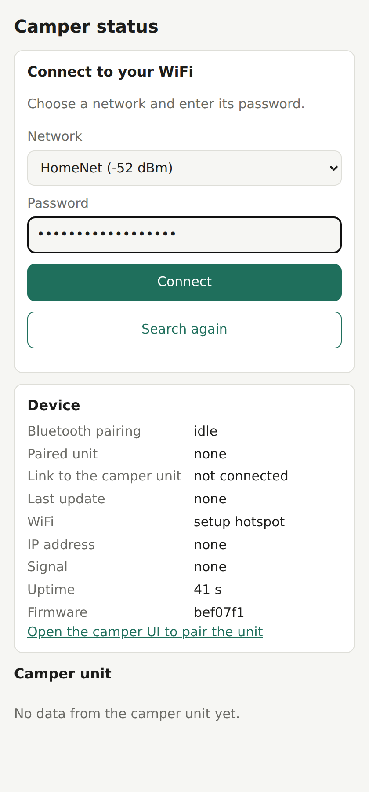
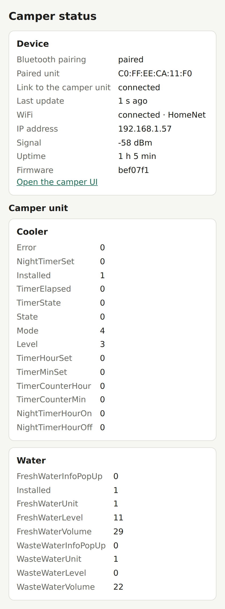
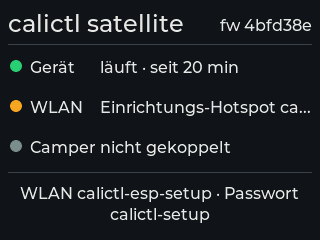
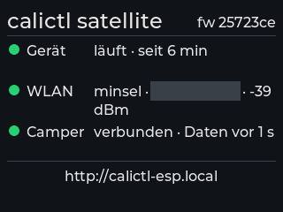

# How to put the ESP32 satellite on your WiFi

This walks you through connecting the ESP32 "satellite" — the small M5Stack CoreS3 board that
pairs with your camper unit on its own, without the Raspberry Pi (see [ESP32 firmware](firmware.md))
— to your WiFi, so you can see its status page from a phone or laptop.

> **Status.** The satellite has been paired with a real camper unit since 2026-10-08 (while the Pi
> stayed connected to the same unit) and switches the fridge, camping mode, lights, air heater and
> energy mode there; it keeps its link while the van is parked. Before that it was proven on a
> Linux build with a simulated WiFi radio, on an emulated chip, and on a real CoreS3 against a
> simulated camper unit (setup hotspot, every screen state, every recorded app action byte for
> byte, the pairing wizard on a home network and over the setup hotspot). What is still to confirm
> is listed in [ESP32 firmware → Network watch items](firmware.md#network-watch-items-board-only).

The satellite reads the camper unit and, on your home WiFi, controls the fridge, camping mode,
lights (the wake-up light included), air heater and energy mode with the same frames the Pi sends
— never the pop-up roof (that stays with buspi or the app). Its page shows what the unit reports
and the device's own state (Bluetooth pairing, link, WiFi).

## What you need

- The satellite, powered (USB-C).
- A phone, tablet or laptop with WiFi.
- The name and password of the WiFi network you want the satellite on — a **2.4 GHz network with
  a password** (WPA2-Personal). The ESP32-S3 radio has no 5 GHz, and **open networks (no
  password) are not supported**: the password must have 8–63 characters.
- For the fallback only: a USB-C cable to a computer and a serial terminal (see
  [No phone? Use the USB console](#no-phone-use-the-usb-console)).

## First-time setup

A satellite with no saved WiFi opens its own setup hotspot as soon as it boots.

1. **Join the setup hotspot.** On your phone, open the WiFi settings and join
   **`calictl-esp-setup`**. Its password is **`calictl-setup`**.
2. **The setup page opens by itself.** Right after you join, your phone checks whether the network
   needs a sign-in and finds the satellite's page instead — a "Sign in to network" notice or a
   small browser window pops up. Tap it.

   **The page doesn't pop up?** Open a browser and go to **<http://192.168.4.1>** (plain `http`, no
   `s`). That is always the satellite's address on its own hotspot.
3. **Choose your network and type its password.** The page lists the networks the satellite can
   see. Pick yours, type the password, tap
   **Connect**. If your network isn't listed, tap **Search again**.

   

4. **Wait for "Connected as …".** The page says *Connecting to …*, and once the satellite has
   joined your network it shows *Connected as 192.168.x.y. Join <your network> with this device
   too, then open:* followed by a link to **<http://calictl-esp.local>**.

   While the satellite joins, its hotspot moves to your network's channel, so your phone may drop
   off the setup WiFi for a moment; it comes back by itself and the page then shows the result.
   (The page also retries a **Connect** that got no answer once, saying *Retrying the connection…*.)

   If joining failed, the page says why: *Wrong password — try again.*, *Network not found — check
   that it is in range, then try again.*, or *Could not join the network — try again.* The
   satellite forgets the failed password and keeps its setup hotspot open, so you can simply try
   again.
5. **Switch back.** About 30 seconds after the satellite joins your network it closes the setup
   hotspot. Put your phone back on your own WiFi (most phones do that on their own) and open
   **<http://calictl-esp.local>**.

From now on the satellite joins your network by itself every time it starts.

## Pair the satellite with your camper unit

The satellite pairs from its own page with the same wizard the Pi uses (step by step, with the
camper screen's side: [How to pair your camper unit](howto-pair-your-camper.md)):

1. On the camper control unit open **Einstellungen → Bluetooth → Gerät verbinden**, and close the
   California On Tour app on your phone for the few minutes pairing takes: the passcode is valid
   for only about 30 seconds, and the app's reconnect attempts (right after a Bluetooth reset on
   the unit) can collide with it. A Pi running calictl can stay up — the unit serves several
   Bluetooth clients at once, so the satellite pairs alongside it.
2. Open the calictl UI — **<http://calictl-esp.local>** on your WiFi, or, still on the setup
   hotspot, the device page's link *Open the camper UI to pair the unit* (**<http://192.168.4.1/app>**).
3. Tap **Set up remote control** on the *No camper unit is paired yet* banner (or ⋮ → **Bluetooth
   pairing…**), tick *I'm on that screen*, tap **Connect now**.
4. Type the 6-digit passcode the unit now shows and tap **Send**. *✓ Paired — …* — the satellite
   keeps the bond across restarts and reads the unit from then on.

**No WiFi at the van?** Pairing works over the setup hotspot too, so a phone alone is enough;
only the controls need your WiFi. **Unit's Bluetooth was reset?** Just pair again (or ⋮ →
**Unpair…** first); the satellite drops the old bond itself.

## Finding the satellite on your network

Open **<http://calictl-esp.local>** from any device on the same network: after setup it shows the
calictl UI — the same tiles as on the Pi, with working controls for the fridge, camping mode,
lights (the wake-up light too), air heater and energy mode; the pop-up roof stays with buspi or the
app (greyed, with the hint *Only via buspi or the app*). Controls work only on your home WiFi,
never over the setup hotspot (see [Control from the satellite](#control-from-the-satellite)).
Device and WiFi details are at **<http://calictl-esp.local/device>** (also in the ⋮ menu,
"Device & WiFi"). That page refreshes every 2 seconds:

*Device* shows the Bluetooth pairing, whether the link to the camper unit is up and how old the
last reading is, the WiFi network, IP address and signal, uptime and firmware version. *Camper
unit* lists each function the unit reports, with the raw field values (the figure shows two; the
real page lists every function the unit reports).

**The name doesn't resolve?** Some devices (older Android phones in particular) can't open
`.local` names. Find the satellite's address instead:

- in your **router's list of connected devices** — it registers as `calictl-esp`; or
- on the **USB console**, type `wifi status` — the answer contains `ip=192.168.x.y`.

Then open `http://192.168.x.y` directly.

## Control from the satellite

On your home WiFi the tiles work like on the Pi: switch the fridge and set its level and quiet
mode, camping mode (master, lights, USB), every light zone, favourites, the sliding-door light and
the wake-up light, the air heater (with its confirmation) and the energy mode. The satellite sends exactly the frames
the Pi — and the vendor app — send for these; what it cannot do:

- **The pop-up roof** is greyed with *Only via buspi or the app*. It is deliberately left to buspi
  and the app.
- **Nothing works over the setup hotspot.** While you are on `calictl-esp-setup` every control is
  greyed (a *Satellite — display only* banner says so); a command sent anyway is answered
  *Controls work only on your home WiFi — not over the setup hotspot*.

Things to expect:

- **The first command after the satellite connects to the camper unit waits a few seconds.** The
  satellite arms the link first (about 3 s after the first full reading); until then a command
  answers *Not connected to the camper unit yet — try again in a few seconds*. The same message
  means the camper unit is out of reach or asleep — the satellite cannot wake it (nothing can,
  short of using the van).
- **One command at a time.** Tap twice quickly and the second answers *The satellite is still
  sending the previous command — try again in a moment*.
- **"✓ Applied"** shows when the unit's own reading shows the new value within about 5 s. If it
  does not, the toast is **"Sent — the unit didn't confirm it"**: the unit accepted the bytes, but
  the satellite saw no reading with the new value (the satellite does no read-back of its own,
  unlike the Pi). The tile updates on the next reading. *Command failed: write_failed* means the unit refused
  the write (or the link dropped before it went out; one that dropped after is confirmed from the
  unit's state once the satellite reconnects); *write_timeout* that it never answered.
- **The wake-up light takes the time from your phone or laptop**, like the app: the page sends its
  own clock with every wake-up edit, and the light comes on at the time you typed, in your device's
  time zone. A device with a wrong clock or time zone sets a wrong wake-up time — the satellite has
  no clock of its own and does not check. Until the unit has reported its wake-up settings, only
  the time can be changed (the rest of the card is greyed with *Wake-up settings not known yet*):
  change the time and the satellite first asks the unit for its settings, as the app does (about
  2 s), then sets the new time with them. If the unit does not answer with them, the edit is
  refused with that reason and nothing else is changed.
- The page and its controls have **no login**, like the Pi's (the project owner's stance: every
  device on the local network is trusted).
- For bench use, the USB console takes the same commands: `set <function> <what> <value>`, for
  example `set cooler power on`, `set lighting kitchen 5`, `set campingmode master off` — it answers
  `LOG control: cooler/power sending` then `… sent`, or the reason it refused.

## What the screen tells you

The CoreS3's own screen shows the same status as the page, without a browser: one coloured dot
per row, the firmware version top right, and the page address (or, in setup, the hotspot and its
password) at the bottom. The texts are German by default; an English build exists.

| Row | Green | Amber | Red | Grey |
|---|---|---|---|---|
| **Gerät** (device) | *läuft · seit 2 h 13 min* — running, and for how long | — | — (a crash shows as a restart: the time starts again) | — |
| **WLAN** (WiFi) | *\<network\> · 192.168.x.y · −58 dBm* — on your network, its address and signal | *Hotspot calictl-esp-setup · 192.168.4.1* (setup hotspot open); *verbinde mit \<network\>* (joining); *\<network\> nicht erreichbar, versuche neu* (out of reach, retrying) | *nicht verbunden* plus the reason: *Netz nicht gefunden*, *falsches Passwort* or *Verbindungsfehler* | — |
| **Camper** | *verbunden · Daten vor 1 s* — linked, and how old the last reading is | *verbinde …* (connecting); *Kopplung läuft …* (pairing); *Code der Einheit eingeben* (type the code the unit shows) | *Verbindung verloren, verbinde neu* (link lost, reconnecting); *keine Daten seit 14 s* (linked, but no reading for more than 10 s); *Kopplung fehlgeschlagen* (pairing failed) | *nicht gekoppelt* — not paired yet |

The screen is at full brightness for **60 seconds** after any row changes colour or wording (a
ticking age or uptime does not count), then dims to 10 %. Each row has room for two lines; only an unusually long network name is cut
with "…" — the page shows it in full.

## If your network is out of reach

When the saved network disappears (you drove off, the router restarted), the satellite keeps
trying to rejoin — after 1 s, then 2 s, 4 s and so on, up to once a minute — and never forgets the
saved network on its own. If it still hasn't rejoined after **5 minutes**, it **also** opens the
setup hotspot `calictl-esp-setup` again, while it keeps retrying the saved network in the
background. So at a new campsite you can join the hotspot and give it the new network (next
section) — or do nothing, and it rejoins your network when you're back in range (the hotspot then
closes 30 seconds later).

## Changing networks, or forgetting the WiFi

- **A different network:** join the setup hotspot when it is open (above) and pick the new network
  on the page — or, on the USB console, `wifi set <network> <password>` at any time. The new
  details replace the old ones and the satellite joins with them right away. If they are wrong it
  behaves like a first-time setup: it forgets them and opens the setup hotspot, and the old
  network is **not** restored.
- **Forget the WiFi completely:** on the USB console type `wifi forget`. The satellite drops the
  saved network and opens the setup hotspot, just like a fresh one.

## No phone? Use the USB console

Everything above can also be done over the USB-C cable. The CoreS3's USB-C port shows up on your
computer as a serial port — `/dev/cu.usbmodem…` on a Mac, `/dev/ttyACM0` (or similar) on Linux.
Open it with a serial terminal, for example `idf.py -p /dev/cu.usbmodemXXXX monitor` (from ESP-IDF)
or `screen /dev/cu.usbmodemXXXX` (quit `screen` with Ctrl-A then K). Type a command and press
Enter:

| Command | What it does |
|---|---|
| `wifi set <network> <password>` | Save the network and join it. The network name must be a single word here — a name with spaces can only be chosen on the setup page. |
| `wifi status` | One line: `LOG wifi: <setup\|station\|off> ssid=… ip=… rssi=… scan=<n>` (`-` where there is nothing to report). |
| `wifi forget` | Forget the saved network and reopen the setup hotspot. |
| `wifi scan` | Look for networks again (the setup page's list). |
| `status` | The Bluetooth pairing state, plus a `"wifi"` part with mode, network and IP. |
| `set <function> <what> <value>` | A control command, e.g. `set cooler power on` (see [Control from the satellite](#control-from-the-satellite)); works in every WiFi mode, since the cable is physical access. |

The satellite **echoes nothing you type** — you type blind — and **never prints the password
back**. The replies you'll see:

- `LOG wifi: joining <network>` then `LOG wifi: online 192.168.x.y` — it worked.
- `LOG wifi: failed auth` (wrong password), `LOG wifi: failed not_found` (network not in range),
  `LOG wifi: failed other`.
- `LOG wifi: bad psk` — the password is not 8–63 characters; `LOG wifi: bad ssid` — the name is
  longer than 32 characters; `LOG wifi: usage: wifi set <ssid> <psk>` — one of the two is missing,
  or the name **or the password** has a space. `wifi set` cannot take either with a space (WiFi
  passwords may contain spaces): use the setup page for those.
- `LOG wifi: credentials replaced, reconnecting` — you replaced a saved network.
- `LOG wifi: setup hotspot up (calictl-esp-setup)` / `LOG wifi: setup hotspot closed`.

## What is stored, and where

- **On the satellite:** your network's name and password, in the board's flash memory (the
  settings area, NVS), **in plain text** — not encrypted. They stay there across restarts until
  you replace them or type `wifi forget` (or a newly typed password turns out wrong). Nothing
  about your WiFi is sent anywhere else.
- **The setup hotspot's password `calictl-setup` is the same on every satellite and printed in
  these docs.** While the hotspot is open (first setup, after `wifi forget`, or after 5 minutes
  without the saved network), anyone in range can join it and read or change the WiFi settings.
  The page and the USB console have no login. This follows the project owner's stance that every
  device on the local network (and near the van) is trusted.

## Troubleshooting

| What you see | What to do |
|---|---|
| No `calictl-esp-setup` network appears | The satellite already has a saved network and is on it (or still inside its first 5 minutes of retrying). Open <http://calictl-esp.local>, or type `wifi status` on the USB console; `wifi forget` reopens the hotspot. |
| Joined the hotspot, no page pops up | Open **<http://192.168.4.1>** in a browser. Some phones only show the sign-in notice once; others open it in a small window you have to tap. |
| Your network is missing from the list | Tap **Search again**. 5 GHz-only networks, and networks that hide their name, never appear — use a 2.4 GHz network; for a hidden one, try `wifi set` on the USB console (untested). |
| "The password needs 8–63 characters." | The password is too short or too long. An open network (no password) cannot be used. |
| A network in the list is greyed out, labelled "open network, not supported" | It has no password (open). The page lists it so you know it's there, but it can't be selected — the device needs a WPA2-Personal password. |
| "Wrong password — try again." | The network turned the password down. The satellite is back on its setup hotspot; type the password again (it is case-sensitive). |
| "Network not found — check that it is in range, then try again." | The satellite could not see the network when it tried to join: it is out of range, switched off, or 5 GHz-only. Move the satellite closer or pick another network. |
| "Could not join the network — try again." | Anything else (the router did not answer, or gave no address). The satellite is back on its setup hotspot; try again, and check the router if it keeps happening. |
| "Device not reachable" banner on the page | The page lost contact with the satellite: your phone left its network (e.g. the setup hotspot closed after the satellite joined your WiFi). Rejoin the right network and reload. |
| <http://calictl-esp.local> doesn't open | Use the IP address from your router's device list or `wifi status` (see [Finding the satellite](#finding-the-satellite-on-your-network)). |
| The page is slow with several tabs open | The satellite answers one request at a time. Keep one tab open. |
| *Link to the camper unit: not connected* | That is the Bluetooth side, not WiFi: the satellite is not paired yet, the camper unit is asleep, or another device (the Pi, the app) holds the unit's only Bluetooth connection. Pair it from the page ([Pair the satellite with your camper unit](#pair-the-satellite-with-your-camper-unit)); the USB console's `pair` / `passkey <code>` does the same. |
| *Not connected to the camper unit yet — try again in a few seconds* after tapping a control | The Bluetooth link is not armed yet (give it a few seconds after the unit connects) or the unit is out of reach / asleep. |
| *Controls work only on your home WiFi — not over the setup hotspot* | You are on `calictl-esp-setup`. Put the satellite on your WiFi (above) and use <http://calictl-esp.local>. |
| *The satellite is still sending the previous command — try again in a moment* | One command at a time; wait for the toast of the previous one. |
| *Only via buspi or the app* on the roof | By design — the roof is not controlled from the satellite. Use the Pi's page or the vendor app. |
| *the wake-up light needs the time from the web page — set it there* | The request came without the page's clock — an old page still open from before the update, or a script. Reload <http://calictl-esp.local> and set the wake-up light on the page. |
| *wake-up config not known yet (the unit has not reported it): give on\|off with the edit*, or the wake-up card shows *Wake-up settings not known yet — the unit has not reported them* | The unit has not told the satellite its wake-up settings. Change the wake-up time: the satellite then asks the unit for its settings (about 2 s) and sets the new time with them. If the unit does not answer with them, the edit is refused with this reason and nothing is changed; set the wake-up light once in the vendor app or on the Pi's page, then try again. |
