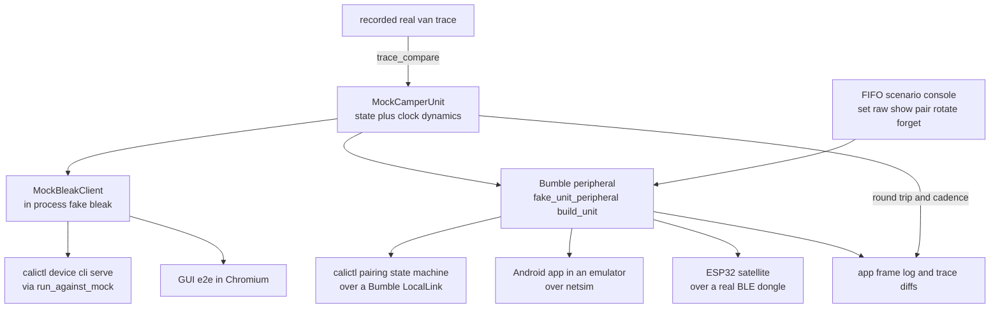

# The mock camper unit: setup and usage

The real VW California camper unit is hard to reach. It sits in a parked van, deep-sleeps for days,
and stops advertising. So nearly all development runs against a
**mock** of the unit instead — a model you can run on a laptop with no van, no phone and usually no
radio.

This is the "how do I drive it" guide. For the test-layer reference — what each fake *proves*, what
it does *not*, and which CI job runs it — see {doc}`simulation-and-testing`. This page points you at
the mock from the operator's seat: how it is built, how to set it up, and every way the project
points `calictl`, the vendor app, and the ESP32 satellite at it.

## What it is, and the two layers

A mock encodes **only behaviour that has already been reverse-engineered**. It is a regression
harness and executable documentation, not an oracle — new protocol facts come from the real unit or
the vendor app, never from the mock. Keep that in mind and the mock is the fastest way to work on
everything downstream of the radio.

There are two layers, and they wrap the **same state model**.

1. **`tools/mock_unit.py` — the behaviour model plus a fake `bleak` client (in-process, no radio).**
   `MockCamperUnit` is the "firmware": it holds per-function decoded state (seeded by `DEFAULT_SEED`
   with every function this van has fitted), models the known write behaviours, and advances
   dynamics on its own clock (`tick()`). `MockBleakClient` is a drop-in for `bleak.BleakClient`
   exposing only the surface `calictl/device.py` uses, delegating to one shared `MockCamperUnit`.
   Nothing here touches Bluetooth, so it runs in the stdlib-only test environment.

2. **`tools/fake_unit_peripheral.py` — that same model wrapped as a real Bumble BLE peripheral.**
   `build_unit()` returns a `FakeUnit` that holds a `MockCamperUnit` and exposes its GATT surface
   through a [Bumble](https://google.github.io/bumble/) peripheral: it advertises `VWCAMPER` from a
   rotating private address, pairs with LE Secure Connections passkey entry (displaying a fresh
   passkey per attempt), refuses new bonds while its pairing screen is closed, and holds one
   connection at a time. This is what makes pairing, SMP and link-layer behaviour testable — over a
   virtual radio (Bumble `LocalLink`), over the emulator's netsim, or over a real BLE dongle.

Use layer 1 when you want the GATT/control logic (`device`/`cli`/`serve`); use layer 2 when the
thing under test lives below GATT (pairing, bonding, the app, the ESP radio stack).

## Architecture



`MockCamperUnit` is the one model at the centre. In-process, `MockBleakClient` feeds it to
`calictl` (`tools/run_against_mock.py`) and to the GUI end-to-end suite. Wrapped as the Bumble
peripheral, the same model is reached three ways: a `LocalLink` to calictl's pairing state machine,
netsim to the Android app in an emulator, and a real BLE dongle to the ESP32 satellite. The FIFO
scenario console injects state into the running peripheral; `tools/trace_compare.py` replays a
recorded real-van trace *through* the mock to find where the model differs from the hardware.

## Setup

### The in-process mock

Nothing to install beyond the dev dependencies (`tools/ci.sh dev`, or `pip install -r
requirements-dev.txt`). `tools/mock_unit.py` imports only stdlib plus `calictl`, so it is already
importable wherever the test suite runs. You drive it through `tools/run_against_mock.py` — see the
recipes below.

### The Bumble peripheral

Needs [Bumble](https://google.github.io/bumble/) (`bumble` is pinned in `requirements-dev.txt`;
`bumble[android]` for the app lab, which also needs the Android SDK and emulator). How you bridge
its HCI is what changes per use:

- **Virtual radio (CI, no dongle).** calictl's pairing tests link the peripheral to a Bumble
  central over a `LocalLink` — no BlueZ, no kernel, no radio. This runs on every PR
  (`tests/test_pairing_link.py`).
- **Real BLE dongle.** For the ESP bench the peripheral runs on a USB BLE adapter (for example the
  UB500 on the "thinky" Linux box) so a real chip can connect to it over the air.

### The Android app lab

The full emulator setup (SDK, AVD, the `bumble[android]` venv, netsim) and the one-command
`labctl.sh up`/`down`/`status` wrapper are in
[`tools/applab/README.md`](https://github.com/ckeller42/open-california/blob/main/tools/applab/README.md).
It is local-only tooling — nothing from the APK or the emulator is committed.

### The ESP32 satellite bench

The firmware's Board tier runs a real M5Stack CoreS3 on a Linux bench against this fake peripheral
on a BLE dongle (`tools/applab/fake_unit_ble.py`). Flashing, the console and the status-display walk
are covered in {doc}`firmware` (the "Three test tiers" table) and `firmware/README.md`.

## Usage recipes

### Drive calictl over the mock

`tools/run_against_mock.py` installs the fake `bleak`, then runs the normal CLI or daemon. The one
shared `MockCamperUnit` persists across calictl's connect-per-operation calls, so a `set` is visible
to a later `get` within one process:

```sh
python -m tools.run_against_mock set cooler power on
python -m tools.run_against_mock get cooler
python -m tools.run_against_mock set lighting kitchen 8
CALICTL_ENABLE_WRITES=1 python -m tools.run_against_mock serve --web 8080 --interval 1 --no-influx
```

The last command runs the real daemon and web UI at `http://localhost:8080` over the mock, with the
pairing wizard backed by `FakePairingTransport`. This is exactly what the GUI e2e suite launches
(`tests/e2e/`, {doc}`simulation-and-testing`).

### Inject state with the FIFO console and watch it propagate

With the Bumble peripheral running (app lab or bench), echo a command into its FIFO
(`FAKE_UNIT_FIFO`, default `${TMPDIR:-/tmp}/applab/fake_unit.in`). Each change notifies subscribers,
so the app or the ESP sees it immediately:

```sh
FIFO="${FAKE_UNIT_FIFO:-${TMPDIR:-/tmp}/applab/fake_unit.in}"
echo "set vehicle TerminalOneFive=1" > "$FIFO"   # ignition on (the roof page needs it)
echo "set roof InfoPopUp=5"          > "$FIFO"    # raise a roof alert dialog
echo "raw airheater 1050003c0c0000"  > "$FIFO"    # replace a whole state frame
echo "show airheater"                > "$FIFO"    # decoded state -> the fake's log
```

The fake's log (`${TMPDIR:-/tmp}/applab/fake_unit.log`) carries `READ <fn>` and
`WRITE <fn> <hex> -> state` lines; the `WRITE` lines are the app's real frames, for diffing against
`control.build()`.

### Run the app lab

See [`tools/applab/README.md`](https://github.com/ckeller42/open-california/blob/main/tools/applab/README.md).
In short: `FAKE_UNIT_VIN=<vin> tools/applab/labctl.sh up` starts the emulator, the fake and the app;
`tools/applab/pair_wizard.py` walks the pairing sheets and types the passkey; `tools/applab/adbui.py`
drives the UI and captures screenshots.

### Point the ESP32 satellite at the fake on a dongle

Run `tools/applab/fake_unit_ble.py` on a BLE dongle and flash the CoreS3; the board pairs, reads the
`SNAP` and serves its status page. The bench walk is `tools/esplab_display_walk.sh`. Detail is in
{doc}`firmware` and `firmware/README.md`.

### Record the app, and replay a real-van trace

- **App frames** are captured passively: every control write the app sends lands in the fake's
  `fake_unit.log` as a `WRITE` line, ready to diff against `control.build()`.
- **Real-van traces** are recorded with `CALICTL_BLE_TRACE` and replayed through the mock with
  `tools/trace_compare.py`, which reports round-trip, notification cadence and dynamics differences.
  Details are in {doc}`simulation-and-testing` ("Real-unit traces").

```sh
CALICTL_BLE_TRACE=~/ble.jsonl python3 -m calictl serve …   # at the van
python3 -m tools.trace_compare ~/ble.jsonl                  # replay through the mock
```

## Fidelity and limits

A green mock run is not proof against the real van. The mock is **wrong or coarser** than the
hardware on these points (the full list is in {doc}`simulation-and-testing`):

- **Roof motion is modelled on the real app's capture, not on calictl's own drive.** The 1402
  sequence and timings (pre-open checklist `0302`, `030c`→`230c`, `2308`→`1300`/`0300`, `2303`→`2300`,
  ~28 s open / ~23 s close, `ROOF_*` constants) follow the real unit under the real app (CAPTURE
  2026-10-10); the ~3 s withhold of a freshly validated counter (`ROOF_WITHHOLD_S`) is still
  semi-verified, and calictl has never driven the real motor.
- **"Driving" is an explicit flag** (`driving`), not a derived predicate — the real "vehicle is
  stationary" condition is still unknown.
- **Timing is collapsed.** The lighting `1` and level frames go out together (the real unit sends
  them ~100 ms apart), and a cooler power change is pushed at once (the real unit pushed the new
  `State` ~2 s after the write).
- **No link-layer behaviour in `mock_unit.py`** — no encryption, bonding, MTU or advertising. That
  all lives in the Bumble peripheral layer.
- **Alert codes** (`InfoPopUp`, `ErrorCode` and the like) change only when a test or the FIFO
  console sets them; their real causes are not modelled.
- **Known fake-peripheral bug (#228):** a fresh pair against a *just-rotated* fake can fail its key
  exchange. Restart the fake before a fresh pair; the app lab README's "Surviving a restart" section
  covers the related reconnect-to-a-restarted-fake caveat.

How strongly each underlying protocol fact is proven is tracked in the
[evidence ledger](https://ckeller42.github.io/open-california/business-logic/evidence-ledger.html).

## Demo video

calictl's own web UI, served over the in-process mock, reacting to control writes — the fridge
toggled on and its cooling level changed, a lighting zone set, and the energy mode switched. Every
value comes from `MockCamperUnit`; no vehicle and no vendor app are involved.

```{raw} html
<video controls muted playsinline width="360" style="max-width:100%;border-radius:8px">
  <source src="_static/mock-webui.webm" type="video/webm">
  Your browser does not display the embedded video; the file is at
  <a href="_static/mock-webui.webm">_static/mock-webui.webm</a>.
</video>
```

Recorded with Playwright over `python -m tools.run_against_mock serve --web` (the recipe in the
"Usage recipes" section above). The vendor app driving the same model is cross-checked in the app
lab, but that footage is not committed — the app's UI is VW's.
