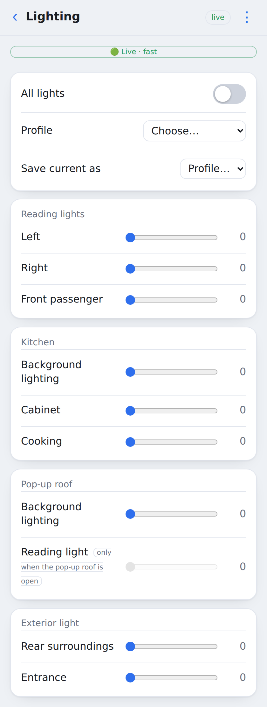
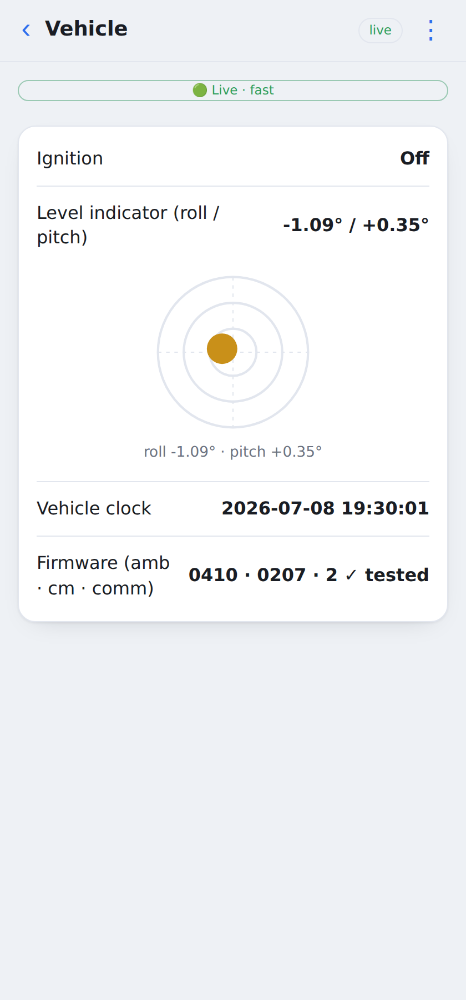

Web UI
======

``calictl serve --web`` serves a browser replica of the camper's Vehicle-tab controls — a
dashboard with an at-a-glance status card, then per-feature screens — from the **same** daemon,
with no extra BLE connection. The images below are rendered automatically in CI against the mock
unit (``tools.ux_gallery``), so they always reflect the current build.

Dashboard
---------

The status overview (fresh/grey water + leisure battery) plus feature tiles.

.. image:: screenshots/light_00_dashboard.png
   :width: 300
   :alt: Dashboard — California Status overview and feature tiles

Energy
------

Leisure + starter battery, voltages, **currents**, and the DC-DC / shore / solar sources.

.. image:: screenshots/light_06_Energy.png
   :width: 300
   :alt: Energy screen

Water
-----

.. image:: screenshots/light_05_Water.png
   :width: 300
   :alt: Water screen — fresh and grey tanks

Lighting
--------

Vehicle
-------

Every screen also renders in dark mode (``docs/screenshots/dark_*.png``).
